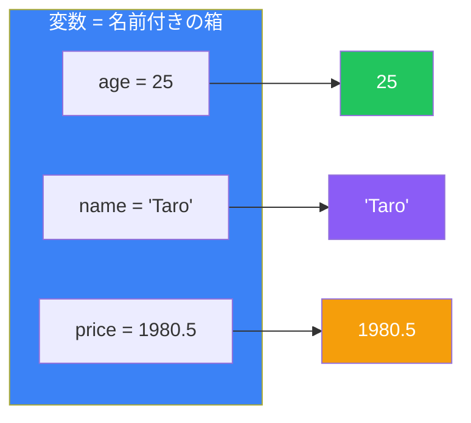
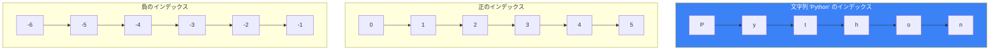
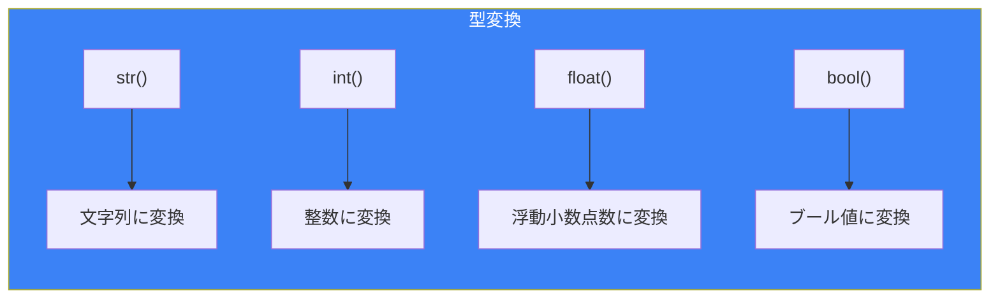

# Day 2: 変数とデータ型

## 今日学ぶこと

- 変数とは何か、どう使うか
- 数値型（整数と浮動小数点数）
- 文字列の基本操作
- ブール型（True/False）
- 型変換

---

## 変数とは？

変数は、データを格納するための「名前付きの箱」のようなものです。値に名前を付けて、後で参照したり変更したりできます。



### 変数の作成と代入

Pythonでは、`=`（代入演算子）を使って変数に値を代入します：

```python
# 変数を作成して値を代入
age = 25
name = "Taro"
price = 1980.5

# 変数の値を表示
print(age)    # 25
print(name)   # Taro
print(price)  # 1980.5
```

### 変数の再代入

変数の値は後から変更できます：

```python
counter = 1
print(counter)  # 1

counter = 2
print(counter)  # 2

counter = counter + 1
print(counter)  # 3
```

### 変数の命名規則

| ルール | 正しい例 | 間違った例 |
|--------|----------|------------|
| 英字、数字、アンダースコアが使える | `user_name`, `count2` | - |
| 数字から始められない | `name1` | `1name` ❌ |
| 予約語は使えない | `my_class` | `class` ❌ |
| 大文字と小文字は区別される | `Age` と `age` は別物 | - |

**推奨される命名スタイル（スネークケース）**：

```python
# 良い例
user_name = "Taro"
total_price = 1000
max_retry_count = 3

# 避けるべき例
userName = "Taro"  # キャメルケース（Pythonでは非推奨）
x = "Taro"         # 意味が分からない
```

---

## 数値型

Pythonには2つの主要な数値型があります。

### 整数（int）

小数点を含まない数値です：

```python
age = 25
year = 2024
negative = -100
big_number = 1_000_000  # アンダースコアで読みやすく

print(type(age))  # <class 'int'>
```

### 浮動小数点数（float）

小数点を含む数値です：

```python
pi = 3.14159
temperature = -5.5
price = 1980.0

print(type(pi))  # <class 'float'>
```

### 数値の演算

```python
a = 10
b = 3

print(a + b)   # 13    加算
print(a - b)   # 7     減算
print(a * b)   # 30    乗算
print(a / b)   # 3.333... 除算（常にfloat）
print(a // b)  # 3     整数除算
print(a % b)   # 1     剰余（余り）
print(a ** b)  # 1000  べき乗
```

### 複合代入演算子

```python
count = 10

count += 5   # count = count + 5 と同じ
print(count)  # 15

count -= 3   # count = count - 3 と同じ
print(count)  # 12

count *= 2   # count = count * 2 と同じ
print(count)  # 24
```

| 演算子 | 意味 | 例 |
|--------|------|-----|
| `+=` | 加算して代入 | `x += 5` |
| `-=` | 減算して代入 | `x -= 3` |
| `*=` | 乗算して代入 | `x *= 2` |
| `/=` | 除算して代入 | `x /= 4` |
| `//=` | 整数除算して代入 | `x //= 2` |
| `%=` | 剰余を代入 | `x %= 3` |

---

## 文字列（str）

文字列は、テキストデータを表します。シングルクォート `'` またはダブルクォート `"` で囲みます。

### 文字列の作成

```python
# どちらでもOK
name = 'Taro'
message = "Hello, World!"

# 複数行の文字列
long_text = """これは
複数行の
文字列です"""

print(long_text)
```

### 文字列の結合

```python
first_name = "Taro"
last_name = "Yamada"

# + で結合
full_name = first_name + " " + last_name
print(full_name)  # Taro Yamada

# * で繰り返し
line = "-" * 20
print(line)  # --------------------
```

### f文字列（フォーマット済み文字列）

Python 3.6以降で使える、最も便利な文字列フォーマット方法です：

```python
name = "Taro"
age = 25

# f文字列を使う（推奨）
message = f"My name is {name} and I am {age} years old."
print(message)  # My name is Taro and I am 25 years old.

# 計算も可能
price = 1000
tax = 0.1
print(f"税込価格: {price * (1 + tax)}円")  # 税込価格: 1100.0円

# フォーマット指定
pi = 3.14159265
print(f"円周率: {pi:.2f}")  # 円周率: 3.14
```

### 文字列のメソッド

```python
text = "  Hello, Python!  "

# 大文字・小文字変換
print(text.upper())      # "  HELLO, PYTHON!  "
print(text.lower())      # "  hello, python!  "

# 空白の除去
print(text.strip())      # "Hello, Python!"

# 置換
print(text.replace("Python", "World"))  # "  Hello, World!  "

# 分割
words = "apple,banana,cherry".split(",")
print(words)  # ['apple', 'banana', 'cherry']

# 長さ
print(len(text))  # 18
```

### 文字列のインデックスとスライス



```python
text = "Python"

# インデックスで1文字取得
print(text[0])   # P（最初の文字）
print(text[2])   # t
print(text[-1])  # n（最後の文字）

# スライスで部分文字列を取得
print(text[0:3])  # Pyt（0から2まで）
print(text[2:])   # thon（2から最後まで）
print(text[:3])   # Pyt（最初から2まで）
print(text[::2])  # Pto（1つ飛ばし）
```

---

## ブール型（bool）

ブール型は、`True`（真）と `False`（偽）の2つの値だけを持つデータ型です。

```python
is_active = True
is_admin = False

print(type(is_active))  # <class 'bool'>
```

### 比較演算子

比較演算子は、ブール値を返します：

```python
a = 10
b = 5

print(a > b)   # True  （より大きい）
print(a < b)   # False （より小さい）
print(a >= b)  # True  （以上）
print(a <= b)  # False （以下）
print(a == b)  # False （等しい）
print(a != b)  # True  （等しくない）
```

### 論理演算子

```python
x = True
y = False

print(x and y)  # False（両方Trueの時だけTrue）
print(x or y)   # True（どちらかがTrueならTrue）
print(not x)    # False（反転）
```

| 演算子 | 意味 | 例 |
|--------|------|-----|
| `and` | かつ | `True and False` → `False` |
| `or` | または | `True or False` → `True` |
| `not` | 否定 | `not True` → `False` |

---

## 型変換

異なる型の間でデータを変換できます。

```python
# 文字列 → 整数
age_str = "25"
age = int(age_str)
print(age + 5)  # 30

# 整数 → 文字列
number = 42
text = str(number)
print("番号: " + text)  # 番号: 42

# 文字列 → 浮動小数点数
price_str = "19.99"
price = float(price_str)
print(price * 2)  # 39.98

# 浮動小数点数 → 整数（小数点以下切り捨て）
pi = 3.14159
print(int(pi))  # 3
```



### type() で型を確認

```python
print(type(42))        # <class 'int'>
print(type(3.14))      # <class 'float'>
print(type("Hello"))   # <class 'str'>
print(type(True))      # <class 'bool'>
```

---

## 入力を受け取る

`input()` 関数でユーザーからの入力を受け取れます：

```python
name = input("あなたの名前は？ ")
print(f"こんにちは、{name}さん！")

# 数値として使う場合は変換が必要
age_str = input("年齢を入力してください: ")
age = int(age_str)
print(f"来年は{age + 1}歳ですね！")
```

---

## None型

`None` は「何もない」ことを表す特別な値です：

```python
result = None
print(result)       # None
print(type(result)) # <class 'NoneType'>

# 値がないことを確認
if result is None:
    print("結果はまだありません")
```

---

## まとめ

| データ型 | 説明 | 例 |
|----------|------|-----|
| **int** | 整数 | `42`, `-5`, `1_000` |
| **float** | 浮動小数点数 | `3.14`, `-0.5`, `1.0e8` |
| **str** | 文字列 | `"Hello"`, `'Python'` |
| **bool** | ブール値 | `True`, `False` |
| **None** | 何もない | `None` |

### 重要ポイント

1. 変数は `=` で値を代入し、何度でも変更可能
2. 変数名は意味のある名前を付ける（スネークケース推奨）
3. f文字列で変数を簡単に文字列に埋め込める
4. `type()` でデータ型を確認できる
5. 型変換で異なる型の間でデータを変換できる

---

## 練習問題

### 問題1: 基本
以下の変数を作成し、それぞれの型を `type()` で確認してください：
- 自分の年齢（整数）
- 自分の身長（浮動小数点数）
- 自分の名前（文字列）
- プログラミングが好きかどうか（ブール値）

### 問題2: 計算
ユーザーから2つの数値を入力してもらい、その合計、差、積、商を表示するプログラムを書いてください。

### チャレンジ問題
ユーザーから「西暦の生年」を入力してもらい、現在の年齢を計算して表示するプログラムを書いてください。f文字列を使って「あなたは○○歳です」と表示してください。

---

## 参考リンク

- [Python公式ドキュメント - 数値型](https://docs.python.org/ja/3/library/stdtypes.html#numeric-types-int-float-complex)
- [Python公式ドキュメント - 文字列](https://docs.python.org/ja/3/library/stdtypes.html#text-sequence-type-str)
- [Python公式ドキュメント - f文字列](https://docs.python.org/ja/3/reference/lexical_analysis.html#f-strings)

---

**次回予告**: Day 3では「制御フロー」について学びます。条件分岐とループで、プログラムの流れを制御しましょう！
