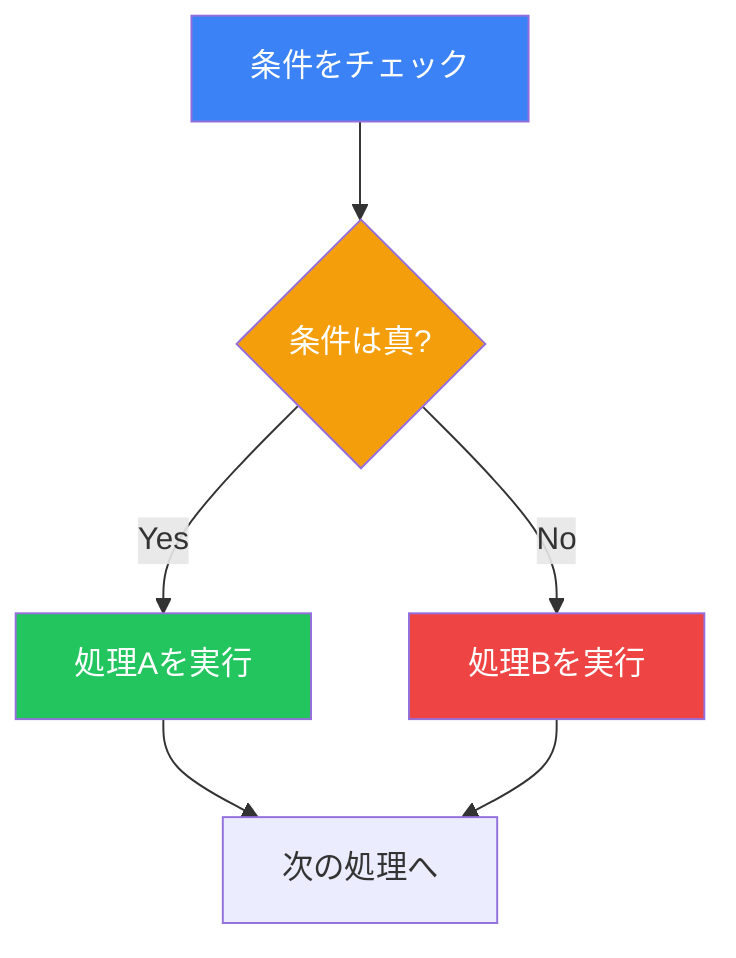
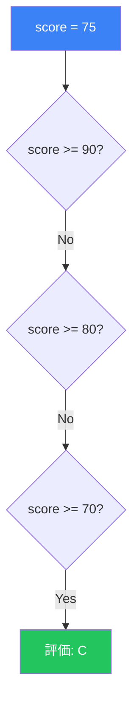
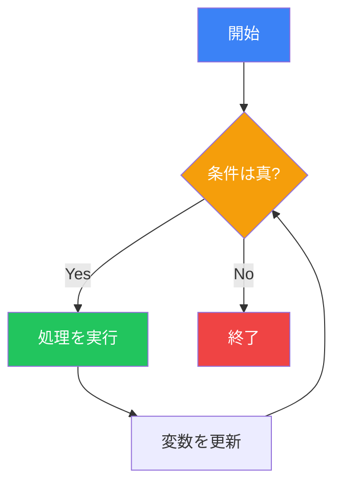

# Day 3: 制御フロー

## 今日学ぶこと

- 条件分岐（if, elif, else）
- 比較演算子と論理演算子
- match文（Python 3.10+）
- ループ（while, for）
- break, continue, else

---

## 条件分岐

プログラムは、条件に応じて異なる処理を実行できます。これを「条件分岐」と呼びます。



### if文の基本

```python
age = 20

if age >= 18:
    print("あなたは成人です")
```

**重要**: Pythonではインデント（字下げ）が構文の一部です。`if` の後のブロックは必ずインデントしてください。

### if-else文

```python
age = 15

if age >= 18:
    print("あなたは成人です")
else:
    print("あなたは未成年です")
```

### if-elif-else文

複数の条件をチェックする場合：

```python
score = 75

if score >= 90:
    print("評価: A")
elif score >= 80:
    print("評価: B")
elif score >= 70:
    print("評価: C")
elif score >= 60:
    print("評価: D")
else:
    print("評価: F")
```



### ネストした条件分岐

条件分岐の中に条件分岐を入れることもできます：

```python
age = 25
has_license = True

if age >= 18:
    if has_license:
        print("運転できます")
    else:
        print("免許を取得してください")
else:
    print("18歳になるまで待ってください")
```

---

## 比較演算子

条件式で使用する演算子です：

| 演算子 | 意味 | 例 |
|--------|------|-----|
| `==` | 等しい | `x == 5` |
| `!=` | 等しくない | `x != 5` |
| `>` | より大きい | `x > 5` |
| `<` | より小さい | `x < 5` |
| `>=` | 以上 | `x >= 5` |
| `<=` | 以下 | `x <= 5` |

```python
x = 10

print(x == 10)  # True
print(x != 5)   # True
print(x > 5)    # True
print(x < 15)   # True
```

### 文字列の比較

```python
name = "Python"

print(name == "Python")  # True
print(name == "python")  # False（大文字小文字は区別される）
print(name.lower() == "python")  # True
```

---

## 論理演算子

複数の条件を組み合わせます：

| 演算子 | 意味 | 例 |
|--------|------|-----|
| `and` | かつ（両方True） | `x > 0 and x < 10` |
| `or` | または（どちらかTrue） | `x < 0 or x > 10` |
| `not` | 否定 | `not x > 5` |

```python
age = 25
income = 500000

# and: 両方の条件を満たす
if age >= 20 and income >= 300000:
    print("ローン審査に進めます")

# or: どちらかの条件を満たす
day = "Saturday"
if day == "Saturday" or day == "Sunday":
    print("週末です！")

# not: 条件を反転
is_raining = False
if not is_raining:
    print("外出できます")
```

### 条件の連結

Pythonでは数学的な書き方も可能です：

```python
x = 5

# 従来の書き方
if x >= 1 and x <= 10:
    print("1から10の間です")

# Pythonらしい書き方
if 1 <= x <= 10:
    print("1から10の間です")
```

---

## in演算子

値がシーケンスに含まれるかチェックします：

```python
fruits = ["apple", "banana", "cherry"]

if "banana" in fruits:
    print("バナナがあります")

if "grape" not in fruits:
    print("ブドウはありません")

# 文字列でも使える
text = "Hello, Python!"
if "Python" in text:
    print("Pythonが含まれています")
```

---

## 真偽値の判定

Pythonでは、様々な値が `True` または `False` として評価されます：

| Falseになる値 | Trueになる値 |
|--------------|-------------|
| `False` | `True` |
| `None` | その他すべて |
| `0`, `0.0` | 0以外の数値 |
| `""` (空文字列) | 空でない文字列 |
| `[]` (空リスト) | 空でないリスト |
| `{}` (空辞書) | 空でない辞書 |

```python
# 空のリストはFalseとして評価される
items = []
if items:
    print("アイテムがあります")
else:
    print("アイテムは空です")

# 0はFalseとして評価される
count = 0
if count:
    print("カウントは0より大きい")
else:
    print("カウントは0です")
```

---

## match文（Python 3.10+）

Python 3.10から追加された構造的パターンマッチングです：

```python
command = "start"

match command:
    case "start":
        print("プログラムを開始します")
    case "stop":
        print("プログラムを停止します")
    case "restart":
        print("プログラムを再起動します")
    case _:
        print("不明なコマンドです")
```

### パターンマッチングの例

```python
def describe_point(point):
    match point:
        case (0, 0):
            return "原点"
        case (0, y):
            return f"Y軸上: y={y}"
        case (x, 0):
            return f"X軸上: x={x}"
        case (x, y):
            return f"点: ({x}, {y})"

print(describe_point((0, 0)))   # 原点
print(describe_point((0, 5)))   # Y軸上: y=5
print(describe_point((3, 4)))   # 点: (3, 4)
```

---

## whileループ

条件が `True` の間、繰り返し処理を実行します：



```python
count = 1
while count <= 5:
    print(count)
    count += 1

# 出力: 1 2 3 4 5
```

### 無限ループに注意

```python
# 悪い例: 無限ループ（count を更新し忘れ）
# count = 1
# while count <= 5:
#     print(count)  # countが増えないので永遠にループ

# 良い例: 必ず終了条件に向かう
count = 1
while count <= 5:
    print(count)
    count += 1  # これを忘れない！
```

---

## forループ

シーケンス（リスト、文字列など）の要素を順番に処理します：

```python
# リストの要素を処理
fruits = ["apple", "banana", "cherry"]
for fruit in fruits:
    print(fruit)

# 文字列の各文字を処理
for char in "Python":
    print(char)
```

### range()関数

連続した数値を生成します：

```python
# 0から4まで
for i in range(5):
    print(i)  # 0, 1, 2, 3, 4

# 1から5まで
for i in range(1, 6):
    print(i)  # 1, 2, 3, 4, 5

# 0から10まで2刻み
for i in range(0, 11, 2):
    print(i)  # 0, 2, 4, 6, 8, 10

# 逆順（10から1まで）
for i in range(10, 0, -1):
    print(i)  # 10, 9, 8, ..., 1
```

### enumerate()関数

インデックスと値を同時に取得：

```python
fruits = ["apple", "banana", "cherry"]

for index, fruit in enumerate(fruits):
    print(f"{index}: {fruit}")

# 出力:
# 0: apple
# 1: banana
# 2: cherry
```

---

## break文

ループを途中で終了します：

```python
for i in range(10):
    if i == 5:
        break
    print(i)

# 出力: 0, 1, 2, 3, 4
```

### 実用例: 入力検証

```python
while True:
    password = input("パスワードを入力: ")
    if password == "secret123":
        print("ログイン成功！")
        break
    print("パスワードが違います。再試行してください。")
```

---

## continue文

現在の反復をスキップして次へ進みます：

```python
for i in range(10):
    if i % 2 == 0:  # 偶数をスキップ
        continue
    print(i)

# 出力: 1, 3, 5, 7, 9（奇数のみ）
```

---

## ループのelse節

ループが `break` で中断されずに終了した場合に実行されます：

```python
# breakが発生しない場合
for i in range(5):
    print(i)
else:
    print("ループが正常に終了しました")

# breakが発生する場合
for i in range(5):
    if i == 3:
        break
    print(i)
else:
    print("この行は実行されません")
```

### 実用例: 検索

```python
numbers = [1, 3, 5, 7, 9]
target = 4

for num in numbers:
    if num == target:
        print(f"{target}が見つかりました")
        break
else:
    print(f"{target}は見つかりませんでした")
```

---

## ネストしたループ

ループの中にループを入れることができます：

```python
# 九九の表
for i in range(1, 10):
    for j in range(1, 10):
        print(f"{i * j:2}", end=" ")
    print()  # 改行
```

出力:
```
 1  2  3  4  5  6  7  8  9
 2  4  6  8 10 12 14 16 18
 3  6  9 12 15 18 21 24 27
...
```

---

## まとめ

| 構文 | 説明 | 例 |
|------|------|-----|
| `if` | 条件が真なら実行 | `if x > 0:` |
| `elif` | 前の条件が偽で、この条件が真なら実行 | `elif x < 0:` |
| `else` | すべての条件が偽なら実行 | `else:` |
| `match` | パターンマッチング（3.10+） | `match value:` |
| `while` | 条件が真の間ループ | `while count < 10:` |
| `for` | シーケンスを反復 | `for item in items:` |
| `break` | ループを終了 | `break` |
| `continue` | 次の反復へスキップ | `continue` |

### 重要ポイント

1. Pythonはインデントでコードブロックを定義する
2. `if-elif-else` で複数条件を効率的にチェック
3. `while` は条件ベース、`for` はシーケンスベースのループ
4. `break` でループを抜け、`continue` で次の反復へ
5. ループの `else` は `break` されなかった場合に実行

---

## 練習問題

### 問題1: 基本
ユーザーから数値を入力してもらい、正の数、負の数、ゼロのどれかを判定するプログラムを書いてください。

### 問題2: FizzBuzz
1から30までの数字を表示し、3で割り切れる場合は「Fizz」、5で割り切れる場合は「Buzz」、両方で割り切れる場合は「FizzBuzz」と表示するプログラムを書いてください。

### チャレンジ問題
ユーザーから正の整数を入力してもらい、その数が素数かどうかを判定するプログラムを書いてください。

---

## 参考リンク

- [Python公式ドキュメント - if文](https://docs.python.org/ja/3/tutorial/controlflow.html#if-statements)
- [Python公式ドキュメント - for文](https://docs.python.org/ja/3/tutorial/controlflow.html#for-statements)
- [Python公式ドキュメント - match文](https://docs.python.org/ja/3/tutorial/controlflow.html#match-statements)

---

**次回予告**: Day 4では「データ構造」について学びます。リスト、タプル、辞書、セットを使いこなしましょう！
