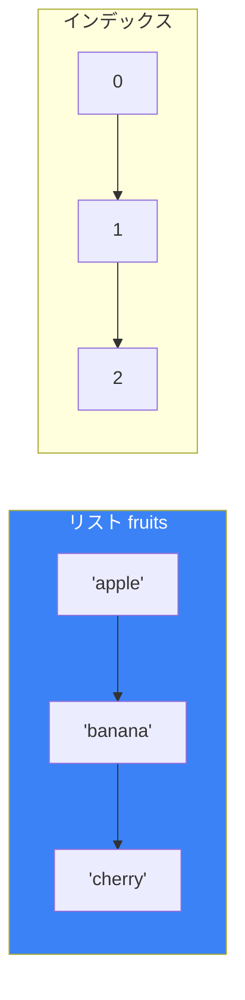
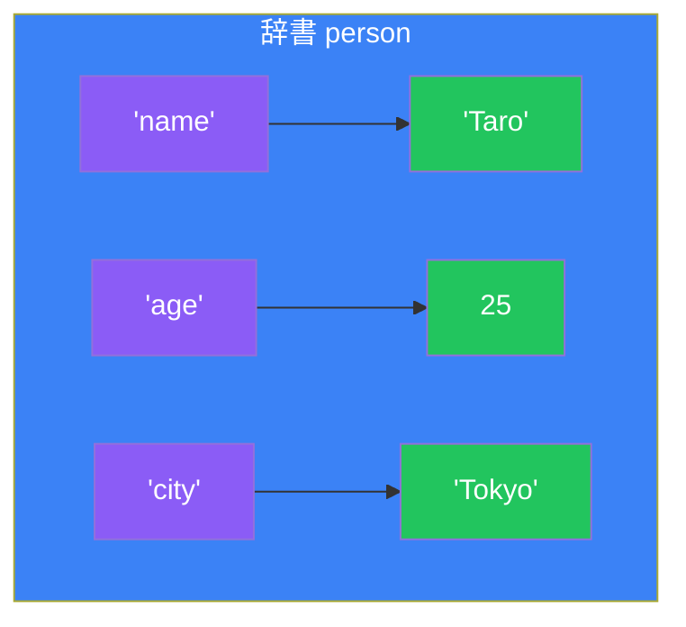
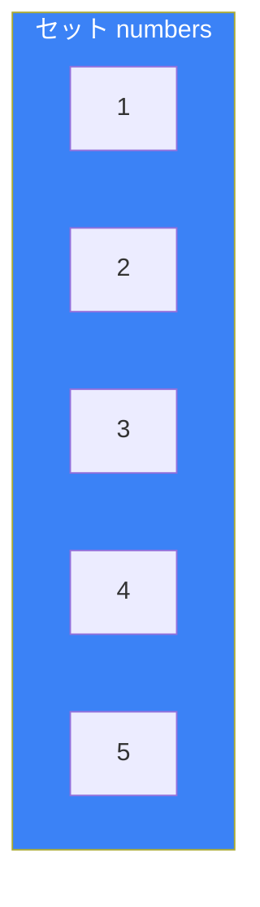
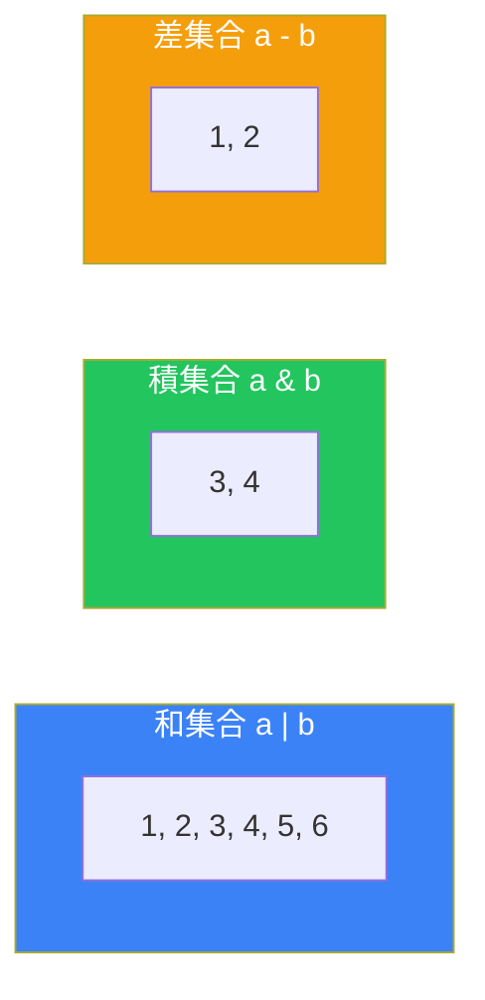

# Day 4: データ構造

## 今日学ぶこと

- リスト（list）: 順序付きで変更可能なコレクション
- タプル（tuple）: 順序付きで変更不可のコレクション
- 辞書（dict）: キーと値のペア
- セット（set）: 重複のないコレクション
- リスト内包表記

---

## リスト（list）

リストは、複数の値を順序付きで格納できる、最もよく使われるデータ構造です。



### リストの作成

```python
# 空のリスト
empty = []
also_empty = list()

# 値を持つリスト
fruits = ["apple", "banana", "cherry"]
numbers = [1, 2, 3, 4, 5]
mixed = [1, "hello", 3.14, True]  # 異なる型も混在可能
```

### 要素へのアクセス

```python
fruits = ["apple", "banana", "cherry", "date"]

# インデックスでアクセス
print(fruits[0])   # apple（最初）
print(fruits[2])   # cherry
print(fruits[-1])  # date（最後）
print(fruits[-2])  # cherry（最後から2番目）
```

### スライス

```python
fruits = ["apple", "banana", "cherry", "date", "elderberry"]

print(fruits[1:4])   # ['banana', 'cherry', 'date']
print(fruits[:3])    # ['apple', 'banana', 'cherry']
print(fruits[2:])    # ['cherry', 'date', 'elderberry']
print(fruits[::2])   # ['apple', 'cherry', 'elderberry']（1つ飛ばし）
print(fruits[::-1])  # 逆順
```

### リストの変更

```python
fruits = ["apple", "banana", "cherry"]

# 要素の変更
fruits[1] = "blueberry"
print(fruits)  # ['apple', 'blueberry', 'cherry']

# 要素の追加
fruits.append("date")        # 末尾に追加
fruits.insert(1, "apricot")  # 指定位置に挿入

# 要素の削除
fruits.remove("apple")  # 値で削除
del fruits[0]           # インデックスで削除
popped = fruits.pop()   # 末尾を取り出して削除
popped = fruits.pop(0)  # 指定位置を取り出して削除
```

### リストの主要メソッド

| メソッド | 説明 | 例 |
|----------|------|-----|
| `append(x)` | 末尾に追加 | `list.append(5)` |
| `insert(i, x)` | 位置iに挿入 | `list.insert(0, 5)` |
| `remove(x)` | 値xを削除 | `list.remove(5)` |
| `pop(i)` | 位置iを取り出す | `list.pop(0)` |
| `index(x)` | 値xの位置を返す | `list.index(5)` |
| `count(x)` | 値xの個数を返す | `list.count(5)` |
| `sort()` | ソート（破壊的） | `list.sort()` |
| `reverse()` | 逆順（破壊的） | `list.reverse()` |
| `copy()` | コピーを作成 | `new = list.copy()` |
| `clear()` | 全要素を削除 | `list.clear()` |

### リストの結合

```python
list1 = [1, 2, 3]
list2 = [4, 5, 6]

# + で結合
combined = list1 + list2  # [1, 2, 3, 4, 5, 6]

# extend で追加
list1.extend(list2)  # list1が [1, 2, 3, 4, 5, 6] になる

# * で繰り返し
repeated = [0] * 5  # [0, 0, 0, 0, 0]
```

### リストのソート

```python
numbers = [3, 1, 4, 1, 5, 9, 2, 6]

# sort(): 元のリストを変更
numbers.sort()
print(numbers)  # [1, 1, 2, 3, 4, 5, 6, 9]

numbers.sort(reverse=True)
print(numbers)  # [9, 6, 5, 4, 3, 2, 1, 1]

# sorted(): 新しいリストを返す
original = [3, 1, 4, 1, 5]
sorted_list = sorted(original)
print(original)     # [3, 1, 4, 1, 5]（変更なし）
print(sorted_list)  # [1, 1, 3, 4, 5]
```

---

## タプル（tuple）

タプルはリストに似ていますが、作成後に変更できない（イミュータブル）点が異なります。

```python
# タプルの作成
coordinates = (10, 20)
rgb = (255, 128, 0)
single = (42,)  # 要素が1つの場合はカンマが必要

# アクセス（リストと同じ）
print(coordinates[0])  # 10
print(rgb[1:])         # (128, 0)

# 変更はできない
# coordinates[0] = 5  # TypeError!
```

### タプルのアンパック

```python
# 複数の変数に一度に代入
point = (3, 4)
x, y = point
print(x)  # 3
print(y)  # 4

# 関数から複数の値を返す
def get_min_max(numbers):
    return min(numbers), max(numbers)

minimum, maximum = get_min_max([3, 1, 4, 1, 5])
print(minimum, maximum)  # 1 5

# 変数の入れ替え
a, b = 1, 2
a, b = b, a
print(a, b)  # 2 1
```

### タプル vs リスト

| 特性 | タプル | リスト |
|------|--------|--------|
| 変更可能 | ❌ | ✅ |
| 括弧 | `()` | `[]` |
| 用途 | 固定データ | 可変データ |
| 辞書のキー | 使える | 使えない |
| 処理速度 | 速い | 遅い |

---

## 辞書（dict）

辞書は、キーと値のペアでデータを管理します。



### 辞書の作成

```python
# 空の辞書
empty = {}
also_empty = dict()

# 値を持つ辞書
person = {
    "name": "Taro",
    "age": 25,
    "city": "Tokyo"
}

# dict()を使用
person = dict(name="Taro", age=25, city="Tokyo")
```

### 値へのアクセス

```python
person = {"name": "Taro", "age": 25, "city": "Tokyo"}

# キーでアクセス
print(person["name"])  # Taro

# get()を使用（キーがない場合にエラーにならない）
print(person.get("name"))      # Taro
print(person.get("country"))   # None
print(person.get("country", "Japan"))  # Japan（デフォルト値）
```

### 辞書の変更

```python
person = {"name": "Taro", "age": 25}

# 値の更新
person["age"] = 26

# 新しいキーの追加
person["city"] = "Tokyo"

# 複数の更新
person.update({"age": 27, "job": "Engineer"})

# キーの削除
del person["city"]
removed = person.pop("age")  # 値を取得して削除
```

### 辞書のメソッド

| メソッド | 説明 | 例 |
|----------|------|-----|
| `get(key, default)` | 値を取得 | `d.get("name", "Unknown")` |
| `keys()` | キーの一覧 | `d.keys()` |
| `values()` | 値の一覧 | `d.values()` |
| `items()` | キーと値のペア | `d.items()` |
| `pop(key)` | キーを削除して値を返す | `d.pop("name")` |
| `update(dict)` | 辞書を更新 | `d.update({"a": 1})` |
| `clear()` | 全要素を削除 | `d.clear()` |

### 辞書のループ

```python
person = {"name": "Taro", "age": 25, "city": "Tokyo"}

# キーでループ
for key in person:
    print(key)

# 値でループ
for value in person.values():
    print(value)

# キーと値でループ
for key, value in person.items():
    print(f"{key}: {value}")
```

### 辞書のキーの確認

```python
person = {"name": "Taro", "age": 25}

if "name" in person:
    print("nameキーがあります")

if "country" not in person:
    print("countryキーはありません")
```

---

## セット（set）

セットは、重複のない値のコレクションです。



### セットの作成

```python
# 空のセット
empty = set()  # {} は空の辞書になるので注意

# 値を持つセット
numbers = {1, 2, 3, 4, 5}
fruits = {"apple", "banana", "cherry"}

# リストからセットを作成（重複が除去される）
numbers = set([1, 2, 2, 3, 3, 3])
print(numbers)  # {1, 2, 3}
```

### セットの操作

```python
numbers = {1, 2, 3}

# 追加
numbers.add(4)
print(numbers)  # {1, 2, 3, 4}

# 削除
numbers.remove(2)     # 存在しないとエラー
numbers.discard(10)   # 存在しなくてもエラーにならない

# 存在確認
print(3 in numbers)  # True
```

### セットの集合演算

```python
a = {1, 2, 3, 4}
b = {3, 4, 5, 6}

# 和集合（どちらかに含まれる）
print(a | b)  # {1, 2, 3, 4, 5, 6}
print(a.union(b))

# 積集合（両方に含まれる）
print(a & b)  # {3, 4}
print(a.intersection(b))

# 差集合（aにあってbにない）
print(a - b)  # {1, 2}
print(a.difference(b))

# 対称差（どちらか一方にのみ含まれる）
print(a ^ b)  # {1, 2, 5, 6}
print(a.symmetric_difference(b))
```



---

## リスト内包表記

リストを簡潔に作成する方法です。

### 基本形

```python
# 従来の方法
squares = []
for x in range(5):
    squares.append(x ** 2)
print(squares)  # [0, 1, 4, 9, 16]

# リスト内包表記
squares = [x ** 2 for x in range(5)]
print(squares)  # [0, 1, 4, 9, 16]
```

### 条件付き

```python
# 偶数のみの2乗
even_squares = [x ** 2 for x in range(10) if x % 2 == 0]
print(even_squares)  # [0, 4, 16, 36, 64]

# if-elseを使う場合
results = ["even" if x % 2 == 0 else "odd" for x in range(5)]
print(results)  # ['even', 'odd', 'even', 'odd', 'even']
```

### ネストしたループ

```python
# 九九の組み合わせ
pairs = [(i, j) for i in range(1, 4) for j in range(1, 4)]
print(pairs)
# [(1, 1), (1, 2), (1, 3), (2, 1), (2, 2), (2, 3), (3, 1), (3, 2), (3, 3)]
```

### 辞書内包表記

```python
# 数値をキーに、その2乗を値とする辞書
squares = {x: x ** 2 for x in range(5)}
print(squares)  # {0: 0, 1: 1, 2: 4, 3: 9, 4: 16}
```

### セット内包表記

```python
# 2乗の値のセット
squares = {x ** 2 for x in range(-3, 4)}
print(squares)  # {0, 1, 4, 9}（重複が除去される）
```

---

## まとめ

| データ構造 | 括弧 | 特徴 | 用途 |
|------------|------|------|------|
| **list** | `[]` | 順序あり、変更可能 | 汎用的なコレクション |
| **tuple** | `()` | 順序あり、変更不可 | 固定データ、辞書のキー |
| **dict** | `{}` | キーと値のペア | 名前付きデータ |
| **set** | `{}` | 重複なし、順序なし | 重複除去、集合演算 |

### 重要ポイント

1. リストは最も汎用的で、追加・削除・変更が自由
2. タプルは変更不可だが、辞書のキーに使える
3. 辞書はキーで値にアクセスする（O(1)で高速）
4. セットは重複を自動的に除去し、集合演算が可能
5. 内包表記を使うとコードが簡潔になる

---

## 練習問題

### 問題1: リスト操作
1から10までの数値のリストを作成し、偶数だけを取り出した新しいリストを作成してください。

### 問題2: 辞書
5人の名前と年齢を格納した辞書を作成し、全員の平均年齢を計算して表示してください。

### チャレンジ問題
2つのリストの共通要素と、どちらか一方にしかない要素を見つけるプログラムを、セットを使って書いてください。

```python
list1 = [1, 2, 3, 4, 5]
list2 = [4, 5, 6, 7, 8]
# 共通: [4, 5]
# list1のみ: [1, 2, 3]
# list2のみ: [6, 7, 8]
```

---

## 参考リンク

- [Python公式ドキュメント - リスト](https://docs.python.org/ja/3/tutorial/datastructures.html)
- [Python公式ドキュメント - 辞書](https://docs.python.org/ja/3/tutorial/datastructures.html#dictionaries)
- [Python公式ドキュメント - セット](https://docs.python.org/ja/3/tutorial/datastructures.html#sets)

---

**次回予告**: Day 5では「関数」について学びます。コードを再利用可能な部品として整理しましょう！
