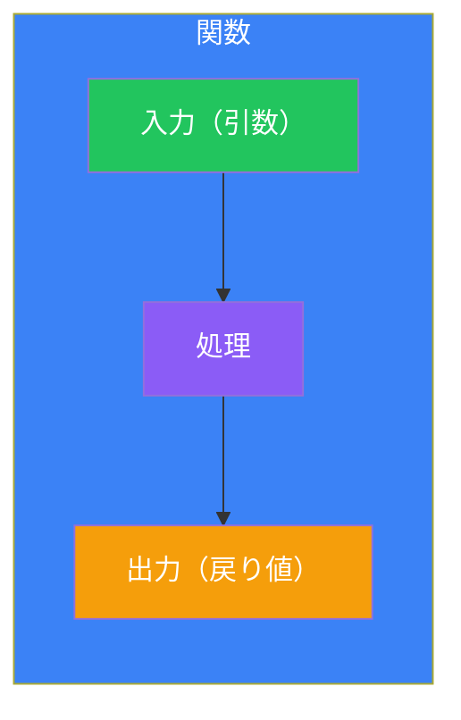
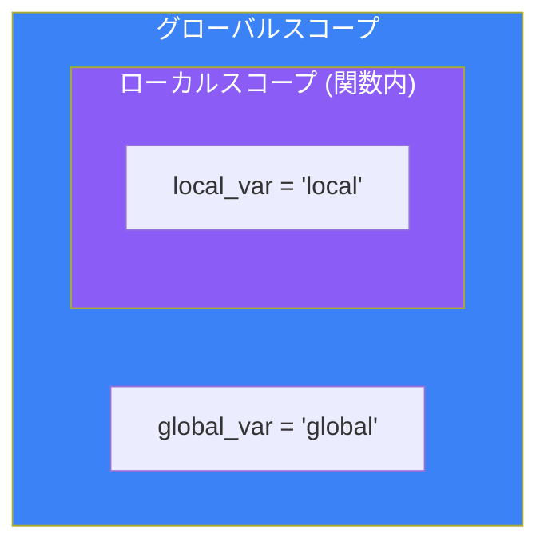
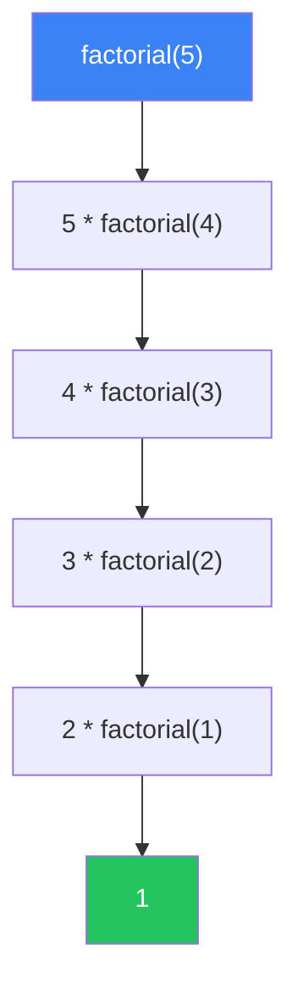

# Day 5: 関数

## 今日学ぶこと

- 関数の定義と呼び出し
- 引数（位置引数、キーワード引数、デフォルト値）
- 戻り値
- スコープ（変数の有効範囲）
- ラムダ関数
- デコレータの基礎

---

## 関数とは？

関数は、特定の処理をまとめた再利用可能なコードブロックです。



### なぜ関数を使うのか？

| メリット | 説明 |
|----------|------|
| **再利用性** | 同じコードを何度も書かなくてよい |
| **可読性** | コードが整理され、理解しやすくなる |
| **保守性** | 修正箇所が1か所で済む |
| **テスト容易性** | 個別にテストできる |

---

## 関数の定義と呼び出し

### 基本構文

```python
def 関数名(引数):
    """ドキュメンテーション文字列"""
    処理
    return 戻り値
```

### シンプルな例

```python
# 関数の定義
def greet():
    print("Hello, World!")

# 関数の呼び出し
greet()  # Hello, World!
```

### 引数を持つ関数

```python
def greet(name):
    print(f"Hello, {name}!")

greet("Taro")    # Hello, Taro!
greet("Hanako")  # Hello, Hanako!
```

### 戻り値を持つ関数

```python
def add(a, b):
    return a + b

result = add(3, 5)
print(result)  # 8

# returnがない場合はNoneが返る
def no_return():
    print("処理を実行")

result = no_return()  # 処理を実行
print(result)         # None
```

---

## 引数の種類

### 位置引数

引数は順番通りに渡されます：

```python
def describe_person(name, age, city):
    print(f"{name}は{age}歳で、{city}に住んでいます。")

describe_person("Taro", 25, "Tokyo")
# Taroは25歳で、Tokyoに住んでいます。
```

### キーワード引数

引数名を指定して渡すことができます：

```python
describe_person(name="Hanako", city="Osaka", age=30)
# Hanakoは30歳で、Osakaに住んでいます。

# 位置引数とキーワード引数の混合（位置引数が先）
describe_person("Jiro", age=20, city="Nagoya")
```

### デフォルト引数

引数にデフォルト値を設定できます：

```python
def greet(name, greeting="Hello"):
    print(f"{greeting}, {name}!")

greet("Taro")            # Hello, Taro!
greet("Taro", "Hi")      # Hi, Taro!
greet("Taro", greeting="Good morning")  # Good morning, Taro!
```

**注意**: デフォルト引数は、デフォルトなし引数の後に置く必要があります。

```python
# 正しい
def func(a, b, c=10):
    pass

# エラー
# def func(a, b=10, c):  # SyntaxError
#     pass
```

### 可変長引数 (*args)

任意の数の位置引数を受け取ります：

```python
def sum_all(*numbers):
    total = 0
    for n in numbers:
        total += n
    return total

print(sum_all(1, 2, 3))        # 6
print(sum_all(1, 2, 3, 4, 5))  # 15
```

### 可変長キーワード引数 (**kwargs)

任意の数のキーワード引数を受け取ります：

```python
def print_info(**kwargs):
    for key, value in kwargs.items():
        print(f"{key}: {value}")

print_info(name="Taro", age=25, city="Tokyo")
# name: Taro
# age: 25
# city: Tokyo
```

### 引数の組み合わせ

```python
def example(a, b, *args, **kwargs):
    print(f"a: {a}")
    print(f"b: {b}")
    print(f"args: {args}")
    print(f"kwargs: {kwargs}")

example(1, 2, 3, 4, 5, x=10, y=20)
# a: 1
# b: 2
# args: (3, 4, 5)
# kwargs: {'x': 10, 'y': 20}
```

---

## 戻り値

### 単一の値を返す

```python
def square(n):
    return n ** 2

result = square(5)
print(result)  # 25
```

### 複数の値を返す

タプルとして返されます：

```python
def min_max(numbers):
    return min(numbers), max(numbers)

minimum, maximum = min_max([3, 1, 4, 1, 5, 9])
print(minimum)  # 1
print(maximum)  # 9
```

### 早期リターン

条件によって早く終了することができます：

```python
def divide(a, b):
    if b == 0:
        return None  # ゼロ除算を防ぐ
    return a / b

print(divide(10, 2))  # 5.0
print(divide(10, 0))  # None
```

---

## スコープ

変数が有効な範囲を「スコープ」と呼びます。



### ローカル変数とグローバル変数

```python
global_var = "グローバル"

def example():
    local_var = "ローカル"
    print(global_var)  # グローバル変数にはアクセス可能
    print(local_var)   # ローカル変数

example()
# print(local_var)  # エラー！関数外からはアクセス不可
```

### global キーワード

グローバル変数を関数内で変更する場合：

```python
counter = 0

def increment():
    global counter
    counter += 1

increment()
increment()
print(counter)  # 2
```

**注意**: `global` の多用は避けましょう。代わりに戻り値を使うほうがよいです。

```python
# 推奨される方法
def increment(counter):
    return counter + 1

counter = 0
counter = increment(counter)
counter = increment(counter)
print(counter)  # 2
```

---

## ドキュメンテーション文字列（Docstring）

関数の説明を記述します：

```python
def calculate_area(width, height):
    """
    長方形の面積を計算します。

    Args:
        width: 幅
        height: 高さ

    Returns:
        面積（width * height）
    """
    return width * height

# ドキュメントを確認
print(calculate_area.__doc__)
help(calculate_area)
```

---

## ラムダ関数

短い無名関数を定義できます：

```python
# 通常の関数
def square(x):
    return x ** 2

# ラムダ関数
square = lambda x: x ** 2

print(square(5))  # 25
```

### ラムダの活用例

```python
# ソートのキーとして
students = [
    {"name": "Taro", "score": 80},
    {"name": "Hanako", "score": 95},
    {"name": "Jiro", "score": 70}
]

# スコアでソート
students.sort(key=lambda x: x["score"])
print(students)

# filter()と組み合わせ
numbers = [1, 2, 3, 4, 5, 6, 7, 8, 9, 10]
even = list(filter(lambda x: x % 2 == 0, numbers))
print(even)  # [2, 4, 6, 8, 10]

# map()と組み合わせ
squares = list(map(lambda x: x ** 2, numbers))
print(squares)  # [1, 4, 9, 16, 25, 36, 49, 64, 81, 100]
```

---

## 関数の引数としての関数

Pythonでは、関数を他の関数の引数として渡せます：

```python
def apply_operation(x, y, operation):
    return operation(x, y)

def add(a, b):
    return a + b

def multiply(a, b):
    return a * b

print(apply_operation(5, 3, add))       # 8
print(apply_operation(5, 3, multiply))  # 15
```

---

## デコレータ

関数の機能を拡張する仕組みです：

```python
def log_decorator(func):
    def wrapper(*args, **kwargs):
        print(f"関数 {func.__name__} を呼び出します")
        result = func(*args, **kwargs)
        print(f"関数 {func.__name__} が完了しました")
        return result
    return wrapper

@log_decorator
def greet(name):
    print(f"Hello, {name}!")

greet("Taro")
# 関数 greet を呼び出します
# Hello, Taro!
# 関数 greet が完了しました
```

### 実用的なデコレータ例：実行時間計測

```python
import time

def timer(func):
    def wrapper(*args, **kwargs):
        start = time.time()
        result = func(*args, **kwargs)
        end = time.time()
        print(f"{func.__name__}: {end - start:.4f}秒")
        return result
    return wrapper

@timer
def slow_function():
    time.sleep(1)
    return "完了"

slow_function()  # slow_function: 1.00XX秒
```

---

## 再帰関数

自分自身を呼び出す関数です：

```python
def factorial(n):
    if n <= 1:
        return 1
    return n * factorial(n - 1)

print(factorial(5))  # 120 (5 * 4 * 3 * 2 * 1)
```



### フィボナッチ数列

```python
def fibonacci(n):
    if n <= 1:
        return n
    return fibonacci(n - 1) + fibonacci(n - 2)

for i in range(10):
    print(fibonacci(i), end=" ")
# 0 1 1 2 3 5 8 13 21 34
```

**注意**: 再帰にはデフォルトで約1000回の制限があります。深い再帰は避けるか、ループに置き換えましょう。

---

## まとめ

| 概念 | 説明 | 例 |
|------|------|-----|
| **def** | 関数を定義 | `def func():` |
| **return** | 値を返す | `return result` |
| **位置引数** | 順番で渡す | `func(1, 2, 3)` |
| **キーワード引数** | 名前で渡す | `func(a=1, b=2)` |
| **デフォルト引数** | デフォルト値 | `def func(x=10):` |
| ***args** | 可変長位置引数 | `def func(*args):` |
| ****kwargs** | 可変長キーワード引数 | `def func(**kwargs):` |
| **lambda** | 無名関数 | `lambda x: x * 2` |

### 重要ポイント

1. 関数はコードの再利用性と可読性を高める
2. 引数のデフォルト値は関数定義時に一度だけ評価される
3. ローカル変数は関数内でのみ有効
4. `global` の使用は最小限に抑える
5. ラムダは短い処理に使い、複雑な処理には通常の関数を使う

---

## 練習問題

### 問題1: 基本
2つの数値を受け取り、大きい方を返す関数 `max_of_two(a, b)` を作成してください。

### 問題2: リスト操作
リストを受け取り、偶数のみを含む新しいリストを返す関数 `filter_even(numbers)` を作成してください。

### チャレンジ問題
任意の数の引数を受け取り、それらの平均値を返す関数 `average(*args)` を作成してください。引数が0個の場合は `None` を返してください。

---

## 参考リンク

- [Python公式ドキュメント - 関数の定義](https://docs.python.org/ja/3/tutorial/controlflow.html#defining-functions)
- [Python公式ドキュメント - ラムダ式](https://docs.python.org/ja/3/tutorial/controlflow.html#lambda-expressions)
- [Python公式ドキュメント - ドキュメンテーション文字列](https://peps.python.org/pep-0257/)

---

**次回予告**: Day 6では「オブジェクト指向プログラミング」について学びます。クラスとオブジェクトの世界へ！
