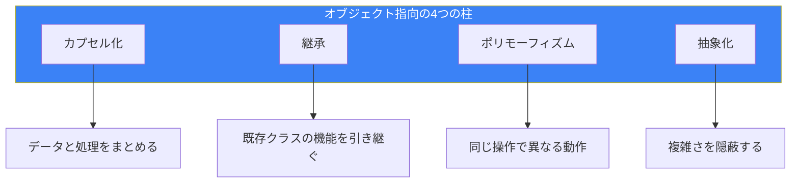
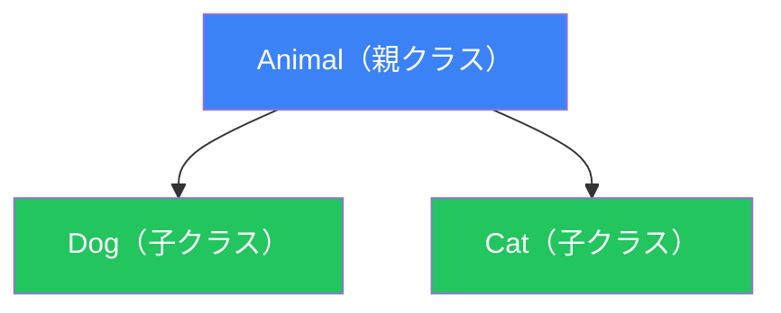

# Day 6: オブジェクト指向プログラミング

## 今日学ぶこと

- クラスとオブジェクトの基本
- 属性とメソッド
- コンストラクタ（`__init__`）
- 継承
- カプセル化
- 特殊メソッド（マジックメソッド）

---

## オブジェクト指向とは？

オブジェクト指向プログラミング（OOP）は、データと処理を「オブジェクト」としてまとめるプログラミング手法です。



### クラスとオブジェクトの関係

| 概念 | 説明 | 例 |
|------|------|-----|
| **クラス** | オブジェクトの設計図 | 「犬」という概念 |
| **オブジェクト** | クラスから作られた実体 | 「ポチ」という具体的な犬 |
| **属性** | オブジェクトが持つデータ | 名前、年齢、品種 |
| **メソッド** | オブジェクトが持つ動作 | 吠える、走る、食べる |

---

## クラスの定義

### 基本構文

```python
class クラス名:
    def __init__(self, 引数):
        self.属性 = 引数

    def メソッド名(self):
        処理
```

### シンプルな例

```python
class Dog:
    def __init__(self, name, age):
        self.name = name
        self.age = age

    def bark(self):
        print(f"{self.name}がワンワン吠えています！")

    def introduce(self):
        print(f"私は{self.name}、{self.age}歳です。")

# オブジェクトの作成（インスタンス化）
my_dog = Dog("ポチ", 3)

# メソッドの呼び出し
my_dog.bark()       # ポチがワンワン吠えています！
my_dog.introduce()  # 私はポチ、3歳です。

# 属性へのアクセス
print(my_dog.name)  # ポチ
print(my_dog.age)   # 3
```

### self について

`self` は、オブジェクト自身を参照する特別な引数です。メソッド定義では必ず最初の引数にします。

```python
class Counter:
    def __init__(self):
        self.count = 0

    def increment(self):
        self.count += 1

    def get_count(self):
        return self.count

counter = Counter()
counter.increment()
counter.increment()
print(counter.get_count())  # 2
```

---

## 属性の種類

### インスタンス属性

各オブジェクト固有の属性です：

```python
class Person:
    def __init__(self, name):
        self.name = name  # インスタンス属性

person1 = Person("Taro")
person2 = Person("Hanako")

print(person1.name)  # Taro
print(person2.name)  # Hanako
```

### クラス属性

全オブジェクトで共有される属性です：

```python
class Person:
    species = "Homo sapiens"  # クラス属性

    def __init__(self, name):
        self.name = name

person1 = Person("Taro")
person2 = Person("Hanako")

print(person1.species)  # Homo sapiens
print(person2.species)  # Homo sapiens
print(Person.species)   # Homo sapiens
```

---

## コンストラクタとデストラクタ

### `__init__` コンストラクタ

オブジェクト作成時に自動的に呼ばれます：

```python
class Book:
    def __init__(self, title, author, pages=100):
        self.title = title
        self.author = author
        self.pages = pages
        print(f"'{self.title}'が作成されました")

book = Book("Python入門", "山田太郎", 300)
# 'Python入門'が作成されました
```

### `__del__` デストラクタ

オブジェクトが削除される時に呼ばれます：

```python
class Book:
    def __init__(self, title):
        self.title = title
        print(f"'{self.title}'が作成されました")

    def __del__(self):
        print(f"'{self.title}'が削除されました")

book = Book("Python入門")  # 'Python入門'が作成されました
del book                    # 'Python入門'が削除されました
```

---

## 継承

既存のクラスの機能を引き継いで、新しいクラスを作成できます。



### 基本的な継承

```python
class Animal:
    def __init__(self, name):
        self.name = name

    def speak(self):
        print("何か音を出す")

class Dog(Animal):
    def speak(self):
        print(f"{self.name}がワンワン！")

class Cat(Animal):
    def speak(self):
        print(f"{self.name}がニャー！")

dog = Dog("ポチ")
cat = Cat("タマ")

dog.speak()  # ポチがワンワン！
cat.speak()  # タマがニャー！
```

### super() を使った親クラスの呼び出し

```python
class Animal:
    def __init__(self, name, age):
        self.name = name
        self.age = age

class Dog(Animal):
    def __init__(self, name, age, breed):
        super().__init__(name, age)  # 親クラスの__init__を呼び出す
        self.breed = breed

    def introduce(self):
        print(f"私は{self.breed}の{self.name}、{self.age}歳です。")

dog = Dog("ポチ", 3, "柴犬")
dog.introduce()  # 私は柴犬のポチ、3歳です。
```

### メソッドのオーバーライド

子クラスで親クラスのメソッドを上書きできます：

```python
class Vehicle:
    def move(self):
        print("移動します")

class Car(Vehicle):
    def move(self):
        print("道路を走ります")

class Airplane(Vehicle):
    def move(self):
        print("空を飛びます")

# ポリモーフィズム: 同じメソッド呼び出しで異なる動作
vehicles = [Car(), Airplane()]
for v in vehicles:
    v.move()
# 道路を走ります
# 空を飛びます
```

---

## カプセル化

データを外部から直接アクセスできないようにし、メソッドを通してのみ操作できるようにします。

### プライベート属性

アンダースコアで始まる属性は「プライベート」として扱います：

```python
class BankAccount:
    def __init__(self, initial_balance):
        self._balance = initial_balance  # 慣例的なプライベート

    def deposit(self, amount):
        if amount > 0:
            self._balance += amount

    def withdraw(self, amount):
        if 0 < amount <= self._balance:
            self._balance -= amount
            return True
        return False

    def get_balance(self):
        return self._balance

account = BankAccount(1000)
account.deposit(500)
print(account.get_balance())  # 1500
```

### 名前マングリング

ダブルアンダースコアで始まる属性は、名前が変更されます：

```python
class Secret:
    def __init__(self):
        self.__hidden = "秘密"

    def reveal(self):
        return self.__hidden

s = Secret()
print(s.reveal())       # 秘密
# print(s.__hidden)     # AttributeError
print(s._Secret__hidden)  # 秘密（アクセス可能だが非推奨）
```

---

## プロパティ

属性へのアクセスをカスタマイズできます：

```python
class Circle:
    def __init__(self, radius):
        self._radius = radius

    @property
    def radius(self):
        return self._radius

    @radius.setter
    def radius(self, value):
        if value <= 0:
            raise ValueError("半径は正の値でなければなりません")
        self._radius = value

    @property
    def area(self):
        return 3.14159 * self._radius ** 2

circle = Circle(5)
print(circle.radius)  # 5
print(circle.area)    # 78.53975

circle.radius = 10
print(circle.area)    # 314.159

# circle.radius = -1  # ValueError
```

---

## 特殊メソッド（マジックメソッド）

ダブルアンダースコアで囲まれたメソッドで、特別な動作を定義できます。

### よく使う特殊メソッド

| メソッド | 説明 | 使用例 |
|----------|------|--------|
| `__init__` | コンストラクタ | `obj = Class()` |
| `__str__` | 文字列表現 | `print(obj)` |
| `__repr__` | 開発者向け表現 | `repr(obj)` |
| `__len__` | 長さ | `len(obj)` |
| `__eq__` | 等価比較 | `obj1 == obj2` |
| `__lt__` | 小なり比較 | `obj1 < obj2` |
| `__add__` | 加算 | `obj1 + obj2` |

### 実装例

```python
class Vector:
    def __init__(self, x, y):
        self.x = x
        self.y = y

    def __str__(self):
        return f"Vector({self.x}, {self.y})"

    def __repr__(self):
        return f"Vector({self.x!r}, {self.y!r})"

    def __add__(self, other):
        return Vector(self.x + other.x, self.y + other.y)

    def __eq__(self, other):
        return self.x == other.x and self.y == other.y

    def __len__(self):
        return int((self.x ** 2 + self.y ** 2) ** 0.5)

v1 = Vector(3, 4)
v2 = Vector(1, 2)

print(v1)           # Vector(3, 4)
print(v1 + v2)      # Vector(4, 6)
print(v1 == v2)     # False
print(len(v1))      # 5
```

---

## データクラス（Python 3.7+）

シンプルなクラスを簡潔に定義できます：

```python
from dataclasses import dataclass

@dataclass
class Person:
    name: str
    age: int
    city: str = "Tokyo"

# 自動的に__init__, __repr__, __eq__が生成される
person = Person("Taro", 25)
print(person)  # Person(name='Taro', age=25, city='Tokyo')

person2 = Person("Taro", 25)
print(person == person2)  # True
```

---

## クラスメソッドと静的メソッド

### クラスメソッド

クラス自体を操作するメソッド：

```python
class Person:
    population = 0

    def __init__(self, name):
        self.name = name
        Person.population += 1

    @classmethod
    def get_population(cls):
        return cls.population

    @classmethod
    def from_dict(cls, data):
        return cls(data["name"])

p1 = Person("Taro")
p2 = Person("Hanako")
print(Person.get_population())  # 2

data = {"name": "Jiro"}
p3 = Person.from_dict(data)
print(p3.name)  # Jiro
```

### 静的メソッド

クラスやインスタンスに依存しないメソッド：

```python
class Math:
    @staticmethod
    def add(a, b):
        return a + b

    @staticmethod
    def multiply(a, b):
        return a * b

print(Math.add(3, 5))       # 8
print(Math.multiply(3, 5))  # 15
```

---

## まとめ

| 概念 | 説明 | キーワード |
|------|------|-----------|
| **クラス** | オブジェクトの設計図 | `class` |
| **インスタンス** | クラスから作られた実体 | `ClassName()` |
| **属性** | オブジェクトのデータ | `self.name` |
| **メソッド** | オブジェクトの動作 | `def method(self):` |
| **継承** | 親クラスの機能を引き継ぐ | `class Child(Parent):` |
| **カプセル化** | データを隠蔽する | `_private`, `__mangled` |
| **ポリモーフィズム** | 同じ操作で異なる動作 | メソッドオーバーライド |

### 重要ポイント

1. クラスはオブジェクトの設計図、オブジェクトはその実体
2. `self` はインスタンス自身を参照する
3. `__init__` はオブジェクト作成時に自動で呼ばれる
4. 継承で既存クラスの機能を拡張できる
5. カプセル化でデータを保護する

---

## 練習問題

### 問題1: 基本
`Rectangle` クラスを作成してください。幅と高さを属性として持ち、面積を計算する `area()` メソッドと周囲の長さを計算する `perimeter()` メソッドを実装してください。

### 問題2: 継承
`Shape` という親クラスを作り、`Rectangle` と `Circle` の子クラスを作成してください。それぞれに `area()` メソッドを実装してください。

### チャレンジ問題
銀行口座を表す `BankAccount` クラスを作成してください。以下の機能を実装してください：
- 残高の初期化
- 入金（deposit）
- 出金（withdraw）：残高不足の場合はエラーメッセージを表示
- 残高照会（get_balance）
- 取引履歴の記録と表示

---

## 参考リンク

- [Python公式ドキュメント - クラス](https://docs.python.org/ja/3/tutorial/classes.html)
- [Python公式ドキュメント - データクラス](https://docs.python.org/ja/3/library/dataclasses.html)
- [Python公式ドキュメント - 特殊メソッド](https://docs.python.org/ja/3/reference/datamodel.html#special-method-names)

---

**次回予告**: Day 7では「モジュールとパッケージ」について学びます。コードを整理し、再利用可能にしましょう！
