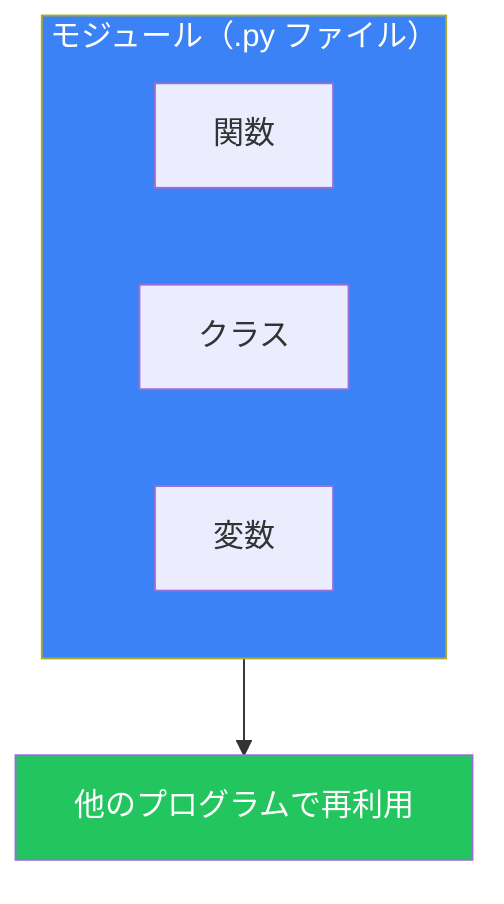
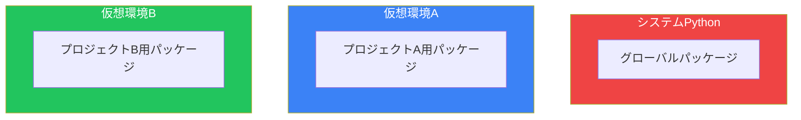

# Day 7: モジュールとパッケージ

## 今日学ぶこと

- モジュールとは何か
- import文の使い方
- 標準ライブラリの活用
- パッケージの構造
- 仮想環境とpip

---

## モジュールとは？

モジュールは、Pythonのコードをまとめたファイル（`.py`）です。関数、クラス、変数を再利用可能な形で整理できます。



### なぜモジュールを使うのか？

| メリット | 説明 |
|----------|------|
| **再利用性** | 同じコードを複数のプログラムで使える |
| **整理** | コードを論理的な単位に分割できる |
| **名前空間** | 名前の衝突を避けられる |
| **保守性** | 変更箇所を特定しやすい |

---

## import文

### 基本的なimport

```python
# モジュール全体をインポート
import math

print(math.pi)        # 3.141592653589793
print(math.sqrt(16))  # 4.0
```

### from ... import

特定の要素だけをインポート：

```python
from math import pi, sqrt

print(pi)        # 3.141592653589793
print(sqrt(16))  # 4.0（math.をつけなくてよい）
```

### エイリアス（別名）

```python
import numpy as np  # 長い名前を短縮
import pandas as pd

# よく使われる慣例
import matplotlib.pyplot as plt
```

### すべてをインポート（非推奨）

```python
from math import *  # 全ての要素をインポート

# 推奨されない理由：
# - どこから来た名前か分からなくなる
# - 名前の衝突が起きやすい
```

---

## 自作モジュール

### モジュールの作成

`my_module.py` ファイルを作成：

```python
# my_module.py
"""自作モジュールの例"""

PI = 3.14159

def greet(name):
    """挨拶を表示する"""
    print(f"Hello, {name}!")

def add(a, b):
    """2つの数を足す"""
    return a + b

class Calculator:
    """簡単な計算機"""
    def multiply(self, a, b):
        return a * b
```

### モジュールの使用

同じディレクトリにある `main.py` から使用：

```python
# main.py
import my_module

my_module.greet("Taro")  # Hello, Taro!
print(my_module.PI)      # 3.14159
print(my_module.add(3, 5))  # 8

calc = my_module.Calculator()
print(calc.multiply(4, 5))  # 20
```

### `__name__` と `__main__`

モジュールが直接実行されたか、インポートされたかを判定：

```python
# my_module.py
def main():
    print("モジュールが直接実行されました")

if __name__ == "__main__":
    main()
```

```bash
python my_module.py  # "モジュールが直接実行されました" が表示される
```

```python
# 別のファイルからインポート
import my_module  # main() は実行されない
```

---

## 標準ライブラリ

Pythonには多くの便利な標準モジュールが含まれています。

### よく使う標準モジュール

| モジュール | 用途 | 例 |
|------------|------|-----|
| `os` | OS操作 | ファイルパス、環境変数 |
| `sys` | システム | コマンドライン引数 |
| `math` | 数学 | 三角関数、対数 |
| `random` | 乱数 | ランダム値生成 |
| `datetime` | 日時 | 日付・時刻操作 |
| `json` | JSON | JSONの読み書き |
| `re` | 正規表現 | パターンマッチング |
| `collections` | データ構造 | Counter, defaultdict |

### os モジュール

```python
import os

# カレントディレクトリ
print(os.getcwd())

# ディレクトリの内容を一覧
print(os.listdir('.'))

# 環境変数
print(os.environ.get('HOME'))

# パス操作
path = os.path.join('folder', 'file.txt')
print(path)  # folder/file.txt（OSに応じて）

# ファイルの存在確認
print(os.path.exists('file.txt'))
```

### random モジュール

```python
import random

# 0.0 から 1.0 の乱数
print(random.random())

# 範囲内のランダムな整数
print(random.randint(1, 10))

# リストからランダムに選択
fruits = ['apple', 'banana', 'cherry']
print(random.choice(fruits))

# リストをシャッフル
random.shuffle(fruits)
print(fruits)

# 複数の要素をランダムに選択
print(random.sample(range(100), 5))
```

### datetime モジュール

```python
from datetime import datetime, date, timedelta

# 現在の日時
now = datetime.now()
print(now)  # 2024-01-15 10:30:45.123456

# 日付のみ
today = date.today()
print(today)  # 2024-01-15

# 特定の日時を作成
dt = datetime(2024, 12, 25, 10, 30)
print(dt)  # 2024-12-25 10:30:00

# フォーマット
print(now.strftime('%Y年%m月%d日'))  # 2024年01月15日

# 日時の計算
tomorrow = today + timedelta(days=1)
next_week = today + timedelta(weeks=1)
```

### json モジュール

```python
import json

# Python → JSON文字列
data = {'name': 'Taro', 'age': 25, 'city': 'Tokyo'}
json_str = json.dumps(data, ensure_ascii=False)
print(json_str)  # {"name": "Taro", "age": 25, "city": "Tokyo"}

# JSON文字列 → Python
parsed = json.loads(json_str)
print(parsed['name'])  # Taro

# ファイルへの書き込み
with open('data.json', 'w', encoding='utf-8') as f:
    json.dump(data, f, ensure_ascii=False, indent=2)

# ファイルからの読み込み
with open('data.json', 'r', encoding='utf-8') as f:
    loaded = json.load(f)
```

---

## パッケージ

パッケージは、複数のモジュールをディレクトリにまとめたものです。

### パッケージの構造

```
my_package/
├── __init__.py      # パッケージの初期化（空でも可）
├── module1.py
├── module2.py
└── subpackage/
    ├── __init__.py
    └── module3.py
```

### `__init__.py`

パッケージを初期化するファイル。インポート時に実行されます：

```python
# my_package/__init__.py
from .module1 import function1
from .module2 import function2

__all__ = ['function1', 'function2']
```

### パッケージの使用

```python
# 方法1: モジュールをインポート
from my_package import module1
module1.function1()

# 方法2: 関数を直接インポート
from my_package.module1 import function1
function1()

# 方法3: __init__.py で公開されているもの
from my_package import function1
function1()

# サブパッケージ
from my_package.subpackage import module3
```

---

## pip と外部パッケージ

### pipとは？

pip はPythonのパッケージ管理ツールで、PyPI（Python Package Index）からパッケージをインストールできます。

### 基本的な使い方

```bash
# パッケージのインストール
pip install requests

# バージョン指定
pip install requests==2.28.0

# アップグレード
pip install --upgrade requests

# アンインストール
pip uninstall requests

# インストール済みパッケージ一覧
pip list

# パッケージ情報
pip show requests
```

### requirements.txt

プロジェクトの依存関係を管理：

```bash
# 現在の環境を出力
pip freeze > requirements.txt

# requirements.txt からインストール
pip install -r requirements.txt
```

`requirements.txt` の例：

```
requests==2.28.0
numpy>=1.20.0
pandas
```

---

## 仮想環境

プロジェクトごとに独立したPython環境を作成できます。



### venv を使った仮想環境

```bash
# 仮想環境の作成
python -m venv myenv

# 仮想環境の有効化
# Windows
myenv\Scripts\activate
# macOS/Linux
source myenv/bin/activate

# 仮想環境を無効化
deactivate
```

### 仮想環境のメリット

| メリット | 説明 |
|----------|------|
| **分離** | プロジェクト間でパッケージが干渉しない |
| **再現性** | 同じ環境を他のマシンで再現できる |
| **クリーンな状態** | システムPythonを汚さない |

---

## モジュール検索パス

Pythonがモジュールを探す順序：

```python
import sys
print(sys.path)
```

1. カレントディレクトリ
2. `PYTHONPATH` 環境変数
3. 標準ライブラリ
4. site-packages（pipでインストールしたパッケージ）

### パスの追加

```python
import sys
sys.path.append('/path/to/my/modules')
```

---

## まとめ

| 概念 | 説明 | 例 |
|------|------|-----|
| **モジュール** | `.py` ファイル | `import math` |
| **パッケージ** | ディレクトリ + `__init__.py` | `from package import module` |
| **pip** | パッケージ管理 | `pip install requests` |
| **venv** | 仮想環境 | `python -m venv myenv` |
| **標準ライブラリ** | Python組み込みモジュール | os, sys, json など |

### 重要ポイント

1. モジュールでコードを整理・再利用
2. `from ... import` で特定の要素だけをインポート
3. `__name__ == "__main__"` でスクリプト実行を判定
4. pipで外部パッケージをインストール
5. 仮想環境でプロジェクトごとに環境を分離

---

## 練習問題

### 問題1: 基本
`calculator.py` というモジュールを作成し、`add()`, `subtract()`, `multiply()`, `divide()` の4つの関数を実装してください。別のファイルからインポートして使用してみましょう。

### 問題2: 標準ライブラリ
`random` モジュールを使って、1から100までのランダムな数を10個生成し、その合計と平均を表示するプログラムを書いてください。

### チャレンジ問題
パッケージを作成してください：
- パッケージ名: `utils`
- モジュール: `string_utils.py`（文字列操作関数）
- モジュール: `math_utils.py`（数学計算関数）
- `__init__.py` でよく使う関数を公開

---

## 参考リンク

- [Python公式ドキュメント - モジュール](https://docs.python.org/ja/3/tutorial/modules.html)
- [Python公式ドキュメント - 標準ライブラリ](https://docs.python.org/ja/3/library/index.html)
- [pip ドキュメント](https://pip.pypa.io/en/stable/)
- [PyPI - Python Package Index](https://pypi.org/)

---

**次回予告**: Day 8では「ファイル操作と例外処理」について学びます。データの読み書きとエラーハンドリングをマスターしましょう！
