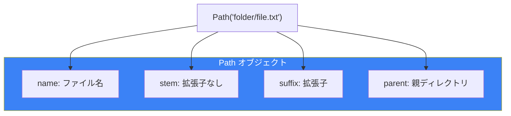
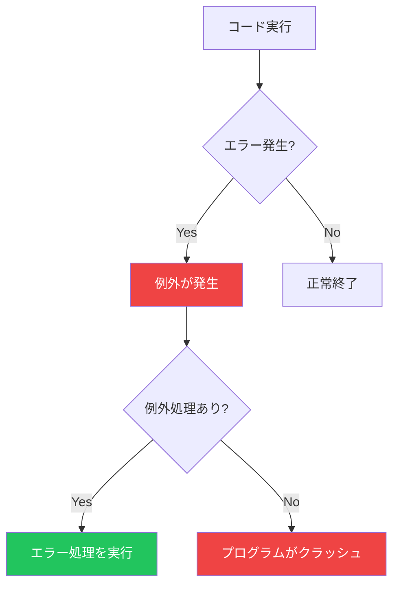

# Day 8: ファイル操作と例外処理

## 今日学ぶこと

- ファイルの読み書き
- with文（コンテキストマネージャ）
- 様々なファイル形式（テキスト、CSV、JSON）
- 例外処理（try-except）
- カスタム例外

---

## ファイルの基本操作

### ファイルを開く

```python
# 基本的な書き方
file = open('example.txt', 'r')  # 読み取りモードで開く
content = file.read()
file.close()  # 必ず閉じる

# with文を使う（推奨）
with open('example.txt', 'r') as file:
    content = file.read()
# 自動的にファイルが閉じられる
```

### ファイルモード

| モード | 説明 |
|--------|------|
| `'r'` | 読み取り（デフォルト） |
| `'w'` | 書き込み（上書き） |
| `'a'` | 追記 |
| `'x'` | 新規作成（存在するとエラー） |
| `'b'` | バイナリモード |
| `'t'` | テキストモード（デフォルト） |
| `'+'` | 読み書き両方 |

```python
# 組み合わせ例
'rb'   # バイナリ読み取り
'w+'   # 読み書き（上書き）
'ab'   # バイナリ追記
```

---

## テキストファイルの読み書き

### ファイルの読み取り

```python
# 全体を読み込む
with open('example.txt', 'r', encoding='utf-8') as f:
    content = f.read()
    print(content)

# 1行ずつ読み込む
with open('example.txt', 'r', encoding='utf-8') as f:
    for line in f:
        print(line.strip())  # 改行を除去

# リストとして読み込む
with open('example.txt', 'r', encoding='utf-8') as f:
    lines = f.readlines()
    print(lines)

# 指定バイト数を読み込む
with open('example.txt', 'r', encoding='utf-8') as f:
    chunk = f.read(100)  # 最初の100文字
```

### ファイルへの書き込み

```python
# 新規作成または上書き
with open('output.txt', 'w', encoding='utf-8') as f:
    f.write('Hello, World!\n')
    f.write('Python is great!\n')

# 複数行を一度に書き込む
lines = ['Line 1\n', 'Line 2\n', 'Line 3\n']
with open('output.txt', 'w', encoding='utf-8') as f:
    f.writelines(lines)

# 追記
with open('output.txt', 'a', encoding='utf-8') as f:
    f.write('追加の行\n')
```

---

## パス操作（pathlib）

Python 3.4以降で推奨されるパス操作モジュールです。

```python
from pathlib import Path

# パスの作成
path = Path('folder') / 'subfolder' / 'file.txt'
print(path)  # folder/subfolder/file.txt

# 現在のディレクトリ
current = Path.cwd()
print(current)

# ホームディレクトリ
home = Path.home()
print(home)

# パスの情報
p = Path('example.txt')
print(p.name)      # example.txt
print(p.stem)      # example
print(p.suffix)    # .txt
print(p.parent)    # .
print(p.exists())  # True/False
print(p.is_file()) # True/False
print(p.is_dir())  # True/False

# ディレクトリの作成
Path('new_folder').mkdir(exist_ok=True)
Path('a/b/c').mkdir(parents=True, exist_ok=True)

# ファイルの一覧
for file in Path('.').glob('*.py'):
    print(file)

# 再帰的に検索
for file in Path('.').rglob('*.txt'):
    print(file)
```



---

## CSVファイルの操作

### csv モジュール

```python
import csv

# CSVの読み込み
with open('data.csv', 'r', encoding='utf-8') as f:
    reader = csv.reader(f)
    for row in reader:
        print(row)  # リストとして取得

# 辞書として読み込む
with open('data.csv', 'r', encoding='utf-8') as f:
    reader = csv.DictReader(f)
    for row in reader:
        print(row)  # {'column1': 'value1', ...}

# CSVの書き込み
data = [
    ['Name', 'Age', 'City'],
    ['Taro', 25, 'Tokyo'],
    ['Hanako', 30, 'Osaka']
]

with open('output.csv', 'w', newline='', encoding='utf-8') as f:
    writer = csv.writer(f)
    writer.writerows(data)

# 辞書から書き込む
data = [
    {'Name': 'Taro', 'Age': 25, 'City': 'Tokyo'},
    {'Name': 'Hanako', 'Age': 30, 'City': 'Osaka'}
]

with open('output.csv', 'w', newline='', encoding='utf-8') as f:
    fieldnames = ['Name', 'Age', 'City']
    writer = csv.DictWriter(f, fieldnames=fieldnames)
    writer.writeheader()
    writer.writerows(data)
```

---

## JSONファイルの操作

```python
import json

# JSONの読み込み
with open('data.json', 'r', encoding='utf-8') as f:
    data = json.load(f)
    print(data)

# JSONの書き込み
data = {
    'name': 'Taro',
    'age': 25,
    'hobbies': ['読書', 'プログラミング']
}

with open('output.json', 'w', encoding='utf-8') as f:
    json.dump(data, f, ensure_ascii=False, indent=2)
```

---

## 例外処理

### 例外とは？

プログラム実行中に発生するエラーを「例外」と呼びます。



### try-except の基本

```python
try:
    result = 10 / 0
except ZeroDivisionError:
    print("ゼロで割ることはできません")

# プログラムは続行される
print("処理を続けます")
```

### 複数の例外をキャッチ

```python
try:
    num = int(input("数値を入力: "))
    result = 10 / num
except ValueError:
    print("有効な数値を入力してください")
except ZeroDivisionError:
    print("ゼロで割ることはできません")

# まとめてキャッチ
try:
    # 何らかの処理
    pass
except (ValueError, TypeError) as e:
    print(f"エラー: {e}")
```

### else と finally

```python
try:
    result = 10 / 2
except ZeroDivisionError:
    print("ゼロ除算エラー")
else:
    # 例外が発生しなかった場合に実行
    print(f"結果: {result}")
finally:
    # 常に実行される（クリーンアップ処理など）
    print("処理完了")
```

### よく使う組み込み例外

| 例外 | 説明 |
|------|------|
| `ValueError` | 値が不正 |
| `TypeError` | 型が不正 |
| `KeyError` | 辞書のキーが存在しない |
| `IndexError` | インデックスが範囲外 |
| `FileNotFoundError` | ファイルが見つからない |
| `ZeroDivisionError` | ゼロ除算 |
| `AttributeError` | 属性が存在しない |
| `ImportError` | インポートに失敗 |

### 例外を発生させる

```python
def validate_age(age):
    if age < 0:
        raise ValueError("年齢は0以上でなければなりません")
    if age > 150:
        raise ValueError("年齢が不正です")
    return age

try:
    validate_age(-5)
except ValueError as e:
    print(f"エラー: {e}")
```

---

## カスタム例外

独自の例外クラスを作成できます：

```python
class ValidationError(Exception):
    """バリデーションエラー"""
    pass

class InsufficientFundsError(Exception):
    """残高不足エラー"""
    def __init__(self, balance, amount):
        self.balance = balance
        self.amount = amount
        message = f"残高{balance}円では{amount}円を引き出せません"
        super().__init__(message)

class BankAccount:
    def __init__(self, balance):
        self.balance = balance

    def withdraw(self, amount):
        if amount > self.balance:
            raise InsufficientFundsError(self.balance, amount)
        self.balance -= amount
        return amount

# 使用例
account = BankAccount(1000)
try:
    account.withdraw(1500)
except InsufficientFundsError as e:
    print(f"エラー: {e}")
    print(f"現在の残高: {e.balance}円")
```

---

## ファイル操作のベストプラクティス

### エラー処理付きファイル読み込み

```python
from pathlib import Path

def read_file_safely(filepath):
    """安全にファイルを読み込む"""
    path = Path(filepath)

    if not path.exists():
        print(f"ファイルが見つかりません: {filepath}")
        return None

    if not path.is_file():
        print(f"ファイルではありません: {filepath}")
        return None

    try:
        with open(path, 'r', encoding='utf-8') as f:
            return f.read()
    except PermissionError:
        print(f"ファイルを読み取る権限がありません: {filepath}")
        return None
    except UnicodeDecodeError:
        print(f"ファイルのエンコーディングが不正です: {filepath}")
        return None

# 使用例
content = read_file_safely('example.txt')
if content:
    print(content)
```

### 一時ファイルの使用

```python
import tempfile

# 一時ファイルを作成
with tempfile.NamedTemporaryFile(mode='w', delete=False, suffix='.txt') as f:
    f.write('一時データ')
    temp_path = f.name

print(f"一時ファイル: {temp_path}")

# 一時ディレクトリを作成
with tempfile.TemporaryDirectory() as tmpdir:
    print(f"一時ディレクトリ: {tmpdir}")
    # ディレクトリ内で作業
# ブロックを抜けると自動削除
```

---

## まとめ

| 概念 | 説明 | 例 |
|------|------|-----|
| **open()** | ファイルを開く | `open('file.txt', 'r')` |
| **with文** | 自動クローズ | `with open(...) as f:` |
| **pathlib** | パス操作 | `Path('folder') / 'file'` |
| **try-except** | 例外処理 | `try: ... except: ...` |
| **raise** | 例外を発生 | `raise ValueError("...")` |

### 重要ポイント

1. ファイルは必ず `with` 文で開く
2. エンコーディングは明示的に指定する（`utf-8`）
3. ファイル操作は例外処理で囲む
4. `pathlib` でパス操作を行う
5. カスタム例外で意味のあるエラーメッセージを提供

---

## 練習問題

### 問題1: 基本
テキストファイルを読み込み、各行の文字数を表示するプログラムを書いてください。

### 問題2: CSV操作
以下の形式のCSVファイルを読み込み、合計点と平均点を計算するプログラムを書いてください：
```
Name,Math,English,Science
Taro,80,75,90
Hanako,95,88,85
```

### チャレンジ問題
設定ファイル（JSON形式）を読み込み、設定が見つからない場合はデフォルト値を使用する関数を作成してください。ファイルが存在しない場合やJSONが不正な場合は適切に例外処理してください。

---

## 参考リンク

- [Python公式ドキュメント - ファイル入出力](https://docs.python.org/ja/3/tutorial/inputoutput.html#reading-and-writing-files)
- [Python公式ドキュメント - pathlib](https://docs.python.org/ja/3/library/pathlib.html)
- [Python公式ドキュメント - 例外処理](https://docs.python.org/ja/3/tutorial/errors.html)

---

**次回予告**: Day 9では「標準ライブラリ活用」について学びます。より便利なモジュールを使いこなしましょう！
