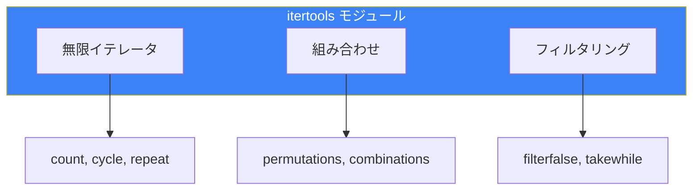

# Day 9: 標準ライブラリ活用

## 今日学ぶこと

- collections モジュール
- itertools モジュール
- functools モジュール
- re（正規表現）モジュール
- logging モジュール
- argparse モジュール

---

## collections モジュール

高度なデータ構造を提供するモジュールです。

### Counter

要素の出現回数をカウント：

```python
from collections import Counter

# 文字列のカウント
text = "hello world"
counter = Counter(text)
print(counter)  # Counter({'l': 3, 'o': 2, 'h': 1, ...})

# リストのカウント
words = ['apple', 'banana', 'apple', 'cherry', 'banana', 'apple']
word_count = Counter(words)
print(word_count)  # Counter({'apple': 3, 'banana': 2, 'cherry': 1})

# 最も多い要素
print(word_count.most_common(2))  # [('apple', 3), ('banana', 2)]

# 加算
counter1 = Counter(['a', 'b', 'a'])
counter2 = Counter(['a', 'c'])
print(counter1 + counter2)  # Counter({'a': 3, 'b': 1, 'c': 1})
```

### defaultdict

存在しないキーにデフォルト値を設定：

```python
from collections import defaultdict

# リストをデフォルト値に
groups = defaultdict(list)
students = [
    ('A', 'Taro'),
    ('B', 'Hanako'),
    ('A', 'Jiro'),
    ('B', 'Yuki')
]

for group, name in students:
    groups[group].append(name)

print(dict(groups))  # {'A': ['Taro', 'Jiro'], 'B': ['Hanako', 'Yuki']}

# intをデフォルト値に（カウンター）
counter = defaultdict(int)
for word in ['apple', 'banana', 'apple']:
    counter[word] += 1
print(dict(counter))  # {'apple': 2, 'banana': 1}
```

### namedtuple

名前付きタプル：

```python
from collections import namedtuple

# 定義
Point = namedtuple('Point', ['x', 'y'])
Person = namedtuple('Person', 'name age city')

# 作成
p = Point(3, 4)
print(p.x, p.y)  # 3 4

person = Person('Taro', 25, 'Tokyo')
print(person.name)  # Taro

# タプルとしても使える
print(p[0], p[1])  # 3 4

# アンパック
x, y = p
print(x, y)  # 3 4
```

### deque

両端キュー（効率的な追加・削除）：

```python
from collections import deque

# 作成
d = deque([1, 2, 3])

# 両端に追加・削除
d.append(4)        # 右に追加: [1, 2, 3, 4]
d.appendleft(0)    # 左に追加: [0, 1, 2, 3, 4]
d.pop()            # 右から削除: 4
d.popleft()        # 左から削除: 0

# 最大サイズを指定（古い要素は自動削除）
d = deque(maxlen=3)
d.extend([1, 2, 3, 4, 5])
print(d)  # deque([3, 4, 5], maxlen=3)

# ローテーション
d = deque([1, 2, 3, 4, 5])
d.rotate(2)   # 右に回転: [4, 5, 1, 2, 3]
d.rotate(-2)  # 左に回転: [1, 2, 3, 4, 5]
```

---

## itertools モジュール

イテレータを効率的に操作するツール群です。



### 組み合わせ

```python
from itertools import permutations, combinations, product

# 順列（並び替え）
items = ['A', 'B', 'C']
perms = list(permutations(items, 2))
print(perms)  # [('A', 'B'), ('A', 'C'), ('B', 'A'), ('B', 'C'), ...]

# 組み合わせ（順序を考慮しない）
combs = list(combinations(items, 2))
print(combs)  # [('A', 'B'), ('A', 'C'), ('B', 'C')]

# 直積（全ての組み合わせ）
colors = ['red', 'blue']
sizes = ['S', 'M', 'L']
prod = list(product(colors, sizes))
print(prod)  # [('red', 'S'), ('red', 'M'), ..., ('blue', 'L')]
```

### チェーンとグループ化

```python
from itertools import chain, groupby

# 複数のイテラブルを連結
list1 = [1, 2, 3]
list2 = [4, 5, 6]
chained = list(chain(list1, list2))
print(chained)  # [1, 2, 3, 4, 5, 6]

# グループ化（事前にソートが必要）
data = [
    ('A', 1), ('A', 2), ('B', 3), ('B', 4), ('A', 5)
]
data.sort(key=lambda x: x[0])  # ソート

for key, group in groupby(data, key=lambda x: x[0]):
    print(key, list(group))
# A [('A', 1), ('A', 2), ('A', 5)]
# B [('B', 3), ('B', 4)]
```

### 累積と圧縮

```python
from itertools import accumulate, compress

# 累積和
numbers = [1, 2, 3, 4, 5]
acc = list(accumulate(numbers))
print(acc)  # [1, 3, 6, 10, 15]

# 累積積
import operator
acc_prod = list(accumulate(numbers, operator.mul))
print(acc_prod)  # [1, 2, 6, 24, 120]

# フィルタリング
data = ['a', 'b', 'c', 'd']
selectors = [True, False, True, False]
result = list(compress(data, selectors))
print(result)  # ['a', 'c']
```

---

## functools モジュール

関数操作のためのツール群です。

### reduce

リストを単一の値に畳み込み：

```python
from functools import reduce

# 合計
numbers = [1, 2, 3, 4, 5]
total = reduce(lambda x, y: x + y, numbers)
print(total)  # 15

# 最大値を見つける
max_val = reduce(lambda x, y: x if x > y else y, numbers)
print(max_val)  # 5

# 階乗
factorial = reduce(lambda x, y: x * y, range(1, 6))
print(factorial)  # 120
```

### lru_cache

メモ化（結果のキャッシュ）：

```python
from functools import lru_cache

@lru_cache(maxsize=128)
def fibonacci(n):
    if n < 2:
        return n
    return fibonacci(n - 1) + fibonacci(n - 2)

print(fibonacci(100))  # 354224848179261915075

# キャッシュ情報
print(fibonacci.cache_info())
# CacheInfo(hits=98, misses=101, maxsize=128, currsize=101)

# キャッシュをクリア
fibonacci.cache_clear()
```

### partial

関数の一部の引数を固定：

```python
from functools import partial

def power(base, exponent):
    return base ** exponent

# 2乗を計算する関数
square = partial(power, exponent=2)
print(square(5))  # 25

# 3乗を計算する関数
cube = partial(power, exponent=3)
print(cube(5))  # 125
```

---

## re（正規表現）モジュール

パターンマッチングのための強力なツールです。

### 基本的な使い方

```python
import re

text = "私の電話番号は 090-1234-5678 です。"

# パターン検索
pattern = r'\d{3}-\d{4}-\d{4}'
match = re.search(pattern, text)
if match:
    print(match.group())  # 090-1234-5678

# すべてのマッチを検索
text = "連絡先: 090-1234-5678, 080-9876-5432"
matches = re.findall(pattern, text)
print(matches)  # ['090-1234-5678', '080-9876-5432']
```

### よく使うパターン

| パターン | 意味 |
|----------|------|
| `\d` | 数字 |
| `\w` | 英数字とアンダースコア |
| `\s` | 空白文字 |
| `.` | 任意の1文字 |
| `*` | 0回以上の繰り返し |
| `+` | 1回以上の繰り返し |
| `?` | 0回または1回 |
| `{n}` | n回の繰り返し |
| `^` | 行頭 |
| `$` | 行末 |

### 置換と分割

```python
import re

# 置換
text = "Hello World"
result = re.sub(r'World', 'Python', text)
print(result)  # Hello Python

# 複数置換
text = "2024-01-15"
result = re.sub(r'-', '/', text)
print(result)  # 2024/01/15

# 分割
text = "apple,banana;cherry:date"
parts = re.split(r'[,;:]', text)
print(parts)  # ['apple', 'banana', 'cherry', 'date']
```

### グループ化

```python
import re

text = "Name: Taro, Age: 25"
pattern = r'Name: (\w+), Age: (\d+)'
match = re.search(pattern, text)

if match:
    print(match.group(0))  # Name: Taro, Age: 25
    print(match.group(1))  # Taro
    print(match.group(2))  # 25
    print(match.groups())  # ('Taro', '25')

# 名前付きグループ
pattern = r'Name: (?P<name>\w+), Age: (?P<age>\d+)'
match = re.search(pattern, text)
if match:
    print(match.group('name'))  # Taro
    print(match.group('age'))   # 25
```

---

## logging モジュール

アプリケーションのログを管理します。

```python
import logging

# 基本設定
logging.basicConfig(
    level=logging.DEBUG,
    format='%(asctime)s - %(levelname)s - %(message)s'
)

# ログ出力
logging.debug('デバッグ情報')
logging.info('情報メッセージ')
logging.warning('警告メッセージ')
logging.error('エラーメッセージ')
logging.critical('重大なエラー')
```

### ログレベル

| レベル | 数値 | 用途 |
|--------|------|------|
| DEBUG | 10 | 詳細な診断情報 |
| INFO | 20 | 一般的な情報 |
| WARNING | 30 | 警告（デフォルト） |
| ERROR | 40 | エラー |
| CRITICAL | 50 | 致命的なエラー |

### ファイルへのログ出力

```python
import logging

# ファイルとコンソールの両方に出力
logging.basicConfig(
    level=logging.INFO,
    format='%(asctime)s - %(name)s - %(levelname)s - %(message)s',
    handlers=[
        logging.FileHandler('app.log', encoding='utf-8'),
        logging.StreamHandler()
    ]
)

logger = logging.getLogger(__name__)
logger.info('アプリケーションが起動しました')
```

---

## argparse モジュール

コマンドライン引数を解析します。

```python
import argparse

# パーサーの作成
parser = argparse.ArgumentParser(description='サンプルプログラム')

# 引数の追加
parser.add_argument('filename', help='処理するファイル')
parser.add_argument('-o', '--output', help='出力ファイル', default='output.txt')
parser.add_argument('-v', '--verbose', action='store_true', help='詳細出力')
parser.add_argument('-n', '--number', type=int, default=10, help='処理数')

# 引数の解析
args = parser.parse_args()

print(f"入力ファイル: {args.filename}")
print(f"出力ファイル: {args.output}")
print(f"詳細モード: {args.verbose}")
print(f"処理数: {args.number}")
```

使用例：
```bash
python script.py input.txt -o result.txt -v -n 20
```

---

## まとめ

| モジュール | 用途 | 主な機能 |
|------------|------|----------|
| **collections** | データ構造 | Counter, defaultdict, deque |
| **itertools** | イテレータ操作 | permutations, combinations |
| **functools** | 関数操作 | reduce, lru_cache, partial |
| **re** | 正規表現 | search, findall, sub |
| **logging** | ログ管理 | debug, info, error |
| **argparse** | CLI引数解析 | add_argument, parse_args |

### 重要ポイント

1. `Counter` で要素のカウントが簡単に
2. `defaultdict` でキーの存在チェックが不要に
3. `lru_cache` で再帰関数を高速化
4. 正規表現で複雑なパターンマッチング
5. `logging` で `print` より適切なログ管理

---

## 練習問題

### 問題1: Counter
テキストファイルを読み込み、最も頻出する単語トップ10を表示するプログラムを書いてください。

### 問題2: 正規表現
メールアドレスを含むテキストから、すべてのメールアドレスを抽出するプログラムを書いてください。

### チャレンジ問題
`argparse` を使って、以下の機能を持つCLIツールを作成してください：
- ファイル名を引数として受け取る
- `--count` オプションで単語数をカウント
- `--lines` オプションで行数をカウント
- `--search` オプションで指定した単語を検索

---

## 参考リンク

- [Python公式ドキュメント - collections](https://docs.python.org/ja/3/library/collections.html)
- [Python公式ドキュメント - itertools](https://docs.python.org/ja/3/library/itertools.html)
- [Python公式ドキュメント - re](https://docs.python.org/ja/3/library/re.html)
- [Python公式ドキュメント - logging](https://docs.python.org/ja/3/library/logging.html)

---

**次回予告**: Day 10では「実践プロジェクト」に取り組みます。これまで学んだ知識を統合して、実用的なプログラムを作りましょう！
