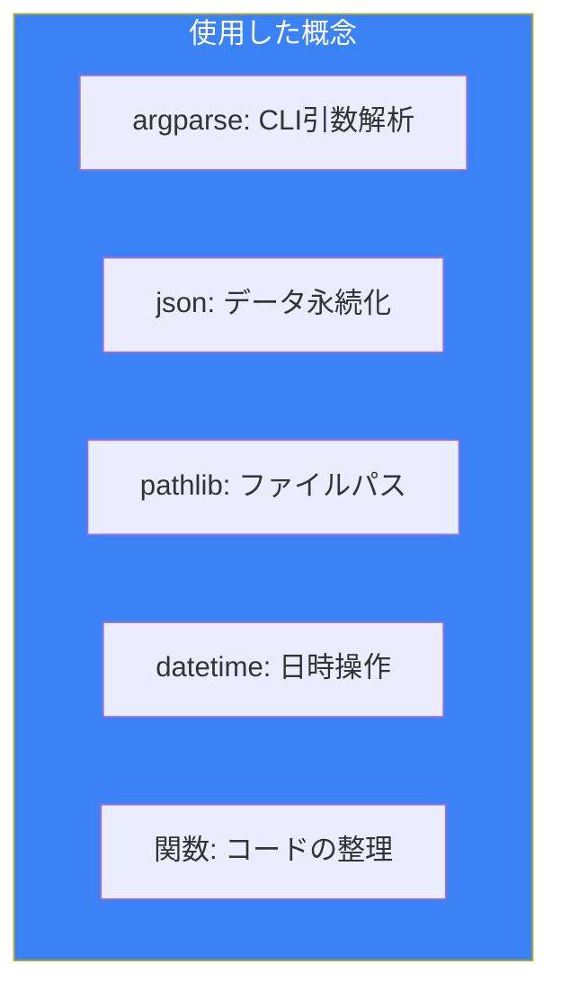
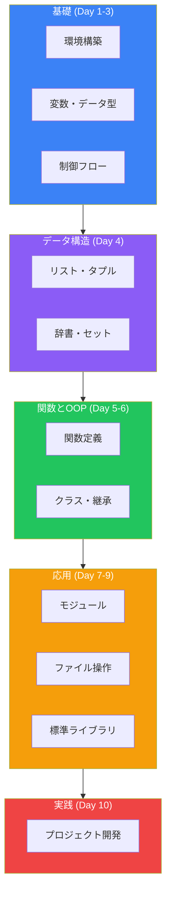

# Day 10: 実践プロジェクト

## 今日学ぶこと

最終日は、これまで学んだ知識を活用して実践的なプロジェクトに取り組みます。

- プロジェクト1: TODOアプリ（CLI）
- プロジェクト2: 天気情報取得ツール
- 次のステップへのガイド

---

## プロジェクト1: TODOアプリ（CLI）

シンプルなコマンドラインTODOアプリを作成します。

### 機能要件

- タスクの追加
- タスクの一覧表示
- タスクの完了マーク
- タスクの削除
- データの永続化（JSON）

### 完成コード

```python
#!/usr/bin/env python3
"""
シンプルなTODOアプリ
使い方: python todo.py [コマンド] [引数]
"""

import json
import argparse
from pathlib import Path
from datetime import datetime

# データファイルのパス
TODO_FILE = Path.home() / '.todo.json'

def load_todos():
    """TODOリストを読み込む"""
    if not TODO_FILE.exists():
        return []
    try:
        with open(TODO_FILE, 'r', encoding='utf-8') as f:
            return json.load(f)
    except json.JSONDecodeError:
        return []

def save_todos(todos):
    """TODOリストを保存する"""
    with open(TODO_FILE, 'w', encoding='utf-8') as f:
        json.dump(todos, f, ensure_ascii=False, indent=2)

def add_todo(title):
    """タスクを追加する"""
    todos = load_todos()
    todo = {
        'id': len(todos) + 1,
        'title': title,
        'done': False,
        'created_at': datetime.now().isoformat()
    }
    todos.append(todo)
    save_todos(todos)
    print(f"✅ タスクを追加しました: {title}")

def list_todos(show_all=False):
    """タスク一覧を表示する"""
    todos = load_todos()
    if not todos:
        print("📝 タスクはありません")
        return

    print("\n📋 TODOリスト:")
    print("-" * 50)
    for todo in todos:
        if not show_all and todo['done']:
            continue
        status = "✓" if todo['done'] else " "
        print(f"  [{status}] {todo['id']}. {todo['title']}")
    print("-" * 50)

def complete_todo(todo_id):
    """タスクを完了にする"""
    todos = load_todos()
    for todo in todos:
        if todo['id'] == todo_id:
            todo['done'] = True
            save_todos(todos)
            print(f"🎉 タスクを完了しました: {todo['title']}")
            return
    print(f"❌ タスクが見つかりません: ID {todo_id}")

def delete_todo(todo_id):
    """タスクを削除する"""
    todos = load_todos()
    for i, todo in enumerate(todos):
        if todo['id'] == todo_id:
            removed = todos.pop(i)
            save_todos(todos)
            print(f"🗑️ タスクを削除しました: {removed['title']}")
            return
    print(f"❌ タスクが見つかりません: ID {todo_id}")

def main():
    parser = argparse.ArgumentParser(description='シンプルなTODOアプリ')
    subparsers = parser.add_subparsers(dest='command', help='コマンド')

    # add コマンド
    add_parser = subparsers.add_parser('add', help='タスクを追加')
    add_parser.add_argument('title', help='タスクのタイトル')

    # list コマンド
    list_parser = subparsers.add_parser('list', help='タスク一覧')
    list_parser.add_argument('-a', '--all', action='store_true', help='完了済みも表示')

    # done コマンド
    done_parser = subparsers.add_parser('done', help='タスクを完了')
    done_parser.add_argument('id', type=int, help='タスクID')

    # delete コマンド
    delete_parser = subparsers.add_parser('delete', help='タスクを削除')
    delete_parser.add_argument('id', type=int, help='タスクID')

    args = parser.parse_args()

    if args.command == 'add':
        add_todo(args.title)
    elif args.command == 'list':
        list_todos(args.all)
    elif args.command == 'done':
        complete_todo(args.id)
    elif args.command == 'delete':
        delete_todo(args.id)
    else:
        parser.print_help()

if __name__ == '__main__':
    main()
```

### 使用方法

```bash
# タスクを追加
python todo.py add "Pythonを勉強する"
python todo.py add "買い物に行く"

# タスク一覧
python todo.py list
python todo.py list --all  # 完了済みも表示

# タスクを完了
python todo.py done 1

# タスクを削除
python todo.py delete 2
```

### 学習ポイント



---

## プロジェクト2: 天気情報取得ツール

Web APIを使って天気情報を取得するツールです。

### 機能要件

- 都市名から天気を取得
- 現在の気温と天気を表示
- エラーハンドリング

### 完成コード

```python
#!/usr/bin/env python3
"""
天気情報取得ツール
Open-Meteo APIを使用（APIキー不要）
"""

import argparse
import urllib.request
import urllib.error
import json
from dataclasses import dataclass

# 主要都市の座標
CITIES = {
    'tokyo': {'lat': 35.6762, 'lon': 139.6503, 'name': '東京'},
    'osaka': {'lat': 34.6937, 'lon': 135.5023, 'name': '大阪'},
    'nagoya': {'lat': 35.1815, 'lon': 136.9066, 'name': '名古屋'},
    'sapporo': {'lat': 43.0618, 'lon': 141.3545, 'name': '札幌'},
    'fukuoka': {'lat': 33.5904, 'lon': 130.4017, 'name': '福岡'},
    'new_york': {'lat': 40.7128, 'lon': -74.0060, 'name': 'ニューヨーク'},
    'london': {'lat': 51.5074, 'lon': -0.1278, 'name': 'ロンドン'},
    'paris': {'lat': 48.8566, 'lon': 2.3522, 'name': 'パリ'},
}

# 天気コードの説明
WEATHER_CODES = {
    0: '☀️ 快晴',
    1: '🌤️ 晴れ',
    2: '⛅ 曇りがち',
    3: '☁️ 曇り',
    45: '🌫️ 霧',
    48: '🌫️ 霧（氷晶）',
    51: '🌧️ 小雨',
    53: '🌧️ 雨',
    55: '🌧️ 強い雨',
    61: '🌧️ 弱い雨',
    63: '🌧️ 雨',
    65: '🌧️ 強い雨',
    71: '🌨️ 小雪',
    73: '🌨️ 雪',
    75: '🌨️ 大雪',
    80: '🌦️ にわか雨',
    81: '🌦️ にわか雨',
    82: '⛈️ 激しいにわか雨',
    95: '⛈️ 雷雨',
    96: '⛈️ 雷雨（雹）',
    99: '⛈️ 雷雨（激しい雹）',
}

@dataclass
class Weather:
    """天気情報を格納するクラス"""
    city: str
    temperature: float
    weather_code: int
    humidity: int
    wind_speed: float

    @property
    def weather_description(self):
        return WEATHER_CODES.get(self.weather_code, '不明')

    def __str__(self):
        return f"""
🌍 {self.city}の天気
━━━━━━━━━━━━━━━━━━━━━━━━
  天気: {self.weather_description}
  気温: {self.temperature}°C
  湿度: {self.humidity}%
  風速: {self.wind_speed} km/h
━━━━━━━━━━━━━━━━━━━━━━━━
"""

def fetch_weather(city_key):
    """天気情報を取得する"""
    if city_key not in CITIES:
        raise ValueError(f"未登録の都市: {city_key}")

    city = CITIES[city_key]
    url = (
        f"https://api.open-meteo.com/v1/forecast?"
        f"latitude={city['lat']}&longitude={city['lon']}"
        f"&current=temperature_2m,weather_code,relative_humidity_2m,wind_speed_10m"
    )

    try:
        with urllib.request.urlopen(url, timeout=10) as response:
            data = json.loads(response.read().decode())
    except urllib.error.URLError as e:
        raise ConnectionError(f"APIへの接続に失敗しました: {e}")
    except json.JSONDecodeError:
        raise ValueError("APIからの応答を解析できませんでした")

    current = data.get('current', {})
    return Weather(
        city=city['name'],
        temperature=current.get('temperature_2m', 0),
        weather_code=current.get('weather_code', 0),
        humidity=current.get('relative_humidity_2m', 0),
        wind_speed=current.get('wind_speed_10m', 0)
    )

def list_cities():
    """利用可能な都市を一覧表示"""
    print("\n📍 利用可能な都市:")
    print("-" * 30)
    for key, info in CITIES.items():
        print(f"  {key:12} : {info['name']}")
    print("-" * 30)

def main():
    parser = argparse.ArgumentParser(description='天気情報取得ツール')
    parser.add_argument('city', nargs='?', help='都市名（例: tokyo, osaka）')
    parser.add_argument('-l', '--list', action='store_true', help='利用可能な都市を一覧表示')

    args = parser.parse_args()

    if args.list:
        list_cities()
        return

    if not args.city:
        parser.print_help()
        list_cities()
        return

    city_key = args.city.lower()

    try:
        weather = fetch_weather(city_key)
        print(weather)
    except ValueError as e:
        print(f"❌ エラー: {e}")
        list_cities()
    except ConnectionError as e:
        print(f"❌ 接続エラー: {e}")
    except Exception as e:
        print(f"❌ 予期しないエラー: {e}")

if __name__ == '__main__':
    main()
```

### 使用方法

```bash
# 都市の天気を取得
python weather.py tokyo
python weather.py osaka
python weather.py london

# 利用可能な都市を一覧表示
python weather.py --list
```

### 学習ポイント

| 概念 | 使用場面 |
|------|----------|
| **urllib** | HTTPリクエスト |
| **dataclass** | データの構造化 |
| **例外処理** | エラーハンドリング |
| **辞書** | 都市データの管理 |
| **f文字列** | 出力フォーマット |

---

## プロジェクト拡張のアイデア

### TODOアプリの拡張

1. **優先度の追加**: high, medium, low の優先度
2. **期限の追加**: 締め切り日時を設定
3. **カテゴリ分け**: 仕事、個人、買い物などのタグ
4. **検索機能**: タイトルで検索
5. **エクスポート**: CSV/Markdown形式で出力

### 天気アプリの拡張

1. **週間予報**: 7日間の予報を表示
2. **複数都市の比較**: 一度に複数都市を表示
3. **グラフ表示**: 気温推移をテキストグラフで表示
4. **アラート機能**: 特定条件で通知
5. **キャッシュ**: APIリクエストの結果をキャッシュ

---

## 10日間の学習を終えて

おめでとうございます！10日間でPythonの基礎から実践まで学習しました。

### 学んだこと



---

## 次のステップ

### Web開発

```python
# Flaskの例
from flask import Flask
app = Flask(__name__)

@app.route('/')
def hello():
    return 'Hello, World!'
```

- **Flask**: 軽量Webフレームワーク
- **Django**: フルスタックWebフレームワーク
- **FastAPI**: 高速APIフレームワーク

### データ分析

```python
# pandasの例
import pandas as pd

df = pd.read_csv('data.csv')
print(df.describe())
```

- **pandas**: データ分析ライブラリ
- **NumPy**: 数値計算ライブラリ
- **Matplotlib**: グラフ描画ライブラリ

### 機械学習

```python
# scikit-learnの例
from sklearn.linear_model import LinearRegression

model = LinearRegression()
model.fit(X_train, y_train)
```

- **scikit-learn**: 機械学習ライブラリ
- **TensorFlow/PyTorch**: 深層学習フレームワーク

### 自動化

- **Selenium**: ブラウザ自動化
- **Beautiful Soup**: Webスクレイピング
- **Schedule**: タスクスケジューリング

---

## 学習リソース

### 公式ドキュメント

- [Python公式チュートリアル](https://docs.python.org/ja/3/tutorial/)
- [Python標準ライブラリ](https://docs.python.org/ja/3/library/)

### オンライン学習

- [Real Python](https://realpython.com/)
- [Python.org](https://www.python.org/about/gettingstarted/)

### 書籍

- 「Python Crash Course」- Eric Matthes
- 「Fluent Python」- Luciano Ramalho
- 「Effective Python」- Brett Slatkin

### コミュニティ

- [Python Japan](https://www.python.jp/)
- [Stack Overflow](https://stackoverflow.com/questions/tagged/python)
- [Reddit r/learnpython](https://www.reddit.com/r/learnpython/)

---

## まとめ

| Day | トピック | 習得スキル |
|-----|----------|-----------|
| 1 | Pythonへようこそ | 環境構築、Hello World |
| 2 | 変数とデータ型 | int, str, bool, 型変換 |
| 3 | 制御フロー | if, for, while |
| 4 | データ構造 | list, dict, set, tuple |
| 5 | 関数 | def, lambda, デコレータ |
| 6 | OOP | class, 継承, カプセル化 |
| 7 | モジュール | import, pip, venv |
| 8 | ファイル・例外 | open, try-except |
| 9 | 標準ライブラリ | collections, re, logging |
| 10 | 実践プロジェクト | アプリケーション開発 |

### 最後に

プログラミングは継続的な学習です。このコースで学んだ基礎をベースに、自分の興味のある分野を深掘りしてください。

**「100回読むより1回書け」**

コードを書き続けることが上達への近道です。失敗を恐れず、たくさんのプロジェクトに挑戦してください！

---

## 参考リンク

- [Python公式サイト](https://www.python.org/)
- [PyPI - Python Package Index](https://pypi.org/)
- [GitHub - Awesome Python](https://github.com/vinta/awesome-python)
- [Python Weekly](https://www.pythonweekly.com/)

---

**おめでとうございます！Pythonの基礎マスターコースを修了しました！** 🎉
