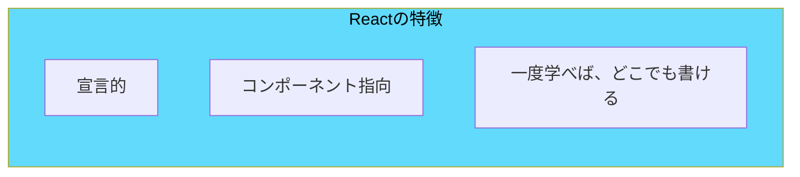
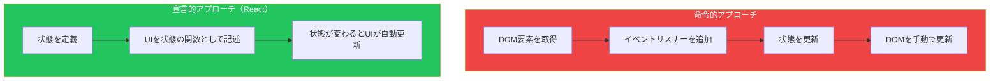
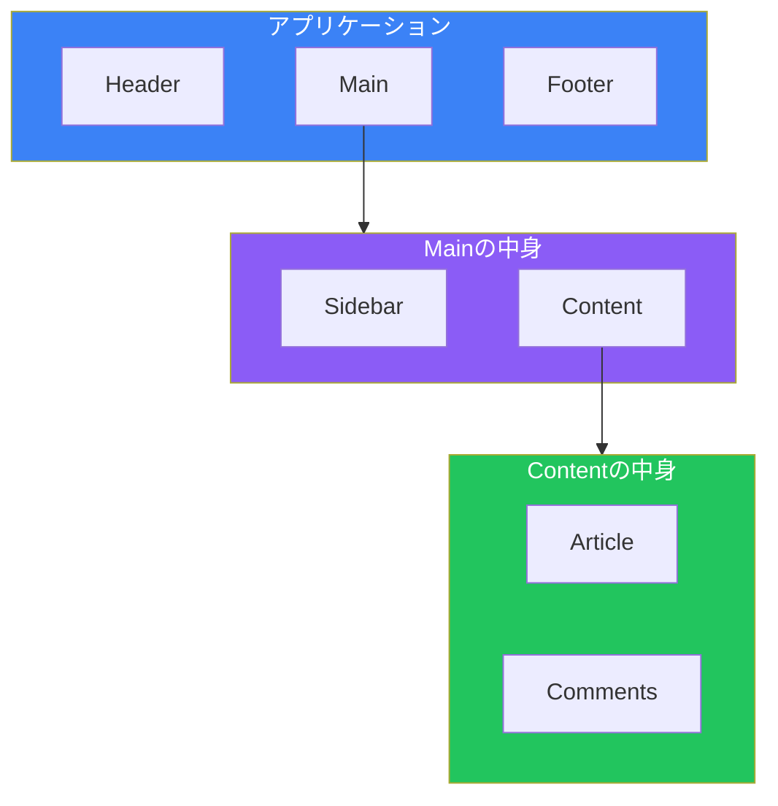

# Day 1: Reactへようこそ

## 今日学ぶこと

- Reactとは何か、そしてなぜ人気があるのか
- 命令的コードと宣言的コードの違い
- コンポーネント指向のメリット
- Viteを使った開発環境のセットアップ
- 最初のReactアプリケーションの作成

---

## Reactとは何か

**React**は、Facebookによって開発されたユーザーインターフェース（UI）を構築するためのJavaScriptライブラリです。2013年にオープンソースとして公開されて以来、世界中の開発者に愛用され、現在では最も人気のあるフロントエンドライブラリの一つとなっています。



### Reactが解決する問題

従来のJavaScriptでWebアプリケーションを構築する場合、DOM（Document Object Model）を直接操作する必要がありました。

```javascript
// 従来のJavaScript（命令的なコード）
const button = document.getElementById('counter-button');
const display = document.getElementById('counter-display');
let count = 0;

button.addEventListener('click', () => {
  count++;
  display.textContent = `カウント: ${count}`;
});
```

このアプローチには問題があります：

1. **複雑さ**: アプリケーションが大きくなると、どの要素がいつ更新されるか追跡が困難になる
2. **パフォーマンス**: DOM操作は遅く、不必要な更新を避けるのが難しい
3. **保守性**: コードが散らばり、再利用が難しい

Reactはこれらの問題を、**宣言的なアプローチ**と**仮想DOM**で解決します。

---

## 宣言的UIとは

プログラミングには「命令的」と「宣言的」という2つのスタイルがあります。

### 命令的（Imperative）

「どうやって」行うかを一つずつ指示します。

```javascript
// 命令的: 料理の作り方を一つずつ指示
// 1. 鍋を取り出す
// 2. 水を入れる
// 3. 火をつける
// 4. 沸騰したら麺を入れる
// 5. 3分待つ
// 6. 湯を切る
```

### 宣言的（Declarative）

「何が」欲しいかを伝えます。

```javascript
// 宣言的: 結果を伝える
// 「ラーメンをください」
```



Reactでは、UIがどのように見えるべきかを宣言的に記述します：

```jsx
// React（宣言的なコード）
function Counter() {
  const [count, setCount] = useState(0);

  return (
    <div>
      <p>カウント: {count}</p>
      <button onClick={() => setCount(count + 1)}>
        増やす
      </button>
    </div>
  );
}
```

状態（`count`）が変わると、Reactが自動的にUIを更新してくれます。開発者はDOMの更新を気にする必要がありません。

---

## コンポーネント指向

Reactの最大の特徴は**コンポーネント**です。コンポーネントとは、UIを独立した再利用可能な部品に分割したものです。



### コンポーネントのメリット

| メリット | 説明 |
|---------|------|
| **再利用性** | 一度作ったコンポーネントは何度でも使える |
| **保守性** | 各コンポーネントは独立しているため、変更の影響範囲が限定される |
| **テスト容易性** | 個々のコンポーネントを独立してテストできる |
| **チーム開発** | 複数の開発者が別々のコンポーネントを同時に開発できる |

```jsx
// ボタンコンポーネント - 再利用可能
function Button({ children, onClick }) {
  return (
    <button onClick={onClick} className="btn">
      {children}
    </button>
  );
}

// 様々な場所で再利用
<Button onClick={handleSave}>保存</Button>
<Button onClick={handleCancel}>キャンセル</Button>
<Button onClick={handleDelete}>削除</Button>
```

---

## 開発環境のセットアップ

Reactアプリケーションを開発するために、**Vite**（ヴィート）を使用します。Viteは高速なビルドツールで、React開発に最適です。

### 前提条件

- **Node.js** 18.0以上がインストールされていること

```bash
# Node.jsのバージョンを確認
node --version
```

### プロジェクトの作成

ターミナルで以下のコマンドを実行します：

```bash
# プロジェクトを作成
npm create vite@latest my-react-app -- --template react

# プロジェクトディレクトリに移動
cd my-react-app

# 依存関係をインストール
npm install

# 開発サーバーを起動
npm run dev
```

ブラウザで `http://localhost:5173` を開くと、Reactアプリケーションが表示されます。

### プロジェクト構造

```
my-react-app/
├── node_modules/     # 依存パッケージ
├── public/           # 静的ファイル
├── src/              # ソースコード
│   ├── App.jsx       # メインコンポーネント
│   ├── App.css       # スタイル
│   ├── main.jsx      # エントリーポイント
│   └── index.css     # グローバルスタイル
├── index.html        # HTMLテンプレート
├── package.json      # プロジェクト設定
└── vite.config.js    # Vite設定
```

---

## 最初のReactアプリケーション

`src/App.jsx` を開いて、以下のように書き換えてみましょう：

```jsx
function App() {
  return (
    <div>
      <h1>こんにちは、React！</h1>
      <p>これが私の最初のReactアプリです。</p>
    </div>
  );
}

export default App;
```

ファイルを保存すると、ブラウザが自動的に更新されます（ホットモジュールリプレースメント）。

### コードの解説

```jsx
// 1. App関数コンポーネントを定義
function App() {
  // 2. JSXを返す（HTMLに似た構文）
  return (
    <div>
      <h1>こんにちは、React！</h1>
      <p>これが私の最初のReactアプリです。</p>
    </div>
  );
}

// 3. コンポーネントをエクスポート
export default App;
```

### 動的な値を表示する

JSXでは、中括弧 `{}` を使ってJavaScriptの値を埋め込めます：

```jsx
function App() {
  const name = "太郎";
  const currentYear = new Date().getFullYear();

  return (
    <div>
      <h1>こんにちは、{name}さん！</h1>
      <p>現在は{currentYear}年です。</p>
    </div>
  );
}

export default App;
```

---

## 仮想DOMの仕組み

Reactが高速な理由の一つは**仮想DOM（Virtual DOM）**です。


仮想DOMは、実際のDOMの軽量なJavaScriptオブジェクトです。Reactは以下のステップでUIを更新します：

1. **状態変化**: アプリケーションの状態が変わる
2. **仮想DOM作成**: 新しい仮想DOMツリーを作成
3. **差分検出（Reconciliation）**: 前の仮想DOMと比較して、何が変わったかを特定
4. **最小限の更新**: 変更された部分のみを実際のDOMに適用

これにより、不必要なDOM操作を避け、パフォーマンスが向上します。

---

## まとめ

| 概念 | 説明 |
|------|------|
| **React** | UIを構築するためのJavaScriptライブラリ |
| **宣言的UI** | 「何が」欲しいかを記述し、「どうやって」はReactに任せる |
| **コンポーネント** | UIを独立した再利用可能な部品に分割 |
| **仮想DOM** | 実際のDOMの軽量コピーで、効率的な更新を実現 |
| **Vite** | 高速なReact開発環境を提供するビルドツール |

### 重要ポイント

1. Reactは**宣言的**にUIを記述できるため、コードの見通しが良くなる
2. **コンポーネント**により、UIを小さな部品に分割して管理できる
3. **仮想DOM**により、効率的なDOM更新が自動的に行われる
4. **Vite**を使えば、数分でReact開発を始められる

---

## 練習問題

### 問題1: 基本
Viteを使って新しいReactプロジェクトを作成し、`App.jsx`を編集して自分の名前と今日の日付を表示してください。

### 問題2: 応用
複数の情報を表示するコンポーネントを作成してください。以下の情報を含めてみましょう：
- 自己紹介（名前、趣味）
- 今日学んだこと
- Reactへの期待

### チャレンジ問題
JavaScriptの配列を使って、好きなプログラミング言語のリストを表示してください。

```jsx
const languages = ["JavaScript", "Python", "Go"];
```

ヒント: 配列の `map()` メソッドを使います（詳細はDay 2で学びます）。

---

## 参考リンク

- [React公式ドキュメント](https://react.dev/)
- [Vite公式ドキュメント](https://vitejs.dev/)
- [MDN - DOM入門](https://developer.mozilla.org/ja/docs/Web/API/Document_Object_Model/Introduction)

---

**次回予告**: Day 2では「JSXを理解する」について学びます。ReactでHTMLのような構文を書ける理由と、その詳細なルールを理解しましょう。
