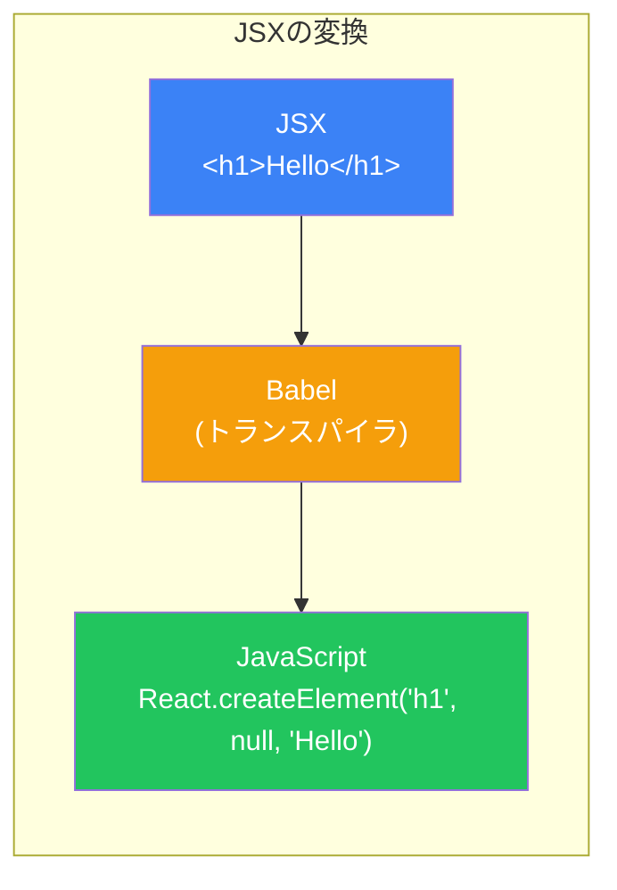
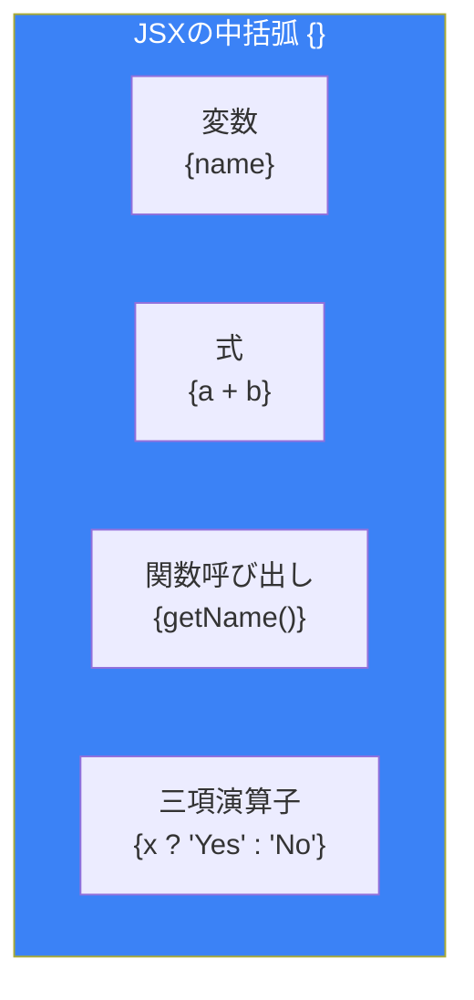
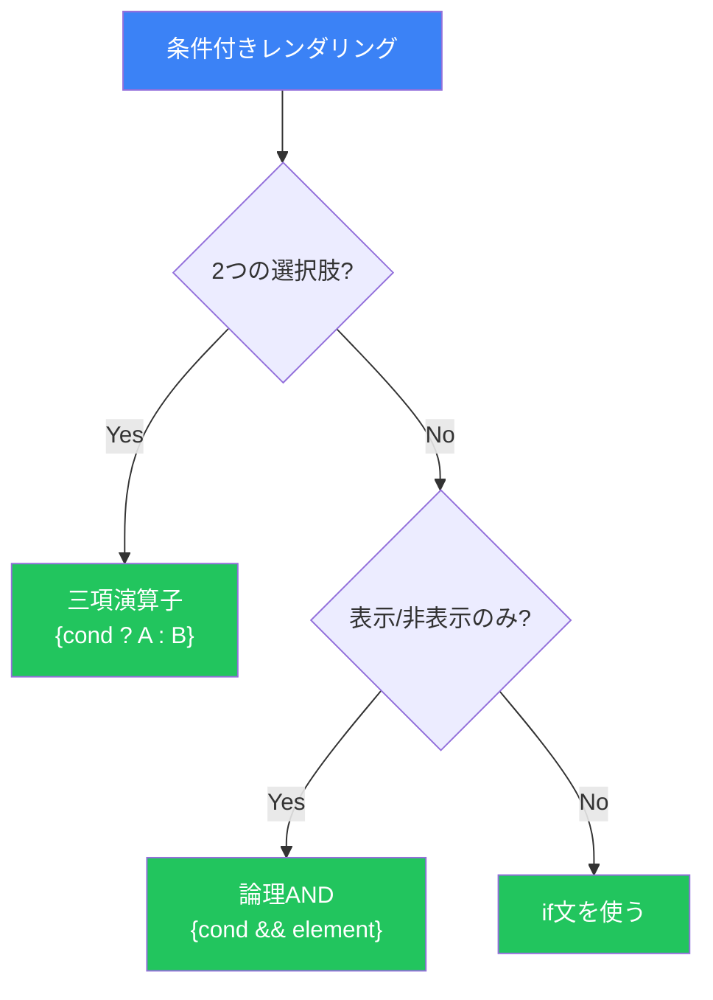
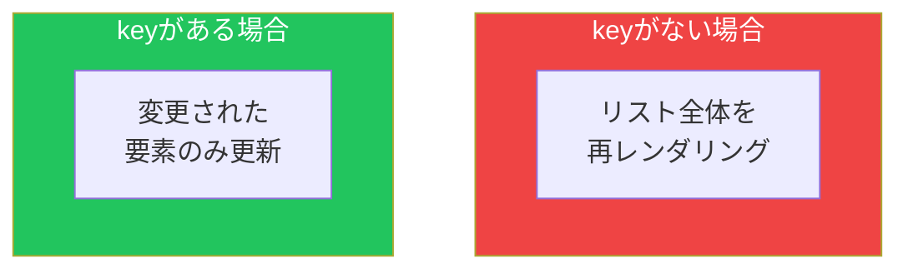

# Day 2: JSXを理解する

## 今日学ぶこと

- JSXとは何か、なぜ使うのか
- JSXの基本的な構文ルール
- 動的な値の埋め込み方
- 条件付きレンダリングの方法
- リストのレンダリングとkeyの重要性

---

## JSXとは何か

**JSX (JavaScript XML)** は、JavaScriptの拡張構文で、HTMLのような記法でReact要素を記述できます。

```jsx
// これがJSX
const element = <h1>Hello, World!</h1>;
```

これは文字列でもHTMLでもありません。JavaScriptのコードです。

### なぜJSXを使うのか

JSXを使わない場合、React要素は以下のように作成します：

```javascript
// JSXを使わない場合
const element = React.createElement(
  'h1',
  { className: 'greeting' },
  'Hello, World!'
);
```

```jsx
// JSXを使う場合
const element = <h1 className="greeting">Hello, World!</h1>;
```

JSXを使うメリット：

| メリット | 説明 |
|---------|------|
| **可読性** | HTMLに似た構文で直感的に理解できる |
| **簡潔さ** | `React.createElement`を何度も書く必要がない |
| **エラー検出** | コンパイル時にエラーを検出できる |
| **生産性** | UIの構造が一目でわかる |



---

## JSXの基本ルール

### ルール1: 単一のルート要素

JSXは必ず**単一のルート要素**を返す必要があります。

```jsx
// ❌ エラー: 複数のルート要素
function App() {
  return (
    <h1>タイトル</h1>
    <p>本文</p>
  );
}

// ✅ 正しい: divでラップ
function App() {
  return (
    <div>
      <h1>タイトル</h1>
      <p>本文</p>
    </div>
  );
}

// ✅ 正しい: Fragmentを使用
function App() {
  return (
    <>
      <h1>タイトル</h1>
      <p>本文</p>
    </>
  );
}
```

`<>...</>` は **Fragment** と呼ばれ、余分なDOM要素を追加せずに複数の要素をグループ化できます。

### ルール2: すべてのタグを閉じる

HTMLでは省略できる閉じタグも、JSXでは必須です。

```jsx
// ❌ HTMLでは動くがJSXではエラー

<input type="text">
<br>

// ✅ 正しい: 自己終了タグを使用

<input type="text" />
<br />
```

### ルール3: camelCaseで属性を指定

HTMLの属性名の多くは、JSXではcamelCaseになります。

```jsx
// HTML
<div class="container" onclick="handleClick()">
  <label for="name">名前</label>
</div>

// JSX
<div className="container" onClick={handleClick}>
  <label htmlFor="name">名前</label>
</div>
```

| HTML | JSX |
|------|-----|
| `class` | `className` |
| `for` | `htmlFor` |
| `onclick` | `onClick` |
| `onchange` | `onChange` |
| `tabindex` | `tabIndex` |

### ルール4: style属性はオブジェクトで指定

```jsx
// HTML
<div style="background-color: blue; font-size: 16px;">

// JSX - オブジェクトで指定、プロパティ名はcamelCase
<div style={{ backgroundColor: 'blue', fontSize: '16px' }}>
```

---

## 動的な値の埋め込み

JSXでは、中括弧 `{}` を使ってJavaScriptの式を埋め込めます。

### 変数の埋め込み

```jsx
function Greeting() {
  const name = "太郎";
  const age = 25;

  return (
    <div>
      <h1>こんにちは、{name}さん！</h1>
      <p>あなたは{age}歳です。</p>
    </div>
  );
}
```

### 式の埋め込み

```jsx
function Calculator() {
  const a = 10;
  const b = 20;

  return (
    <div>
      <p>{a} + {b} = {a + b}</p>
      <p>現在時刻: {new Date().toLocaleTimeString()}</p>
      <p>大文字: {"hello".toUpperCase()}</p>
    </div>
  );
}
```

### 属性への埋め込み

```jsx
function Avatar() {
  const user = {
    name: "太郎",
    imageUrl: "/images/taro.jpg"
  };

  return (
    
  );
}
```



---

## 条件付きレンダリング

UIの一部を条件によって表示/非表示にする方法は複数あります。

### 方法1: if文を使う

```jsx
function Greeting({ isLoggedIn }) {
  if (isLoggedIn) {
    return <h1>おかえりなさい！</h1>;
  }
  return <h1>ログインしてください</h1>;
}
```

### 方法2: 三項演算子

```jsx
function Greeting({ isLoggedIn }) {
  return (
    <h1>
      {isLoggedIn ? 'おかえりなさい！' : 'ログインしてください'}
    </h1>
  );
}
```

### 方法3: 論理AND演算子

条件がtrueの場合のみ表示したいときに便利です。

```jsx
function Notification({ hasNewMessage }) {
  return (
    <div>
      <h1>ダッシュボード</h1>
      {hasNewMessage && <p>新しいメッセージがあります！</p>}
    </div>
  );
}
```

### 使い分けの指針



| 方法 | 使いどころ |
|------|-----------|
| if文 | 複雑な条件分岐、コンポーネント全体を切り替える場合 |
| 三項演算子 | 2つの選択肢から1つを選ぶ場合 |
| 論理AND | 条件がtrueのときだけ表示する場合 |

---

## リストのレンダリング

配列のデータを表示するには、`map()` メソッドを使います。

### 基本的な使い方

```jsx
function FruitList() {
  const fruits = ['りんご', 'バナナ', 'オレンジ'];

  return (
    <ul>
      {fruits.map((fruit) => (
        <li>{fruit}</li>
      ))}
    </ul>
  );
}
```

### keyの重要性

上のコードを実行すると、コンソールに警告が表示されます：

> Warning: Each child in a list should have a unique "key" prop.

**key**は、Reactがリスト内の要素を識別するために使用する特別な属性です。

```jsx
function FruitList() {
  const fruits = ['りんご', 'バナナ', 'オレンジ'];

  return (
    <ul>
      {fruits.map((fruit, index) => (
        <li key={index}>{fruit}</li>
      ))}
    </ul>
  );
}
```

### なぜkeyが必要なのか



keyがないと、Reactはリストのどの要素が変更されたか特定できず、リスト全体を再レンダリングします。keyがあれば、変更された要素のみを効率的に更新できます。

### keyのベストプラクティス

```jsx
// ✅ 推奨: ユニークなIDを使用
function TodoList({ todos }) {
  return (
    <ul>
      {todos.map((todo) => (
        <li key={todo.id}>{todo.text}</li>
      ))}
    </ul>
  );
}

// ⚠️ 注意: indexはリストが変化しない場合のみ
function StaticList() {
  const items = ['A', 'B', 'C'];
  return (
    <ul>
      {items.map((item, index) => (
        <li key={index}>{item}</li>
      ))}
    </ul>
  );
}

// ❌ 避ける: ランダムな値
function BadList() {
  const items = ['A', 'B', 'C'];
  return (
    <ul>
      {items.map((item) => (
        <li key={Math.random()}>{item}</li>  // 毎回異なるkeyになる
      ))}
    </ul>
  );
}
```

---

## オブジェクトの配列をレンダリング

実際のアプリケーションでは、オブジェクトの配列を扱うことが多いです。

```jsx
function UserList() {
  const users = [
    { id: 1, name: '太郎', email: 'taro@example.com' },
    { id: 2, name: '花子', email: 'hanako@example.com' },
    { id: 3, name: '次郎', email: 'jiro@example.com' },
  ];

  return (
    <div>
      <h2>ユーザー一覧</h2>
      <ul>
        {users.map((user) => (
          <li key={user.id}>
            <strong>{user.name}</strong> - {user.email}
          </li>
        ))}
      </ul>
    </div>
  );
}
```

### 別のコンポーネントに分離

リストアイテムが複雑な場合は、別のコンポーネントに分離します。

```jsx
// UserCard コンポーネント
function UserCard({ user }) {
  return (
    <div className="user-card">
      <h3>{user.name}</h3>
      <p>{user.email}</p>
    </div>
  );
}

// UserList コンポーネント
function UserList() {
  const users = [
    { id: 1, name: '太郎', email: 'taro@example.com' },
    { id: 2, name: '花子', email: 'hanako@example.com' },
  ];

  return (
    <div>
      {users.map((user) => (
        <UserCard key={user.id} user={user} />
      ))}
    </div>
  );
}
```

---

## まとめ

| 概念 | 説明 |
|------|------|
| **JSX** | JavaScriptでHTMLライクな構文を書ける拡張 |
| **Fragment** | `<>...</>`で余分なDOMなしに要素をグループ化 |
| **中括弧 {}** | JSX内でJavaScriptの式を埋め込む |
| **条件付きレンダリング** | 三項演算子や論理ANDで条件表示 |
| **key** | リスト内の要素を一意に識別する属性 |

### 重要ポイント

1. JSXは**単一のルート要素**を返す必要がある
2. すべてのタグは**閉じる**必要がある
3. HTML属性は**camelCase**で書く（`className`, `onClick`など）
4. 中括弧 `{}` で**JavaScriptの式**を埋め込める
5. リストには必ず**一意のkey**を指定する

---

## 練習問題

### 問題1: 基本
以下の情報を表示するコンポーネントを作成してください：
- 名前（変数から）
- 現在の年齢と、来年の年齢（計算して表示）

### 問題2: 条件付きレンダリング
`isOnline` というpropsを受け取り、オンラインなら緑色の「オンライン」、オフラインなら灰色の「オフライン」と表示するStatusIndicatorコンポーネントを作成してください。

### チャレンジ問題
以下の商品データを表示するProductListコンポーネントを作成してください。在庫がない商品は「売り切れ」と表示してください。

```jsx
const products = [
  { id: 1, name: 'ノートPC', price: 120000, inStock: true },
  { id: 2, name: 'マウス', price: 3000, inStock: true },
  { id: 3, name: 'キーボード', price: 15000, inStock: false },
];
```

---

## 参考リンク

- [React公式 - JSXの導入](https://ja.react.dev/learn/writing-markup-with-jsx)
- [React公式 - 条件付きレンダリング](https://ja.react.dev/learn/conditional-rendering)
- [React公式 - リストのレンダリング](https://ja.react.dev/learn/rendering-lists)

---

**次回予告**: Day 3では「コンポーネントとProps」について学びます。コンポーネント間でデータを受け渡す方法を理解しましょう。
