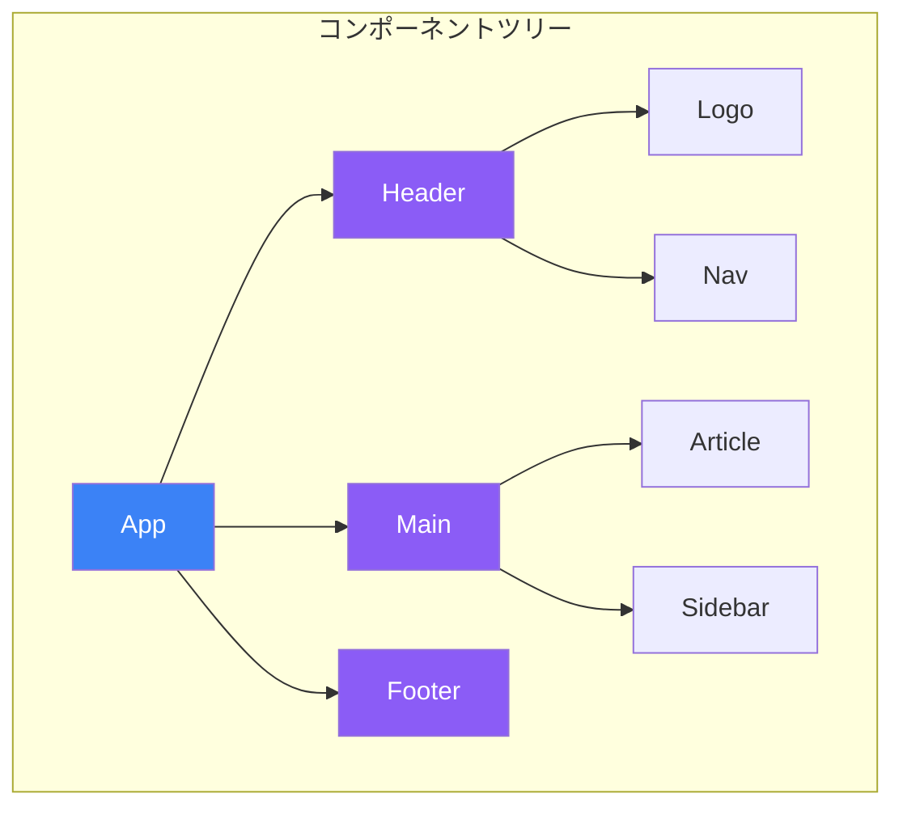
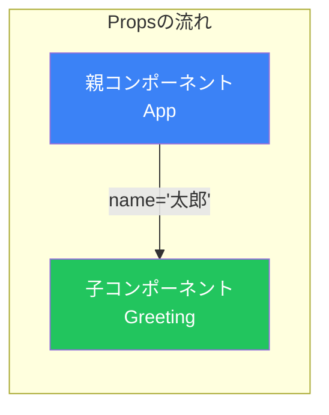
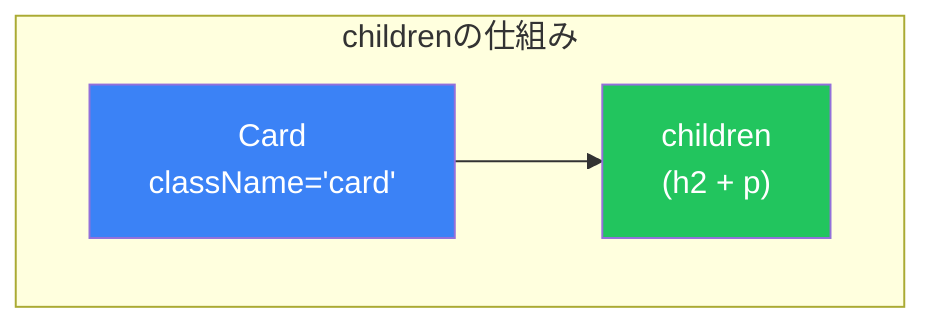
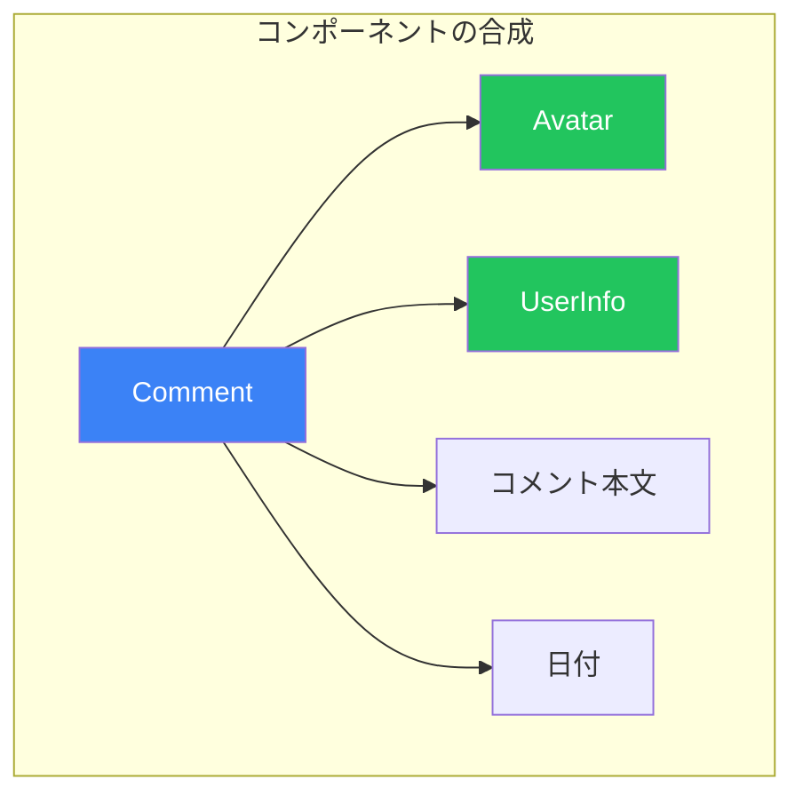

# Day 3: コンポーネントとProps

## 今日学ぶこと

- コンポーネントの作成と構成方法
- Propsを使ったデータの受け渡し
- childrenプロパティの活用
- コンポーネント分割の指針
- デフォルトPropsの設定

---

## コンポーネントとは

コンポーネントは、UIを独立した再利用可能な部品に分割したものです。ReactアプリケーションはコンポーネントのツリーとしてUI構築されます。



### コンポーネントの作成

Reactでは、関数を使ってコンポーネントを作成します。

```jsx
// シンプルなコンポーネント
function Welcome() {
  return <h1>ようこそ！</h1>;
}

// コンポーネントを使用
function App() {
  return (
    <div>
      <Welcome />
      <Welcome />
      <Welcome />
    </div>
  );
}
```

### コンポーネントの命名規則

| ルール | 説明 |
|-------|------|
| **大文字で始める** | `Welcome`、`UserCard`（小文字はHTMLタグと解釈される） |
| **PascalCase** | 複数単語は `UserProfileCard` のように |
| **意味のある名前** | 機能を表す名前をつける |

---

## Propsとは

**Props (Properties)** は、親コンポーネントから子コンポーネントへデータを渡す仕組みです。



### Propsの基本的な使い方

```jsx
// 子コンポーネント - propsを受け取る
function Greeting(props) {
  return <h1>こんにちは、{props.name}さん！</h1>;
}

// 親コンポーネント - propsを渡す
function App() {
  return (
    <div>
      <Greeting name="太郎" />
      <Greeting name="花子" />
      <Greeting name="次郎" />
    </div>
  );
}
```

### 分割代入でPropsを受け取る

より簡潔に書くために、分割代入を使用します。

```jsx
// 分割代入を使用
function Greeting({ name }) {
  return <h1>こんにちは、{name}さん！</h1>;
}

// 複数のpropsを受け取る
function UserCard({ name, age, email }) {
  return (
    <div className="user-card">
      <h2>{name}</h2>
      <p>年齢: {age}歳</p>
      <p>メール: {email}</p>
    </div>
  );
}

// 使用例
<UserCard name="太郎" age={25} email="taro@example.com" />
```

### Propsの型

Propsには様々な型の値を渡せます。

```jsx
function Example({
  text,        // 文字列
  count,       // 数値
  isActive,    // 真偽値
  items,       // 配列
  user,        // オブジェクト
  onClick,     // 関数
}) {
  return (
    <div>
      <p>{text}</p>
      <p>カウント: {count}</p>
      <p>状態: {isActive ? 'アクティブ' : '非アクティブ'}</p>
      <ul>
        {items.map((item, i) => <li key={i}>{item}</li>)}
      </ul>
      <p>ユーザー: {user.name}</p>
      <button onClick={onClick}>クリック</button>
    </div>
  );
}

// 使用例
<Example
  text="こんにちは"
  count={42}
  isActive={true}
  items={['A', 'B', 'C']}
  user={{ name: '太郎', age: 25 }}
  onClick={() => alert('クリックされました')}
/>
```

---

## childrenプロパティ

`children`は特別なpropsで、コンポーネントの開始タグと終了タグの間に配置された内容を受け取ります。

```jsx
// Cardコンポーネント
function Card({ children }) {
  return (
    <div className="card">
      {children}
    </div>
  );
}

// 使用例
function App() {
  return (
    <Card>
      <h2>タイトル</h2>
      <p>これはカードの内容です。</p>
    </Card>
  );
}
```



### childrenの活用例

```jsx
// レイアウトコンポーネント
function PageLayout({ children }) {
  return (
    <div className="page">
      <header>ヘッダー</header>
      <main>{children}</main>
      <footer>フッター</footer>
    </div>
  );
}

// ボタンコンポーネント
function Button({ children, onClick }) {
  return (
    <button className="btn" onClick={onClick}>
      {children}
    </button>
  );
}

// 使用例
<PageLayout>
  <h1>ようこそ</h1>
  <Button onClick={() => alert('クリック')}>
    詳しく見る
  </Button>
</PageLayout>
```

---

## コンポーネントの合成

小さなコンポーネントを組み合わせて、複雑なUIを構築します。

```jsx
// アバターコンポーネント
function Avatar({ src, alt }) {
  return ;
}

// ユーザー情報コンポーネント
function UserInfo({ name, title }) {
  return (
    <div className="user-info">
      <p className="name">{name}</p>
      <p className="title">{title}</p>
    </div>
  );
}

// コメントコンポーネント（合成）
function Comment({ author, text, date }) {
  return (
    <div className="comment">
      <Avatar src={author.avatarUrl} alt={author.name} />
      <UserInfo name={author.name} title={author.title} />
      <p className="comment-text">{text}</p>
      <p className="comment-date">{date}</p>
    </div>
  );
}
```



---

## コンポーネント分割の指針

### いつコンポーネントを分割すべきか

| 指標 | 説明 |
|------|------|
| **再利用性** | 同じUIが複数箇所で使われる |
| **複雑さ** | コンポーネントが大きくなりすぎている |
| **責任の分離** | 異なる関心事が混在している |
| **テスト容易性** | 独立してテストしたい部分がある |

### 例: 分割前と分割後

```jsx
// ❌ 分割前: 1つのコンポーネントに詰め込みすぎ
function ProductPage() {
  return (
    <div>
      <header>
        
        <nav>
          <a href="/">ホーム</a>
          <a href="/products">商品</a>
        </nav>
      </header>
      <main>
        <div className="product">
          
          <h1>商品名</h1>
          <p>¥1,000</p>
          <button>カートに追加</button>
        </div>
        <div className="reviews">
          <h2>レビュー</h2>
          {/* レビューリスト */}
        </div>
      </main>
      <footer>© 2024</footer>
    </div>
  );
}
```

```jsx
// ✅ 分割後: 責任ごとにコンポーネントを分離
function Logo() {
  return ;
}

function Navigation() {
  return (
    <nav>
      <a href="/">ホーム</a>
      <a href="/products">商品</a>
    </nav>
  );
}

function Header() {
  return (
    <header>
      <Logo />
      <Navigation />
    </header>
  );
}

function ProductDetail({ product }) {
  return (
    <div className="product">
      
      <h1>{product.name}</h1>
      <p>¥{product.price}</p>
      <button>カートに追加</button>
    </div>
  );
}

function ReviewList({ reviews }) {
  return (
    <div className="reviews">
      <h2>レビュー</h2>
      {reviews.map(review => (
        <ReviewItem key={review.id} review={review} />
      ))}
    </div>
  );
}

function Footer() {
  return <footer>© 2024</footer>;
}

function ProductPage({ product, reviews }) {
  return (
    <div>
      <Header />
      <main>
        <ProductDetail product={product} />
        <ReviewList reviews={reviews} />
      </main>
      <Footer />
    </div>
  );
}
```

---

## デフォルトProps

propsにデフォルト値を設定できます。

```jsx
// 方法1: デフォルト引数を使用（推奨）
function Button({ text = 'クリック', color = 'blue' }) {
  return (
    <button style={{ backgroundColor: color }}>
      {text}
    </button>
  );
}

// 使用例
<Button />                    // デフォルト値が使われる
<Button text="送信" />        // textのみ上書き
<Button color="red" />        // colorのみ上書き
<Button text="削除" color="red" />  // 両方上書き
```

```jsx
// 方法2: OR演算子を使用
function Greeting({ name }) {
  return <h1>こんにちは、{name || 'ゲスト'}さん！</h1>;
}

// 方法3: Nullish合体演算子を使用
function Counter({ count }) {
  return <p>カウント: {count ?? 0}</p>;
}
```

### デフォルト値の使い分け

| 方法 | 使いどころ |
|------|-----------|
| デフォルト引数 | 基本的にはこれを使う |
| OR演算子 `\|\|` | falsy値（0, ''など）もデフォルトにしたい場合 |
| Nullish合体 `??` | null/undefinedのみデフォルトにしたい場合 |

---

## Propsのスプレッド構文

オブジェクトのプロパティをpropsとして一括で渡せます。

```jsx
function UserProfile({ name, age, email, avatar }) {
  return (
    <div>
      
      <h2>{name}</h2>
      <p>{age}歳</p>
      <p>{email}</p>
    </div>
  );
}

// 通常の方法
const user = { name: '太郎', age: 25, email: 'taro@example.com', avatar: '/taro.jpg' };

<UserProfile
  name={user.name}
  age={user.age}
  email={user.email}
  avatar={user.avatar}
/>

// スプレッド構文を使用
<UserProfile {...user} />
```

### 一部のpropsを取り出す

```jsx
function Button({ children, className, ...rest }) {
  return (
    <button className={`btn ${className}`} {...rest}>
      {children}
    </button>
  );
}

// 使用例
<Button className="primary" onClick={handleClick} disabled={true}>
  送信
</Button>
```

---

## まとめ

| 概念 | 説明 |
|------|------|
| **コンポーネント** | UIを構成する独立した再利用可能な部品 |
| **Props** | 親から子へデータを渡す仕組み |
| **children** | タグ間のコンテンツを受け取る特別なprops |
| **コンポーネント合成** | 小さなコンポーネントを組み合わせてUIを構築 |
| **デフォルトProps** | propsの初期値を設定 |

### 重要ポイント

1. コンポーネント名は**大文字で始める**
2. Propsは**読み取り専用**（子コンポーネントで変更してはいけない）
3. `children`で**柔軟なコンポーネント**を作れる
4. コンポーネントは**小さく保つ**ことで保守性が向上
5. **デフォルト引数**でpropsの初期値を設定できる

---

## 練習問題

### 問題1: 基本
以下のpropsを受け取る`ProfileCard`コンポーネントを作成してください：
- name（名前）
- job（職業）
- bio（自己紹介文）

### 問題2: children
`Panel`コンポーネントを作成してください。タイトルとchildrenを受け取り、装飾されたパネルとして表示します。

```jsx
<Panel title="お知らせ">
  <p>明日は休業日です。</p>
</Panel>
```

### チャレンジ問題
以下の要件を満たす`ProductCard`コンポーネントを作成してください：
- 商品名、価格、画像URL、在庫数を受け取る
- 在庫がない場合は「売り切れ」バッジを表示
- 価格が10000円以上の場合は「高額商品」バッジを表示

---

## 参考リンク

- [React公式 - コンポーネントにpropsを渡す](https://ja.react.dev/learn/passing-props-to-a-component)
- [React公式 - childrenをpropsとして渡す](https://ja.react.dev/learn/passing-props-to-a-component#passing-jsx-as-children)

---

**次回予告**: Day 4では「Stateとイベント処理」について学びます。ユーザーの操作に反応するインタラクティブなUIを作成しましょう。
