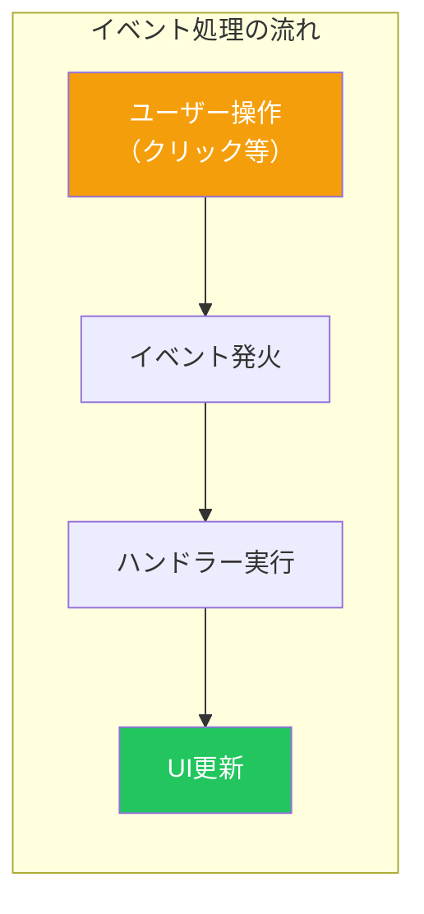
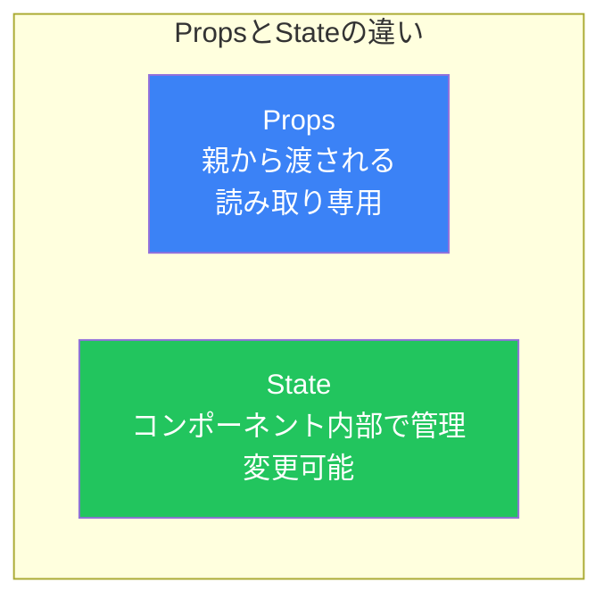
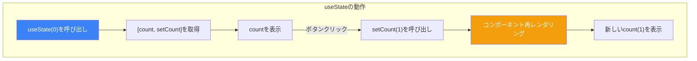
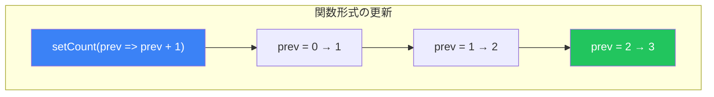
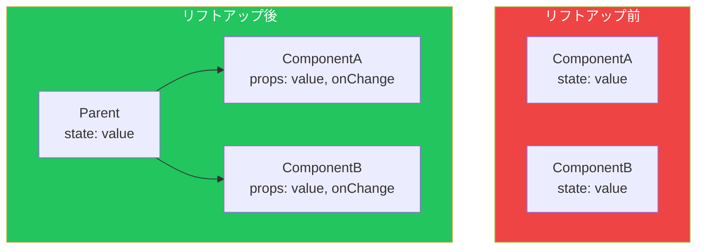

# Day 4: Stateとイベント処理

## 今日学ぶこと

- イベント処理の基本
- useStateフックの使い方
- State更新の仕組み
- 複数のStateの管理
- 前の値に基づくState更新

---

## イベント処理の基本

Reactでは、イベントハンドラーを使ってユーザーの操作に反応します。

### クリックイベント

```jsx
function Button() {
  function handleClick() {
    alert('クリックされました！');
  }

  return <button onClick={handleClick}>クリック</button>;
}
```

### イベントハンドラーの命名規則

| 命名パターン | 例 |
|------------|-----|
| `handle` + イベント名 | `handleClick`, `handleSubmit` |
| `on` + 動作 | `onSave`, `onDelete` |

```jsx
function Form() {
  function handleSubmit(event) {
    event.preventDefault();  // デフォルト動作を防ぐ
    console.log('フォームが送信されました');
  }

  function handleChange(event) {
    console.log('入力値:', event.target.value);
  }

  return (
    <form onSubmit={handleSubmit}>
      <input type="text" onChange={handleChange} />
      <button type="submit">送信</button>
    </form>
  );
}
```

### インラインイベントハンドラー

シンプルな処理の場合は、インラインで書くこともできます。

```jsx
// インラインで記述
<button onClick={() => alert('クリック！')}>クリック</button>

// 引数を渡す場合
<button onClick={() => handleDelete(id)}>削除</button>
```



---

## Stateとは

**State（状態）** は、コンポーネントが「記憶」できるデータです。Stateが変わると、Reactは自動的にUIを再レンダリングします。

### Propsとの違い



| 特徴 | Props | State |
|------|-------|-------|
| データの出所 | 親コンポーネント | コンポーネント自身 |
| 変更可否 | 読み取り専用 | 変更可能 |
| 用途 | 設定、データの受け渡し | 動的なデータの管理 |

---

## useStateフック

`useState`は、関数コンポーネントにStateを追加するためのフックです。

### 基本的な使い方

```jsx
import { useState } from 'react';

function Counter() {
  // [現在の値, 更新関数] = useState(初期値)
  const [count, setCount] = useState(0);

  return (
    <div>
      <p>カウント: {count}</p>
      <button onClick={() => setCount(count + 1)}>
        増やす
      </button>
    </div>
  );
}
```

### useStateの構造

```jsx
const [state, setState] = useState(initialValue);
```

| 要素 | 説明 |
|------|------|
| `state` | 現在のState値 |
| `setState` | Stateを更新する関数 |
| `initialValue` | Stateの初期値 |



### 様々な型のState

```jsx
function Examples() {
  // 数値
  const [count, setCount] = useState(0);

  // 文字列
  const [name, setName] = useState('');

  // 真偽値
  const [isVisible, setIsVisible] = useState(false);

  // 配列
  const [items, setItems] = useState([]);

  // オブジェクト
  const [user, setUser] = useState({ name: '', age: 0 });

  return (
    // ...
  );
}
```

---

## State更新の仕組み

### Stateの更新は非同期

State更新は即座には反映されません。Reactは複数の更新をまとめて処理します。

```jsx
function Counter() {
  const [count, setCount] = useState(0);

  function handleClick() {
    setCount(count + 1);
    console.log(count);  // まだ0が出力される！
  }

  return <button onClick={handleClick}>{count}</button>;
}
```

### バッチ処理

複数のState更新は、1回のレンダリングにまとめられます。

```jsx
function Example() {
  const [count, setCount] = useState(0);
  const [flag, setFlag] = useState(false);

  function handleClick() {
    setCount(count + 1);  // 更新をキューに追加
    setFlag(!flag);       // 更新をキューに追加
    // → 2回ではなく、1回だけ再レンダリング
  }

  return (
    // ...
  );
}
```

---

## 前の値に基づく更新

連続した更新では、関数形式を使う必要があります。

### 問題のあるコード

```jsx
function Counter() {
  const [count, setCount] = useState(0);

  function handleTripleClick() {
    // ❌ これは期待通りに動かない！
    setCount(count + 1);  // count = 0 → 1
    setCount(count + 1);  // count = 0 → 1（まだ0を参照）
    setCount(count + 1);  // count = 0 → 1（まだ0を参照）
    // 結果: 1 になる（3ではない）
  }

  return <button onClick={handleTripleClick}>{count}</button>;
}
```

### 正しいコード（関数形式）

```jsx
function Counter() {
  const [count, setCount] = useState(0);

  function handleTripleClick() {
    // ✅ 関数形式を使う
    setCount(prev => prev + 1);  // 0 → 1
    setCount(prev => prev + 1);  // 1 → 2
    setCount(prev => prev + 1);  // 2 → 3
    // 結果: 3 になる
  }

  return <button onClick={handleTripleClick}>{count}</button>;
}
```



### 使い分けの指針

| 状況 | 使用する形式 |
|------|------------|
| 単純な代入 | `setState(newValue)` |
| 前の値に基づく更新 | `setState(prev => ...)` |
| トグル操作 | `setState(prev => !prev)` |

---

## 複数のStateを管理

### 独立したState

関連のないデータは、別々のStateで管理します。

```jsx
function UserForm() {
  const [name, setName] = useState('');
  const [age, setAge] = useState(0);
  const [email, setEmail] = useState('');

  return (
    <form>
      <input
        value={name}
        onChange={(e) => setName(e.target.value)}
        placeholder="名前"
      />
      <input
        type="number"
        value={age}
        onChange={(e) => setAge(Number(e.target.value))}
        placeholder="年齢"
      />
      <input
        type="email"
        value={email}
        onChange={(e) => setEmail(e.target.value)}
        placeholder="メール"
      />
    </form>
  );
}
```

### オブジェクトのState

関連するデータは、オブジェクトとしてまとめることもできます。

```jsx
function UserForm() {
  const [user, setUser] = useState({
    name: '',
    age: 0,
    email: ''
  });

  function handleChange(field, value) {
    setUser(prev => ({
      ...prev,        // 既存のプロパティをコピー
      [field]: value  // 指定したフィールドを更新
    }));
  }

  return (
    <form>
      <input
        value={user.name}
        onChange={(e) => handleChange('name', e.target.value)}
        placeholder="名前"
      />
      <input
        type="number"
        value={user.age}
        onChange={(e) => handleChange('age', Number(e.target.value))}
        placeholder="年齢"
      />
      <input
        type="email"
        value={user.email}
        onChange={(e) => handleChange('email', e.target.value)}
        placeholder="メール"
      />
    </form>
  );
}
```

### 配列のState

```jsx
function TodoList() {
  const [todos, setTodos] = useState([]);
  const [input, setInput] = useState('');

  // 追加
  function addTodo() {
    if (input.trim()) {
      setTodos(prev => [...prev, { id: Date.now(), text: input }]);
      setInput('');
    }
  }

  // 削除
  function removeTodo(id) {
    setTodos(prev => prev.filter(todo => todo.id !== id));
  }

  // 更新
  function updateTodo(id, newText) {
    setTodos(prev => prev.map(todo =>
      todo.id === id ? { ...todo, text: newText } : todo
    ));
  }

  return (
    <div>
      <input
        value={input}
        onChange={(e) => setInput(e.target.value)}
        placeholder="新しいタスク"
      />
      <button onClick={addTodo}>追加</button>
      <ul>
        {todos.map(todo => (
          <li key={todo.id}>
            {todo.text}
            <button onClick={() => removeTodo(todo.id)}>削除</button>
          </li>
        ))}
      </ul>
    </div>
  );
}
```

---

## Stateのリフトアップ

複数のコンポーネントでStateを共有する場合、共通の親コンポーネントにStateを移動します。



### 例: 温度変換器

```jsx
// 親コンポーネント - Stateを管理
function TemperatureConverter() {
  const [celsius, setCelsius] = useState(0);

  const fahrenheit = (celsius * 9/5) + 32;

  return (
    <div>
      <TemperatureInput
        label="摂氏"
        value={celsius}
        onChange={setCelsius}
      />
      <TemperatureInput
        label="華氏"
        value={fahrenheit}
        onChange={(f) => setCelsius((f - 32) * 5/9)}
      />
    </div>
  );
}

// 子コンポーネント - Stateを持たない
function TemperatureInput({ label, value, onChange }) {
  return (
    <label>
      {label}:
      <input
        type="number"
        value={value}
        onChange={(e) => onChange(Number(e.target.value))}
      />
    </label>
  );
}
```

---

## 派生State（Derived State）

Stateから計算できる値は、Stateとして保持せずに計算します。

```jsx
function ShoppingCart() {
  const [items, setItems] = useState([
    { id: 1, name: '商品A', price: 1000, quantity: 2 },
    { id: 2, name: '商品B', price: 500, quantity: 3 },
  ]);

  // ❌ 悪い例: 派生値をStateとして保持
  // const [total, setTotal] = useState(0);

  // ✅ 良い例: Stateから計算
  const total = items.reduce(
    (sum, item) => sum + item.price * item.quantity,
    0
  );

  const itemCount = items.reduce(
    (sum, item) => sum + item.quantity,
    0
  );

  return (
    <div>
      <p>商品数: {itemCount}</p>
      <p>合計: ¥{total}</p>
    </div>
  );
}
```

---

## まとめ

| 概念 | 説明 |
|------|------|
| **イベントハンドラー** | `onClick`などでユーザー操作に反応 |
| **useState** | コンポーネントにStateを追加するフック |
| **State更新** | `setState`を呼ぶと再レンダリングされる |
| **関数形式の更新** | 前の値に基づく更新は`prev => ...`を使う |
| **Stateのリフトアップ** | 共有Stateを親コンポーネントに移動 |

### 重要ポイント

1. Stateの更新は**非同期**で行われる
2. 前の値に基づく更新は**関数形式**を使う
3. オブジェクトや配列の更新は**スプレッド構文**で新しい参照を作る
4. 派生値は**計算**で求め、Stateとして保持しない
5. 共有Stateは**リフトアップ**で親コンポーネントに移動

---

## 練習問題

### 問題1: 基本
カウンターコンポーネントを作成してください。「+1」「-1」「リセット」の3つのボタンを持ち、カウント値を表示します。

### 問題2: 応用
入力フォームを作成してください。名前を入力すると、リアルタイムで「こんにちは、{名前}さん！」と表示されます。名前が空の場合は「名前を入力してください」と表示します。

### チャレンジ問題
簡単なTodoリストを作成してください：
- テキスト入力で新しいTodoを追加
- 各Todoに削除ボタン
- 完了/未完了のトグル機能
- 未完了のTodo数を表示

---

## 参考リンク

- [React公式 - State: コンポーネントのメモリ](https://ja.react.dev/learn/state-a-components-memory)
- [React公式 - stateの更新](https://ja.react.dev/learn/updating-objects-in-state)
- [React公式 - コンポーネント間でstateを共有する](https://ja.react.dev/learn/sharing-state-between-components)

---

**次回予告**: Day 5では「フォームの処理」について学びます。制御コンポーネントと非制御コンポーネントの違いを理解しましょう。
