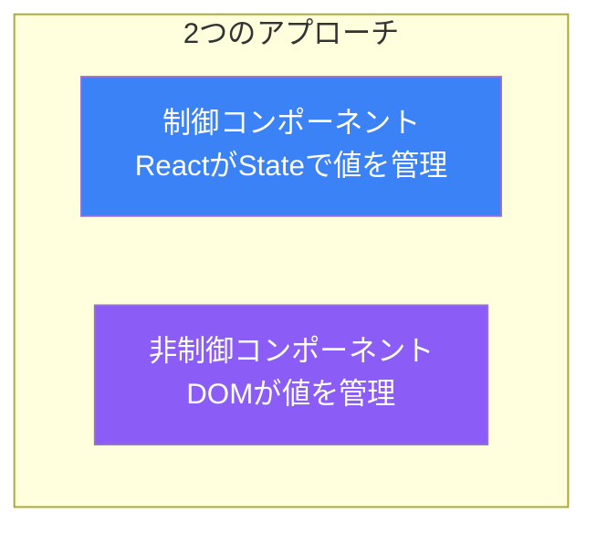
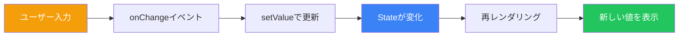
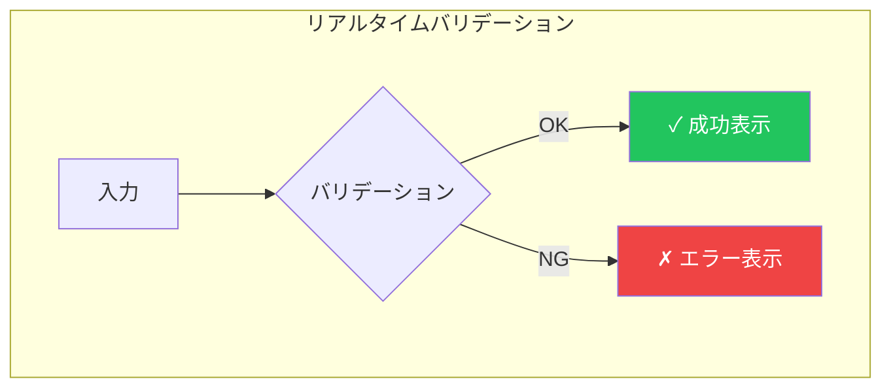
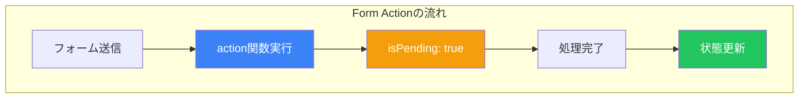

# Day 5: フォームの処理

## 今日学ぶこと

- 制御コンポーネントと非制御コンポーネントの違い
- フォーム入力の管理方法
- バリデーションの実装
- フォーム送信の処理
- React 19のForm Actions

---

## 制御コンポーネント vs 非制御コンポーネント

Reactでフォームを扱う方法は2つあります。



| 特徴 | 制御コンポーネント | 非制御コンポーネント |
|------|------------------|-------------------|
| 値の管理 | React State | DOM |
| 値の取得 | Stateから直接 | refで取得 |
| リアルタイム検証 | 簡単 | 難しい |
| 動的な変更 | 簡単 | 難しい |
| 実装量 | 多い | 少ない |

---

## 制御コンポーネント

制御コンポーネントでは、入力値をReactのStateで管理します。

### 基本的な制御コンポーネント

```jsx
import { useState } from 'react';

function ControlledInput() {
  const [value, setValue] = useState('');

  function handleChange(event) {
    setValue(event.target.value);
  }

  return (
    <input
      type="text"
      value={value}
      onChange={handleChange}
    />
  );
}
```

### 制御コンポーネントの流れ



### 様々な入力タイプ

```jsx
function FormExample() {
  const [text, setText] = useState('');
  const [number, setNumber] = useState(0);
  const [isChecked, setIsChecked] = useState(false);
  const [selected, setSelected] = useState('');
  const [description, setDescription] = useState('');

  return (
    <form>
      {/* テキスト入力 */}
      <input
        type="text"
        value={text}
        onChange={(e) => setText(e.target.value)}
      />

      {/* 数値入力 */}
      <input
        type="number"
        value={number}
        onChange={(e) => setNumber(Number(e.target.value))}
      />

      {/* チェックボックス */}
      <input
        type="checkbox"
        checked={isChecked}
        onChange={(e) => setIsChecked(e.target.checked)}
      />

      {/* セレクトボックス */}
      <select
        value={selected}
        onChange={(e) => setSelected(e.target.value)}
      >
        <option value="">選択してください</option>
        <option value="a">オプションA</option>
        <option value="b">オプションB</option>
      </select>

      {/* テキストエリア */}
      <textarea
        value={description}
        onChange={(e) => setDescription(e.target.value)}
      />
    </form>
  );
}
```

---

## 非制御コンポーネント

非制御コンポーネントでは、DOMが値を管理し、必要な時にrefで取得します。

```jsx
import { useRef } from 'react';

function UncontrolledInput() {
  const inputRef = useRef(null);

  function handleSubmit(event) {
    event.preventDefault();
    console.log('入力値:', inputRef.current.value);
  }

  return (
    <form onSubmit={handleSubmit}>
      <input type="text" ref={inputRef} />
      <button type="submit">送信</button>
    </form>
  );
}
```

### ファイル入力

ファイル入力は常に非制御コンポーネントです。

```jsx
function FileUpload() {
  const fileRef = useRef(null);

  function handleSubmit(event) {
    event.preventDefault();
    const file = fileRef.current.files[0];
    if (file) {
      console.log('ファイル名:', file.name);
      console.log('サイズ:', file.size);
    }
  }

  return (
    <form onSubmit={handleSubmit}>
      <input type="file" ref={fileRef} />
      <button type="submit">アップロード</button>
    </form>
  );
}
```

---

## フォームの実装例

### ログインフォーム

```jsx
function LoginForm() {
  const [formData, setFormData] = useState({
    email: '',
    password: ''
  });
  const [errors, setErrors] = useState({});

  function handleChange(event) {
    const { name, value } = event.target;
    setFormData(prev => ({
      ...prev,
      [name]: value
    }));
    // エラーをクリア
    if (errors[name]) {
      setErrors(prev => ({ ...prev, [name]: '' }));
    }
  }

  function validate() {
    const newErrors = {};

    if (!formData.email) {
      newErrors.email = 'メールアドレスは必須です';
    } else if (!/\S+@\S+\.\S+/.test(formData.email)) {
      newErrors.email = '有効なメールアドレスを入力してください';
    }

    if (!formData.password) {
      newErrors.password = 'パスワードは必須です';
    } else if (formData.password.length < 8) {
      newErrors.password = 'パスワードは8文字以上必要です';
    }

    setErrors(newErrors);
    return Object.keys(newErrors).length === 0;
  }

  function handleSubmit(event) {
    event.preventDefault();
    if (validate()) {
      console.log('送信:', formData);
    }
  }

  return (
    <form onSubmit={handleSubmit}>
      <div>
        <label htmlFor="email">メールアドレス</label>
        <input
          id="email"
          name="email"
          type="email"
          value={formData.email}
          onChange={handleChange}
        />
        {errors.email && <span className="error">{errors.email}</span>}
      </div>

      <div>
        <label htmlFor="password">パスワード</label>
        <input
          id="password"
          name="password"
          type="password"
          value={formData.password}
          onChange={handleChange}
        />
        {errors.password && <span className="error">{errors.password}</span>}
      </div>

      <button type="submit">ログイン</button>
    </form>
  );
}
```

---

## リアルタイムバリデーション

入力中にリアルタイムでバリデーションを行います。

```jsx
function RealtimeValidation() {
  const [username, setUsername] = useState('');
  const [touched, setTouched] = useState(false);

  // バリデーションロジック
  const isValid = username.length >= 3;
  const errorMessage = !isValid && touched
    ? 'ユーザー名は3文字以上必要です'
    : '';

  return (
    <div>
      <input
        type="text"
        value={username}
        onChange={(e) => setUsername(e.target.value)}
        onBlur={() => setTouched(true)}
        className={errorMessage ? 'error' : ''}
      />
      {errorMessage && <span className="error">{errorMessage}</span>}

      {/* 入力状態の表示 */}
      {username && (
        <span className={isValid ? 'valid' : 'invalid'}>
          {isValid ? '✓' : '✗'} {username.length}/3
        </span>
      )}
    </div>
  );
}
```



---

## 複数フィールドの管理

### カスタムフックで抽象化

```jsx
function useForm(initialValues) {
  const [values, setValues] = useState(initialValues);
  const [errors, setErrors] = useState({});
  const [touched, setTouched] = useState({});

  function handleChange(event) {
    const { name, value, type, checked } = event.target;
    setValues(prev => ({
      ...prev,
      [name]: type === 'checkbox' ? checked : value
    }));
  }

  function handleBlur(event) {
    const { name } = event.target;
    setTouched(prev => ({ ...prev, [name]: true }));
  }

  function reset() {
    setValues(initialValues);
    setErrors({});
    setTouched({});
  }

  return {
    values,
    errors,
    touched,
    handleChange,
    handleBlur,
    setErrors,
    reset
  };
}

// 使用例
function RegistrationForm() {
  const {
    values,
    errors,
    touched,
    handleChange,
    handleBlur,
    setErrors,
    reset
  } = useForm({
    name: '',
    email: '',
    password: '',
    confirmPassword: ''
  });

  function validate() {
    const newErrors = {};
    if (!values.name) newErrors.name = '名前は必須です';
    if (!values.email) newErrors.email = 'メールは必須です';
    if (values.password !== values.confirmPassword) {
      newErrors.confirmPassword = 'パスワードが一致しません';
    }
    return newErrors;
  }

  function handleSubmit(event) {
    event.preventDefault();
    const validationErrors = validate();
    if (Object.keys(validationErrors).length === 0) {
      console.log('送信:', values);
      reset();
    } else {
      setErrors(validationErrors);
    }
  }

  return (
    <form onSubmit={handleSubmit}>
      <input
        name="name"
        value={values.name}
        onChange={handleChange}
        onBlur={handleBlur}
        placeholder="名前"
      />
      {touched.name && errors.name && <span>{errors.name}</span>}

      <input
        name="email"
        type="email"
        value={values.email}
        onChange={handleChange}
        onBlur={handleBlur}
        placeholder="メール"
      />
      {touched.email && errors.email && <span>{errors.email}</span>}

      <input
        name="password"
        type="password"
        value={values.password}
        onChange={handleChange}
        placeholder="パスワード"
      />

      <input
        name="confirmPassword"
        type="password"
        value={values.confirmPassword}
        onChange={handleChange}
        placeholder="パスワード確認"
      />
      {errors.confirmPassword && <span>{errors.confirmPassword}</span>}

      <button type="submit">登録</button>
    </form>
  );
}
```

---

## React 19のForm Actions

React 19では、フォーム処理を簡素化する新しいAPIが導入されました。

### 基本的なForm Action

```jsx
function ContactForm() {
  async function submitAction(formData) {
    const name = formData.get('name');
    const email = formData.get('email');
    const message = formData.get('message');

    // サーバーに送信
    await fetch('/api/contact', {
      method: 'POST',
      body: JSON.stringify({ name, email, message })
    });
  }

  return (
    <form action={submitAction}>
      <input name="name" placeholder="名前" required />
      <input name="email" type="email" placeholder="メール" required />
      <textarea name="message" placeholder="メッセージ" required />
      <button type="submit">送信</button>
    </form>
  );
}
```

### useActionStateフック

フォームの状態を管理するためのフックです。

```jsx
import { useActionState } from 'react';

function FeedbackForm() {
  async function submitFeedback(prevState, formData) {
    const rating = formData.get('rating');
    const comment = formData.get('comment');

    try {
      await fetch('/api/feedback', {
        method: 'POST',
        body: JSON.stringify({ rating, comment })
      });
      return { success: true, message: 'フィードバックを送信しました' };
    } catch (error) {
      return { success: false, message: '送信に失敗しました' };
    }
  }

  const [state, formAction, isPending] = useActionState(
    submitFeedback,
    { success: false, message: '' }
  );

  return (
    <form action={formAction}>
      <select name="rating" required>
        <option value="">評価を選択</option>
        <option value="5">★★★★★</option>
        <option value="4">★★★★☆</option>
        <option value="3">★★★☆☆</option>
        <option value="2">★★☆☆☆</option>
        <option value="1">★☆☆☆☆</option>
      </select>

      <textarea name="comment" placeholder="コメント" />

      <button type="submit" disabled={isPending}>
        {isPending ? '送信中...' : '送信'}
      </button>

      {state.message && (
        <p className={state.success ? 'success' : 'error'}>
          {state.message}
        </p>
      )}
    </form>
  );
}
```



---

## 使い分けの指針

| シナリオ | 推奨アプローチ |
|---------|---------------|
| リアルタイムバリデーション | 制御コンポーネント |
| シンプルなフォーム | 非制御コンポーネント or Form Actions |
| 複雑なフォーム（多数のフィールド） | カスタムフック |
| サーバー送信が主目的 | Form Actions |
| ファイルアップロード | 非制御コンポーネント |

---

## まとめ

| 概念 | 説明 |
|------|------|
| **制御コンポーネント** | Stateで入力値を管理、リアルタイム制御が可能 |
| **非制御コンポーネント** | DOMが値を管理、シンプルな実装 |
| **バリデーション** | 入力値の検証、エラーメッセージの表示 |
| **Form Actions** | React 19の新API、フォーム処理を簡素化 |
| **useActionState** | フォーム状態と送信処理を管理 |

### 重要ポイント

1. **制御コンポーネント**はリアルタイム検証や動的変更に適している
2. **非制御コンポーネント**はシンプルな場合に使用
3. バリデーションは**touched状態**と組み合わせてUXを向上
4. 複雑なフォームは**カスタムフック**で抽象化
5. React 19の**Form Actions**でサーバー送信が簡潔に

---

## 練習問題

### 問題1: 基本
ユーザー登録フォームを作成してください：
- 名前（必須）
- メールアドレス（必須、形式チェック）
- 年齢（数値、18歳以上）
- 各フィールドにバリデーションエラーを表示

### 問題2: 応用
検索フォームを作成してください：
- 検索キーワード入力
- カテゴリ選択（セレクトボックス）
- 「新着のみ」チェックボックス
- 入力内容をリアルタイムでプレビュー表示

### チャレンジ問題
複数ステップのウィザードフォームを作成してください：
- ステップ1: 個人情報（名前、メール）
- ステップ2: アドレス情報（住所、電話番号）
- ステップ3: 確認画面
- 「次へ」「戻る」ボタンでナビゲーション

---

## 参考リンク

- [React公式 - フォーム](https://ja.react.dev/reference/react-dom/components/form)
- [React公式 - input](https://ja.react.dev/reference/react-dom/components/input)
- [React公式 - useActionState](https://ja.react.dev/reference/react/useActionState)

---

**次回予告**: Day 6では「副作用とuseEffect」について学びます。外部システムとの連携方法を理解しましょう。
