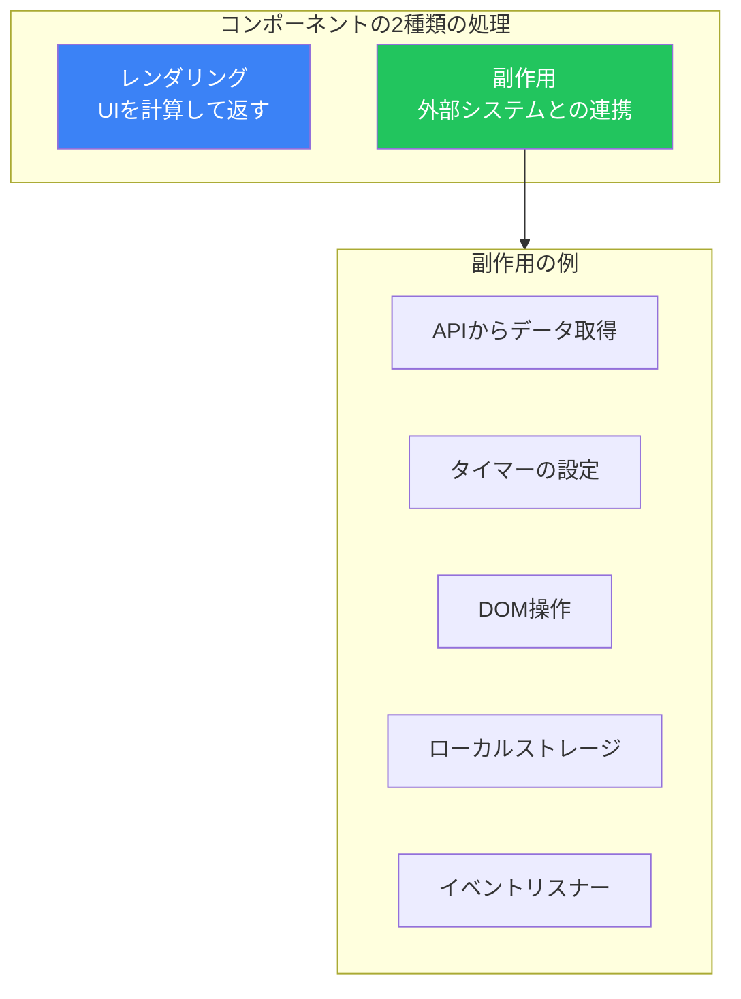
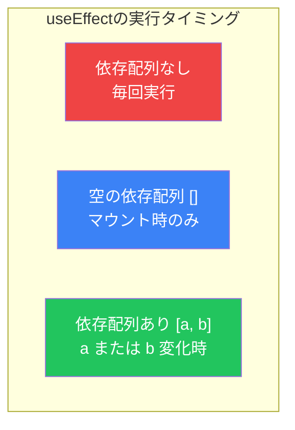
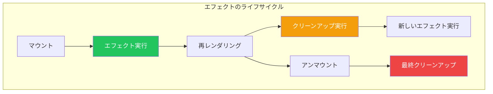

# Day 6: 副作用とuseEffect

## 今日学ぶこと

- 副作用（Side Effect）とは何か
- useEffectフックの基本的な使い方
- 依存配列の理解
- クリーンアップ関数
- データフェッチングの実装

---

## 副作用とは

**副作用（Side Effect）** とは、コンポーネントのレンダリング以外で行う処理のことです。



### なぜ副作用を分離するのか

```jsx
// ❌ 悪い例: レンダリング中に副作用を実行
function BadComponent() {
  // これは毎回レンダリングで実行される！
  fetch('/api/data')
    .then(res => res.json())
    .then(data => console.log(data));

  return <div>...</div>;
}

// ✅ 良い例: useEffectで副作用を分離
function GoodComponent() {
  useEffect(() => {
    fetch('/api/data')
      .then(res => res.json())
      .then(data => console.log(data));
  }, []);

  return <div>...</div>;
}
```

---

## useEffectの基本

`useEffect`は副作用を実行するためのフックです。

### 基本構文

```jsx
import { useEffect } from 'react';

useEffect(() => {
  // 副作用のコード
}, [dependencies]);
```

### 依存配列による実行タイミング



### パターン1: 毎回のレンダリング後に実行

```jsx
function Counter() {
  const [count, setCount] = useState(0);

  // 依存配列なし → 毎回実行
  useEffect(() => {
    console.log('レンダリングされました');
  });

  return <button onClick={() => setCount(count + 1)}>{count}</button>;
}
```

### パターン2: マウント時のみ実行

```jsx
function App() {
  const [data, setData] = useState(null);

  // 空の依存配列 → マウント時のみ
  useEffect(() => {
    console.log('コンポーネントがマウントされました');
    fetch('/api/data')
      .then(res => res.json())
      .then(setData);
  }, []);

  return <div>{data ? JSON.stringify(data) : 'Loading...'}</div>;
}
```

### パターン3: 特定の値が変化した時に実行

```jsx
function UserProfile({ userId }) {
  const [user, setUser] = useState(null);

  // userId が変化したら実行
  useEffect(() => {
    console.log(`ユーザー ${userId} のデータを取得`);
    fetch(`/api/users/${userId}`)
      .then(res => res.json())
      .then(setUser);
  }, [userId]);

  return <div>{user ? user.name : 'Loading...'}</div>;
}
```

---

## 依存配列の詳細

依存配列には、エフェクト内で使用する全ての「リアクティブな値」を含めます。

### リアクティブな値とは

```jsx
function SearchResults({ query }) {  // props → リアクティブ
  const [page, setPage] = useState(1);  // state → リアクティブ
  const limit = 10;  // 定数 → リアクティブではない

  useEffect(() => {
    // query と page を使用 → 依存配列に含める
    fetch(`/api/search?q=${query}&page=${page}&limit=${limit}`)
      .then(res => res.json())
      .then(data => console.log(data));
  }, [query, page]);  // limit は定数なので不要

  return (...);
}
```

### よくある間違い

```jsx
// ❌ 依存配列の不足
function BadExample({ userId }) {
  const [user, setUser] = useState(null);

  useEffect(() => {
    fetch(`/api/users/${userId}`)  // userId を使用
      .then(res => res.json())
      .then(setUser);
  }, []);  // userId が依存配列にない！

  return <div>{user?.name}</div>;
}

// ✅ 正しい依存配列
function GoodExample({ userId }) {
  const [user, setUser] = useState(null);

  useEffect(() => {
    fetch(`/api/users/${userId}`)
      .then(res => res.json())
      .then(setUser);
  }, [userId]);  // userId を含める

  return <div>{user?.name}</div>;
}
```

---

## クリーンアップ関数

副作用の中には、クリーンアップ（後片付け）が必要なものがあります。



### タイマーのクリーンアップ

```jsx
function Timer() {
  const [seconds, setSeconds] = useState(0);

  useEffect(() => {
    const intervalId = setInterval(() => {
      setSeconds(prev => prev + 1);
    }, 1000);

    // クリーンアップ関数を返す
    return () => {
      clearInterval(intervalId);
      console.log('タイマーをクリア');
    };
  }, []);

  return <div>経過時間: {seconds}秒</div>;
}
```

### イベントリスナーのクリーンアップ

```jsx
function WindowSize() {
  const [size, setSize] = useState({
    width: window.innerWidth,
    height: window.innerHeight
  });

  useEffect(() => {
    function handleResize() {
      setSize({
        width: window.innerWidth,
        height: window.innerHeight
      });
    }

    window.addEventListener('resize', handleResize);

    // クリーンアップ
    return () => {
      window.removeEventListener('resize', handleResize);
    };
  }, []);

  return (
    <div>
      ウィンドウサイズ: {size.width} x {size.height}
    </div>
  );
}
```

### WebSocketのクリーンアップ

```jsx
function ChatRoom({ roomId }) {
  const [messages, setMessages] = useState([]);

  useEffect(() => {
    const socket = new WebSocket(`wss://chat.example.com/${roomId}`);

    socket.onmessage = (event) => {
      const message = JSON.parse(event.data);
      setMessages(prev => [...prev, message]);
    };

    // クリーンアップ: 接続を閉じる
    return () => {
      socket.close();
    };
  }, [roomId]);

  return (
    <ul>
      {messages.map((msg, i) => <li key={i}>{msg.text}</li>)}
    </ul>
  );
}
```

---

## データフェッチング

APIからデータを取得する一般的なパターンです。

### 基本的なデータフェッチング

```jsx
function UserList() {
  const [users, setUsers] = useState([]);
  const [loading, setLoading] = useState(true);
  const [error, setError] = useState(null);

  useEffect(() => {
    async function fetchUsers() {
      try {
        setLoading(true);
        const response = await fetch('/api/users');
        if (!response.ok) {
          throw new Error('データの取得に失敗しました');
        }
        const data = await response.json();
        setUsers(data);
      } catch (err) {
        setError(err.message);
      } finally {
        setLoading(false);
      }
    }

    fetchUsers();
  }, []);

  if (loading) return <div>読み込み中...</div>;
  if (error) return <div>エラー: {error}</div>;

  return (
    <ul>
      {users.map(user => (
        <li key={user.id}>{user.name}</li>
      ))}
    </ul>
  );
}
```

### レースコンディションの対処

コンポーネントがアンマウントされた後にStateを更新しないようにします。

```jsx
function SearchResults({ query }) {
  const [results, setResults] = useState([]);

  useEffect(() => {
    let isCancelled = false;

    async function search() {
      const response = await fetch(`/api/search?q=${query}`);
      const data = await response.json();

      // キャンセルされていない場合のみ更新
      if (!isCancelled) {
        setResults(data);
      }
    }

    search();

    // クリーンアップでキャンセルフラグを立てる
    return () => {
      isCancelled = true;
    };
  }, [query]);

  return (
    <ul>
      {results.map(item => <li key={item.id}>{item.title}</li>)}
    </ul>
  );
}
```

### AbortControllerを使用

```jsx
function FetchWithAbort({ url }) {
  const [data, setData] = useState(null);
  const [loading, setLoading] = useState(true);

  useEffect(() => {
    const controller = new AbortController();

    async function fetchData() {
      try {
        setLoading(true);
        const response = await fetch(url, {
          signal: controller.signal
        });
        const json = await response.json();
        setData(json);
      } catch (err) {
        if (err.name !== 'AbortError') {
          console.error('Fetch error:', err);
        }
      } finally {
        setLoading(false);
      }
    }

    fetchData();

    return () => {
      controller.abort();
    };
  }, [url]);

  if (loading) return <div>Loading...</div>;
  return <pre>{JSON.stringify(data, null, 2)}</pre>;
}
```

---

## カスタムフックへの抽出

データフェッチングのロジックをカスタムフックに抽出します。

```jsx
function useFetch(url) {
  const [data, setData] = useState(null);
  const [loading, setLoading] = useState(true);
  const [error, setError] = useState(null);

  useEffect(() => {
    const controller = new AbortController();

    async function fetchData() {
      try {
        setLoading(true);
        setError(null);
        const response = await fetch(url, {
          signal: controller.signal
        });
        if (!response.ok) {
          throw new Error(`HTTP error! status: ${response.status}`);
        }
        const json = await response.json();
        setData(json);
      } catch (err) {
        if (err.name !== 'AbortError') {
          setError(err.message);
        }
      } finally {
        setLoading(false);
      }
    }

    fetchData();

    return () => controller.abort();
  }, [url]);

  return { data, loading, error };
}

// 使用例
function UserProfile({ userId }) {
  const { data: user, loading, error } = useFetch(`/api/users/${userId}`);

  if (loading) return <div>読み込み中...</div>;
  if (error) return <div>エラー: {error}</div>;

  return (
    <div>
      <h1>{user.name}</h1>
      <p>{user.email}</p>
    </div>
  );
}
```

---

## useEffectのベストプラクティス

### 不要なエフェクトを避ける

```jsx
// ❌ 不要なエフェクト: 派生値の計算
function BadExample({ items }) {
  const [total, setTotal] = useState(0);

  useEffect(() => {
    setTotal(items.reduce((sum, item) => sum + item.price, 0));
  }, [items]);

  return <div>合計: {total}</div>;
}

// ✅ 計算はレンダリング中に行う
function GoodExample({ items }) {
  const total = items.reduce((sum, item) => sum + item.price, 0);

  return <div>合計: {total}</div>;
}
```

### イベントハンドラー vs useEffect

```jsx
// ❌ useEffectでフォーム送信を処理
function BadForm() {
  const [submitted, setSubmitted] = useState(false);

  useEffect(() => {
    if (submitted) {
      fetch('/api/submit', { method: 'POST' });
    }
  }, [submitted]);

  return <button onClick={() => setSubmitted(true)}>送信</button>;
}

// ✅ イベントハンドラーで処理
function GoodForm() {
  function handleSubmit() {
    fetch('/api/submit', { method: 'POST' });
  }

  return <button onClick={handleSubmit}>送信</button>;
}
```

---

## まとめ

| 概念 | 説明 |
|------|------|
| **副作用** | レンダリング以外の処理（API呼び出し、タイマーなど） |
| **useEffect** | 副作用を実行するためのフック |
| **依存配列** | エフェクトの実行タイミングを制御 |
| **クリーンアップ** | エフェクトの後片付け（タイマー解除など） |
| **レースコンディション** | 非同期処理の競合状態を防ぐ |

### 重要ポイント

1. **依存配列**にはエフェクト内で使う全てのリアクティブな値を含める
2. **クリーンアップ関数**でリソースを解放する
3. **レースコンディション**を防ぐためにキャンセル処理を実装
4. **派生値**はuseEffectではなく、レンダリング中に計算
5. **イベントへの反応**はuseEffectではなく、イベントハンドラーで

---

## 練習問題

### 問題1: 基本
現在時刻を1秒ごとに更新して表示するClockコンポーネントを作成してください。

### 問題2: 応用
検索クエリを入力すると、APIからデータを取得して表示するコンポーネントを作成してください。ローディング状態とエラー状態も表示してください。

### チャレンジ問題
ウィンドウのスクロール位置を監視し、ページの何%をスクロールしたかを表示するScrollProgressコンポーネントを作成してください。

---

## 参考リンク

- [React公式 - useEffect](https://ja.react.dev/reference/react/useEffect)
- [React公式 - エフェクトで同期する](https://ja.react.dev/learn/synchronizing-with-effects)
- [React公式 - エフェクトは必要ないかもしれない](https://ja.react.dev/learn/you-might-not-need-an-effect)

---

**次回予告**: Day 7では「RefsとPortals」について学びます。DOM要素への直接アクセスと、DOMツリー外へのレンダリング方法を理解しましょう。
