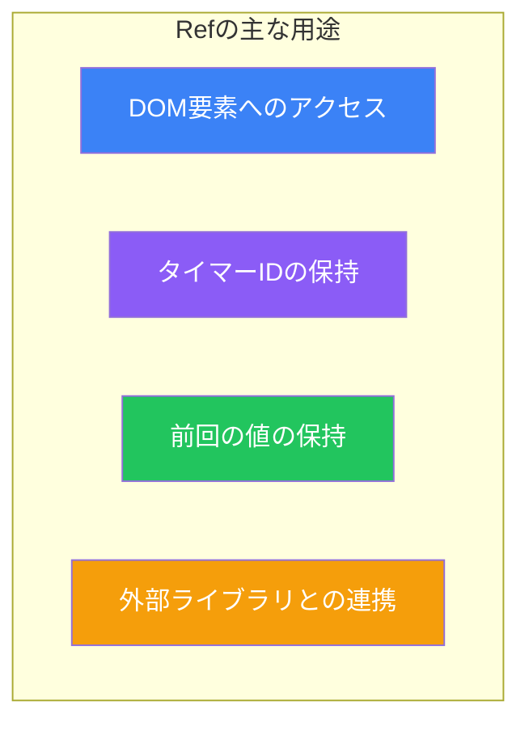
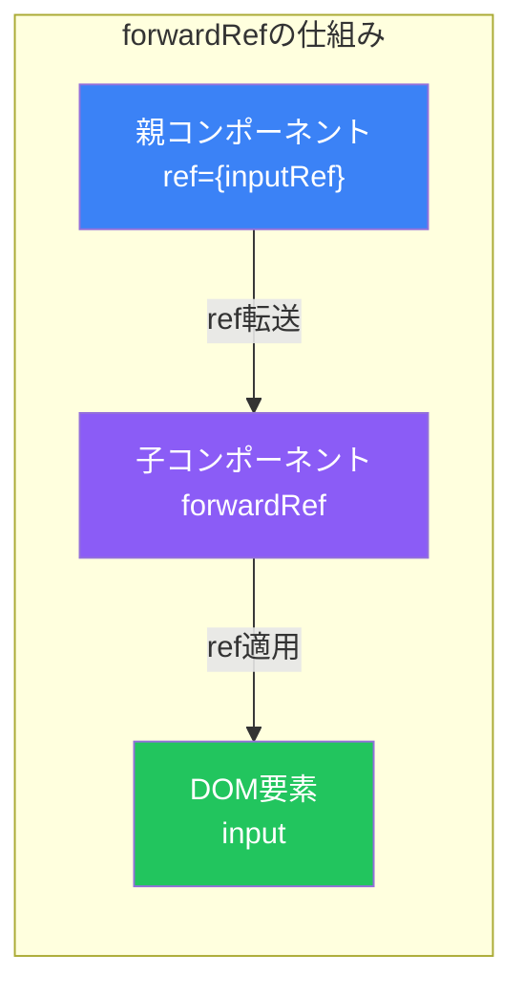
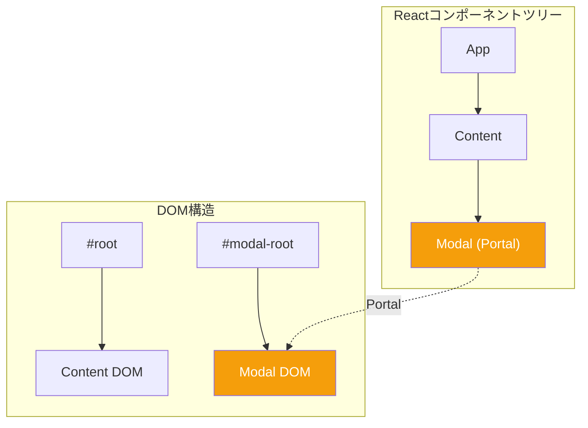

# Day 7: RefsとPortals

## 今日学ぶこと

- useRefフックの基本
- DOM要素への直接アクセス
- Refと状態の違い
- forwardRefによるRef転送
- Portalsの活用方法

---

## Refとは

**Ref（リファレンス）** は、レンダリングに影響しない値を保持するための仕組みです。主にDOM要素への直接アクセスに使用します。



### Stateとの違い

| 特徴 | State | Ref |
|------|-------|-----|
| 更新時に再レンダリング | する | しない |
| 値の保持 | レンダリング間で保持 | レンダリング間で保持 |
| 主な用途 | UIに表示するデータ | レンダリング不要なデータ |
| アクセス方法 | 直接参照 | `.current`プロパティ |

---

## useRefの基本

`useRef`は、Refオブジェクトを作成するフックです。

### 基本構文

```jsx
import { useRef } from 'react';

function Component() {
  const ref = useRef(initialValue);
  // ref.current でアクセス
}
```

### シンプルな例

```jsx
function Counter() {
  const countRef = useRef(0);

  function handleClick() {
    countRef.current += 1;
    console.log(`クリック回数: ${countRef.current}`);
    // 注意: UIは更新されない！
  }

  return <button onClick={handleClick}>クリック</button>;
}
```

---

## DOM要素へのアクセス

Refの最も一般的な用途は、DOM要素への直接アクセスです。

### フォーカスの制御

```jsx
function TextInput() {
  const inputRef = useRef(null);

  function handleFocus() {
    inputRef.current.focus();
  }

  return (
    <div>
      <input ref={inputRef} type="text" />
      <button onClick={handleFocus}>フォーカス</button>
    </div>
  );
}
```

### スクロールの制御

```jsx
function ScrollableList() {
  const listRef = useRef(null);

  function scrollToTop() {
    listRef.current.scrollTo({
      top: 0,
      behavior: 'smooth'
    });
  }

  function scrollToBottom() {
    listRef.current.scrollTo({
      top: listRef.current.scrollHeight,
      behavior: 'smooth'
    });
  }

  return (
    <div>
      <button onClick={scrollToTop}>上へ</button>
      <button onClick={scrollToBottom}>下へ</button>
      <ul ref={listRef} style={{ height: '200px', overflow: 'auto' }}>
        {Array.from({ length: 50 }, (_, i) => (
          <li key={i}>アイテム {i + 1}</li>
        ))}
      </ul>
    </div>
  );
}
```

### 要素のサイズ取得

```jsx
function MeasureBox() {
  const boxRef = useRef(null);
  const [dimensions, setDimensions] = useState({ width: 0, height: 0 });

  useEffect(() => {
    if (boxRef.current) {
      const { width, height } = boxRef.current.getBoundingClientRect();
      setDimensions({ width, height });
    }
  }, []);

  return (
    <div>
      <div ref={boxRef} style={{ width: '200px', height: '100px', background: 'lightblue' }}>
        ボックス
      </div>
      <p>サイズ: {dimensions.width} x {dimensions.height}</p>
    </div>
  );
}
```

---

## 前回の値を保持

Refを使って、前回レンダリング時の値を保持できます。

```jsx
function PreviousValue() {
  const [count, setCount] = useState(0);
  const prevCountRef = useRef();

  useEffect(() => {
    prevCountRef.current = count;
  });

  const prevCount = prevCountRef.current;

  return (
    <div>
      <p>現在: {count}, 前回: {prevCount ?? 'なし'}</p>
      <button onClick={() => setCount(count + 1)}>増やす</button>
    </div>
  );
}
```

### カスタムフックに抽出

```jsx
function usePrevious(value) {
  const ref = useRef();

  useEffect(() => {
    ref.current = value;
  }, [value]);

  return ref.current;
}

// 使用例
function Counter() {
  const [count, setCount] = useState(0);
  const prevCount = usePrevious(count);

  return (
    <div>
      <p>現在: {count}, 前回: {prevCount ?? 'なし'}</p>
      <button onClick={() => setCount(count + 1)}>増やす</button>
    </div>
  );
}
```

---

## タイマーの管理

タイマーIDをRefで保持することで、クリーンアップが確実に行えます。

```jsx
function Stopwatch() {
  const [time, setTime] = useState(0);
  const [isRunning, setIsRunning] = useState(false);
  const intervalRef = useRef(null);

  function start() {
    if (!isRunning) {
      setIsRunning(true);
      intervalRef.current = setInterval(() => {
        setTime(prev => prev + 10);
      }, 10);
    }
  }

  function stop() {
    if (isRunning) {
      clearInterval(intervalRef.current);
      setIsRunning(false);
    }
  }

  function reset() {
    clearInterval(intervalRef.current);
    setIsRunning(false);
    setTime(0);
  }

  // クリーンアップ
  useEffect(() => {
    return () => {
      if (intervalRef.current) {
        clearInterval(intervalRef.current);
      }
    };
  }, []);

  const formatTime = (ms) => {
    const minutes = Math.floor(ms / 60000);
    const seconds = Math.floor((ms % 60000) / 1000);
    const centiseconds = Math.floor((ms % 1000) / 10);
    return `${minutes}:${seconds.toString().padStart(2, '0')}.${centiseconds.toString().padStart(2, '0')}`;
  };

  return (
    <div>
      <p style={{ fontSize: '2rem' }}>{formatTime(time)}</p>
      <button onClick={start} disabled={isRunning}>開始</button>
      <button onClick={stop} disabled={!isRunning}>停止</button>
      <button onClick={reset}>リセット</button>
    </div>
  );
}
```

---

## forwardRef

子コンポーネントのDOM要素に親からアクセスするには、`forwardRef`を使用します。



### 基本的な使い方

```jsx
import { forwardRef, useRef } from 'react';

// 子コンポーネント: forwardRefでラップ
const TextInput = forwardRef(function TextInput(props, ref) {
  return (
    <input
      ref={ref}
      type="text"
      className="custom-input"
      {...props}
    />
  );
});

// 親コンポーネント
function Form() {
  const inputRef = useRef(null);

  function handleFocus() {
    inputRef.current.focus();
  }

  return (
    <div>
      <TextInput ref={inputRef} placeholder="入力してください" />
      <button onClick={handleFocus}>フォーカス</button>
    </div>
  );
}
```

### useImperativeHandle

子コンポーネントから公開するメソッドを制限できます。

```jsx
import { forwardRef, useImperativeHandle, useRef } from 'react';

const CustomInput = forwardRef(function CustomInput(props, ref) {
  const inputRef = useRef(null);

  // 公開するメソッドを定義
  useImperativeHandle(ref, () => ({
    focus() {
      inputRef.current.focus();
    },
    clear() {
      inputRef.current.value = '';
    },
    getValue() {
      return inputRef.current.value;
    }
  }));

  return <input ref={inputRef} {...props} />;
});

// 使用例
function Form() {
  const inputRef = useRef(null);

  return (
    <div>
      <CustomInput ref={inputRef} />
      <button onClick={() => inputRef.current.focus()}>フォーカス</button>
      <button onClick={() => inputRef.current.clear()}>クリア</button>
      <button onClick={() => alert(inputRef.current.getValue())}>値を取得</button>
    </div>
  );
}
```

---

## Portals

**Portal**を使うと、コンポーネントのDOMツリー階層外にレンダリングできます。



### 基本的な使い方

```jsx
import { createPortal } from 'react-dom';

function Modal({ children, onClose }) {
  return createPortal(
    <div className="modal-overlay" onClick={onClose}>
      <div className="modal-content" onClick={e => e.stopPropagation()}>
        {children}
      </div>
    </div>,
    document.getElementById('modal-root')
  );
}

// index.html に <div id="modal-root"></div> を追加
```

### モーダルの完全な実装

```jsx
import { useState } from 'react';
import { createPortal } from 'react-dom';

function Modal({ isOpen, onClose, title, children }) {
  if (!isOpen) return null;

  return createPortal(
    <div className="modal-overlay">
      <div className="modal-content">
        <div className="modal-header">
          <h2>{title}</h2>
          <button onClick={onClose} className="close-button">×</button>
        </div>
        <div className="modal-body">
          {children}
        </div>
      </div>
    </div>,
    document.getElementById('modal-root')
  );
}

function App() {
  const [isModalOpen, setIsModalOpen] = useState(false);

  return (
    <div>
      <h1>メインコンテンツ</h1>
      <button onClick={() => setIsModalOpen(true)}>
        モーダルを開く
      </button>

      <Modal
        isOpen={isModalOpen}
        onClose={() => setIsModalOpen(false)}
        title="確認"
      >
        <p>本当に実行しますか？</p>
        <button onClick={() => setIsModalOpen(false)}>キャンセル</button>
        <button onClick={() => {
          console.log('実行');
          setIsModalOpen(false);
        }}>OK</button>
      </Modal>
    </div>
  );
}
```

### Portalの用途

| 用途 | 説明 |
|------|------|
| モーダル | 画面全体を覆うダイアログ |
| ツールチップ | 要素に紐づくポップアップ |
| ドロップダウン | 親のoverflow設定を回避 |
| 通知 | 画面端に固定表示 |

---

## ベストプラクティス

### Refを使うべき場面

```jsx
// ✅ Refを使うべき
// - DOM操作（フォーカス、スクロール）
// - タイマーIDの保持
// - 前回の値の保持
// - 外部ライブラリとの連携

// ❌ Refを使うべきでない
// - UIに表示するデータ → Stateを使う
// - 派生データの計算 → 通常の変数を使う
```

### Portalを使うべき場面

```jsx
// ✅ Portalを使うべき
// - モーダル、ダイアログ
// - ツールチップ、ポップオーバー
// - 親のCSS制約を回避したい場合

// ❌ Portalを使うべきでない
// - 通常のコンポーネント構成で解決できる場合
```

---

## まとめ

| 概念 | 説明 |
|------|------|
| **useRef** | 再レンダリングなしで値を保持するフック |
| **DOM Ref** | DOM要素への直接アクセス |
| **forwardRef** | 子コンポーネントにRefを転送 |
| **useImperativeHandle** | 公開するRef APIをカスタマイズ |
| **Portal** | DOMツリー外にレンダリング |

### 重要ポイント

1. Refの変更は**再レンダリングを引き起こさない**
2. DOM要素のRefは**レンダリング後**に利用可能
3. **forwardRef**で子コンポーネントのDOMにアクセス
4. **useImperativeHandle**で公開APIを制限
5. **Portal**はz-indexやoverflowの問題を解決

---

## 練習問題

### 問題1: 基本
テキスト入力フィールドとボタンを持つコンポーネントを作成してください。ボタンをクリックすると、入力フィールドにフォーカスが当たり、内容が選択された状態になるようにしてください。

### 問題2: 応用
画像ギャラリーを作成してください。サムネイルをクリックすると、その画像のモーダルが開いて大きく表示されます（Portalを使用）。

### チャレンジ問題
カスタム動画プレイヤーコンポーネントを作成してください。useImperativeHandleを使って、親コンポーネントから`play()`, `pause()`, `seekTo(time)`メソッドを呼び出せるようにしてください。

---

## 参考リンク

- [React公式 - useRef](https://ja.react.dev/reference/react/useRef)
- [React公式 - forwardRef](https://ja.react.dev/reference/react/forwardRef)
- [React公式 - createPortal](https://ja.react.dev/reference/react-dom/createPortal)

---

**次回予告**: Day 8では「Context APIと状態管理」について学びます。コンポーネント間でデータを効率的に共有する方法を理解しましょう。
