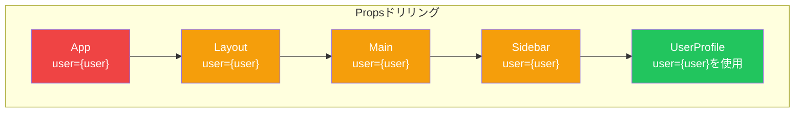
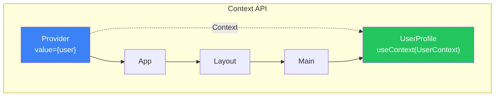
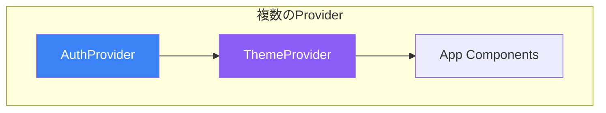
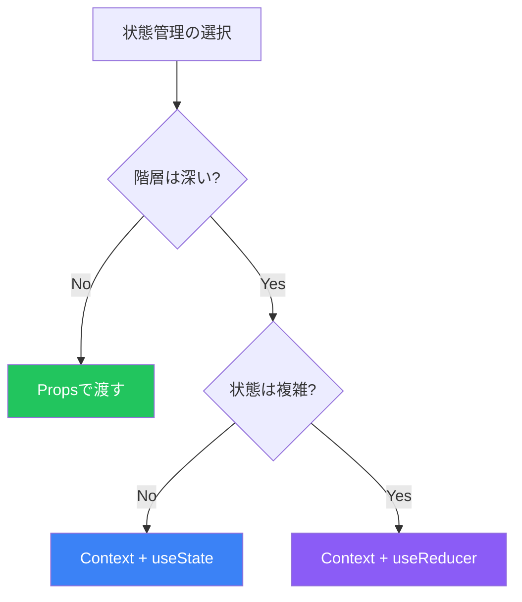

# Day 8: Context APIと状態管理

## 今日学ぶこと

- Propsドリリングの問題
- Context APIの基本
- useContextフック
- Contextの設計パターン
- useReducerとの組み合わせ

---

## Propsドリリングの問題

深くネストしたコンポーネントにデータを渡すとき、中間のコンポーネントを経由する必要があります。これを**Propsドリリング**と呼びます。



### 問題点

```jsx
// ❌ Propsドリリング: 中間コンポーネントがuserを使わないのに渡している
function App() {
  const [user, setUser] = useState({ name: '太郎', role: 'admin' });

  return <Layout user={user} />;
}

function Layout({ user }) {
  return (
    <div>
      <Header />
      <Main user={user} />  {/* 渡すだけ */}
      <Footer />
    </div>
  );
}

function Main({ user }) {
  return <Sidebar user={user} />;  {/* 渡すだけ */}
}

function Sidebar({ user }) {
  return <UserProfile user={user} />;  {/* 渡すだけ */}
}

function UserProfile({ user }) {
  return <p>ようこそ、{user.name}さん</p>;  {/* 実際に使用 */}
}
```

---

## Context APIとは

**Context API**は、コンポーネントツリー全体にデータを「トンネル」で渡す仕組みです。



---

## Contextの基本的な使い方

### Step 1: Contextの作成

```jsx
import { createContext } from 'react';

// デフォルト値を指定してContextを作成
const UserContext = createContext(null);

export default UserContext;
```

### Step 2: Providerでラップ

```jsx
import { useState } from 'react';
import UserContext from './UserContext';

function App() {
  const [user, setUser] = useState({ name: '太郎', role: 'admin' });

  return (
    <UserContext.Provider value={user}>
      <Layout />
    </UserContext.Provider>
  );
}
```

### Step 3: useContextで使用

```jsx
import { useContext } from 'react';
import UserContext from './UserContext';

function UserProfile() {
  const user = useContext(UserContext);

  return <p>ようこそ、{user.name}さん</p>;
}
```

### 完成したコード

```jsx
import { createContext, useContext, useState } from 'react';

// Context作成
const UserContext = createContext(null);

// 最上位コンポーネント
function App() {
  const [user, setUser] = useState({ name: '太郎', role: 'admin' });

  return (
    <UserContext.Provider value={user}>
      <Layout />
    </UserContext.Provider>
  );
}

// 中間コンポーネント（userを意識しない）
function Layout() {
  return (
    <div>
      <Header />
      <Main />
      <Footer />
    </div>
  );
}

function Main() {
  return <Sidebar />;
}

function Sidebar() {
  return <UserProfile />;
}

// Contextを使用するコンポーネント
function UserProfile() {
  const user = useContext(UserContext);
  return <p>ようこそ、{user.name}さん</p>;
}
```

---

## 更新可能なContext

Stateと更新関数をContextで提供します。

```jsx
import { createContext, useContext, useState } from 'react';

// Context作成
const ThemeContext = createContext(null);

// Providerコンポーネント
function ThemeProvider({ children }) {
  const [theme, setTheme] = useState('light');

  function toggleTheme() {
    setTheme(prev => prev === 'light' ? 'dark' : 'light');
  }

  const value = {
    theme,
    toggleTheme
  };

  return (
    <ThemeContext.Provider value={value}>
      {children}
    </ThemeContext.Provider>
  );
}

// カスタムフック
function useTheme() {
  const context = useContext(ThemeContext);
  if (context === null) {
    throw new Error('useTheme must be used within ThemeProvider');
  }
  return context;
}

// 使用例
function App() {
  return (
    <ThemeProvider>
      <Header />
      <Main />
    </ThemeProvider>
  );
}

function Header() {
  const { theme, toggleTheme } = useTheme();

  return (
    <header style={{ background: theme === 'light' ? '#fff' : '#333' }}>
      <button onClick={toggleTheme}>
        {theme === 'light' ? '🌙' : '☀️'}
      </button>
    </header>
  );
}
```

---

## 複数のContextを組み合わせる

```jsx
// 認証Context
const AuthContext = createContext(null);

function AuthProvider({ children }) {
  const [user, setUser] = useState(null);

  const login = (userData) => setUser(userData);
  const logout = () => setUser(null);

  return (
    <AuthContext.Provider value={{ user, login, logout }}>
      {children}
    </AuthContext.Provider>
  );
}

// テーマContext
const ThemeContext = createContext(null);

function ThemeProvider({ children }) {
  const [theme, setTheme] = useState('light');
  const toggleTheme = () => setTheme(t => t === 'light' ? 'dark' : 'light');

  return (
    <ThemeContext.Provider value={{ theme, toggleTheme }}>
      {children}
    </ThemeContext.Provider>
  );
}

// 複数のProviderを組み合わせる
function App() {
  return (
    <AuthProvider>
      <ThemeProvider>
        <MainApp />
      </ThemeProvider>
    </AuthProvider>
  );
}
```



---

## useReducerとの組み合わせ

複雑な状態管理には`useReducer`を使用します。

### useReducerの基本

```jsx
import { useReducer } from 'react';

// 初期状態
const initialState = { count: 0 };

// Reducer関数
function reducer(state, action) {
  switch (action.type) {
    case 'increment':
      return { count: state.count + 1 };
    case 'decrement':
      return { count: state.count - 1 };
    case 'reset':
      return initialState;
    default:
      throw new Error(`Unknown action: ${action.type}`);
  }
}

function Counter() {
  const [state, dispatch] = useReducer(reducer, initialState);

  return (
    <div>
      <p>Count: {state.count}</p>
      <button onClick={() => dispatch({ type: 'increment' })}>+</button>
      <button onClick={() => dispatch({ type: 'decrement' })}>-</button>
      <button onClick={() => dispatch({ type: 'reset' })}>Reset</button>
    </div>
  );
}
```

### ContextとuseReducerの組み合わせ

```jsx
import { createContext, useContext, useReducer } from 'react';

// Todoの型定義（コメントで説明）
// { id: number, text: string, completed: boolean }

// 初期状態
const initialState = {
  todos: [],
  filter: 'all'  // 'all' | 'active' | 'completed'
};

// Reducer
function todoReducer(state, action) {
  switch (action.type) {
    case 'ADD_TODO':
      return {
        ...state,
        todos: [
          ...state.todos,
          { id: Date.now(), text: action.payload, completed: false }
        ]
      };

    case 'TOGGLE_TODO':
      return {
        ...state,
        todos: state.todos.map(todo =>
          todo.id === action.payload
            ? { ...todo, completed: !todo.completed }
            : todo
        )
      };

    case 'DELETE_TODO':
      return {
        ...state,
        todos: state.todos.filter(todo => todo.id !== action.payload)
      };

    case 'SET_FILTER':
      return {
        ...state,
        filter: action.payload
      };

    default:
      return state;
  }
}

// Context
const TodoContext = createContext(null);

// Provider
function TodoProvider({ children }) {
  const [state, dispatch] = useReducer(todoReducer, initialState);

  // フィルタリングされたTodo
  const filteredTodos = state.todos.filter(todo => {
    if (state.filter === 'active') return !todo.completed;
    if (state.filter === 'completed') return todo.completed;
    return true;
  });

  const value = {
    todos: filteredTodos,
    allTodos: state.todos,
    filter: state.filter,
    dispatch
  };

  return (
    <TodoContext.Provider value={value}>
      {children}
    </TodoContext.Provider>
  );
}

// カスタムフック
function useTodo() {
  const context = useContext(TodoContext);
  if (!context) {
    throw new Error('useTodo must be used within TodoProvider');
  }
  return context;
}

// コンポーネント
function TodoApp() {
  return (
    <TodoProvider>
      <h1>Todo App</h1>
      <AddTodo />
      <FilterButtons />
      <TodoList />
      <TodoStats />
    </TodoProvider>
  );
}

function AddTodo() {
  const { dispatch } = useTodo();
  const [text, setText] = useState('');

  function handleSubmit(e) {
    e.preventDefault();
    if (text.trim()) {
      dispatch({ type: 'ADD_TODO', payload: text });
      setText('');
    }
  }

  return (
    <form onSubmit={handleSubmit}>
      <input
        value={text}
        onChange={(e) => setText(e.target.value)}
        placeholder="新しいタスク"
      />
      <button type="submit">追加</button>
    </form>
  );
}

function FilterButtons() {
  const { filter, dispatch } = useTodo();

  return (
    <div>
      {['all', 'active', 'completed'].map(f => (
        <button
          key={f}
          onClick={() => dispatch({ type: 'SET_FILTER', payload: f })}
          style={{ fontWeight: filter === f ? 'bold' : 'normal' }}
        >
          {f}
        </button>
      ))}
    </div>
  );
}

function TodoList() {
  const { todos, dispatch } = useTodo();

  return (
    <ul>
      {todos.map(todo => (
        <li key={todo.id}>
          <input
            type="checkbox"
            checked={todo.completed}
            onChange={() => dispatch({ type: 'TOGGLE_TODO', payload: todo.id })}
          />
          <span style={{ textDecoration: todo.completed ? 'line-through' : 'none' }}>
            {todo.text}
          </span>
          <button onClick={() => dispatch({ type: 'DELETE_TODO', payload: todo.id })}>
            削除
          </button>
        </li>
      ))}
    </ul>
  );
}

function TodoStats() {
  const { allTodos } = useTodo();
  const completed = allTodos.filter(t => t.completed).length;

  return (
    <p>
      完了: {completed} / {allTodos.length}
    </p>
  );
}
```

---

## Contextのベストプラクティス

### 適切な分割

```jsx
// ❌ 1つのContextに詰め込みすぎ
const AppContext = createContext({
  user: null,
  theme: 'light',
  language: 'ja',
  notifications: [],
  cart: [],
  // ...
});

// ✅ 関心事ごとに分割
const AuthContext = createContext(null);
const ThemeContext = createContext(null);
const LanguageContext = createContext(null);
const NotificationContext = createContext(null);
const CartContext = createContext(null);
```

### パフォーマンスの考慮

```jsx
// ❌ オブジェクトを毎回作成（不必要な再レンダリング）
function BadProvider({ children }) {
  const [count, setCount] = useState(0);

  return (
    <MyContext.Provider value={{ count, setCount }}>
      {children}
    </MyContext.Provider>
  );
}

// ✅ useMemoでメモ化
function GoodProvider({ children }) {
  const [count, setCount] = useState(0);

  const value = useMemo(() => ({ count, setCount }), [count]);

  return (
    <MyContext.Provider value={value}>
      {children}
    </MyContext.Provider>
  );
}
```

---

## 使い分けの指針

| シナリオ | 推奨アプローチ |
|---------|---------------|
| 2-3階層のProps渡し | Propsで十分 |
| テーマ、認証、言語設定 | Context |
| グローバルな状態管理 | Context + useReducer |
| 複雑なアプリ全体の状態 | 外部ライブラリ検討 |



---

## まとめ

| 概念 | 説明 |
|------|------|
| **Propsドリリング** | 深い階層へのProps渡しの問題 |
| **Context** | コンポーネントツリー全体にデータを共有 |
| **Provider** | Contextの値を提供するコンポーネント |
| **useContext** | Contextの値を取得するフック |
| **useReducer** | 複雑な状態更新ロジックを管理 |

### 重要ポイント

1. Contextは**グローバルな状態**に適している
2. **カスタムフック**でContext使用をカプセル化
3. 関心事ごとに**Contextを分割**
4. 複雑な状態には**useReducer**を組み合わせる
5. パフォーマンスには**useMemo**を活用

---

## 練習問題

### 問題1: 基本
言語設定（日本語/英語）を管理するContextを作成してください。ボタンで言語を切り替え、表示テキストが変わるようにしてください。

### 問題2: 応用
ショッピングカートのContextを作成してください：
- 商品の追加/削除
- 数量の変更
- 合計金額の計算

### チャレンジ問題
認証システムのContext（useReducer使用）を作成してください：
- ログイン/ログアウト機能
- ローディング状態の管理
- エラーメッセージの管理
- 認証状態に基づくルーティング

---

## 参考リンク

- [React公式 - Context](https://ja.react.dev/learn/passing-data-deeply-with-context)
- [React公式 - useReducer](https://ja.react.dev/reference/react/useReducer)
- [React公式 - Contextでのstateの拡張](https://ja.react.dev/learn/scaling-up-with-reducer-and-context)

---

**次回予告**: Day 9では「パフォーマンス最適化」について学びます。Reactアプリを高速に保つためのテクニックを理解しましょう。
