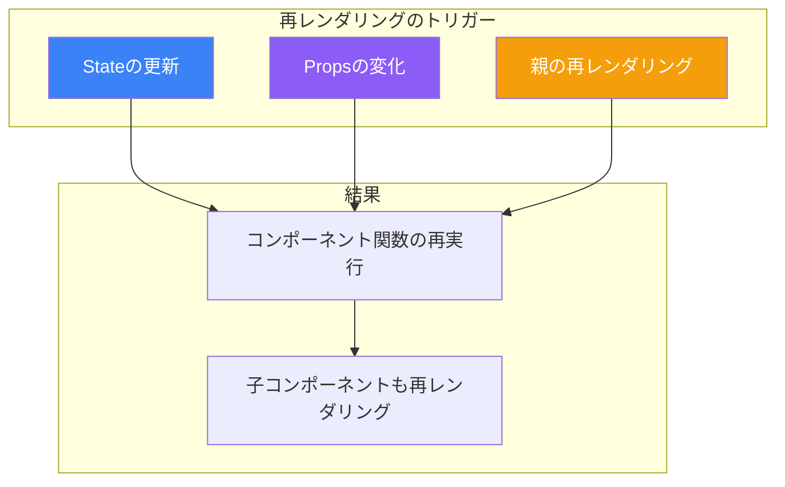
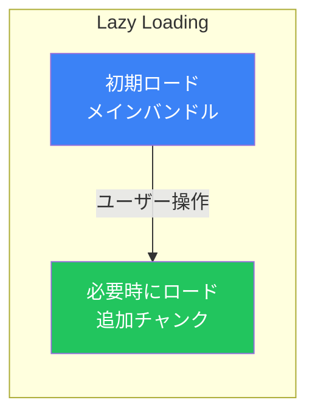
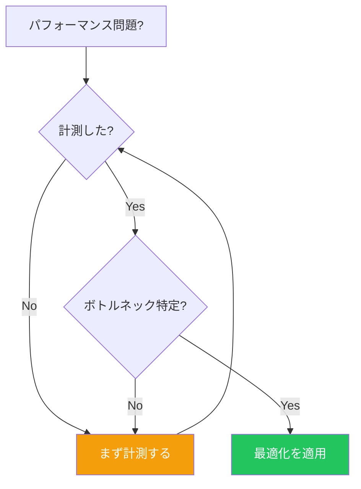

# Day 9: パフォーマンス最適化

## 今日学ぶこと

- 再レンダリングの仕組み
- React.memoによるコンポーネントのメモ化
- useMemoによる値のメモ化
- useCallbackによる関数のメモ化
- コード分割とLazy Loading

---

## 再レンダリングの仕組み

Reactでは、**State**または**Props**が変化すると、コンポーネントが再レンダリングされます。



### 再レンダリングの例

```jsx
function Parent() {
  const [count, setCount] = useState(0);
  console.log('Parent rendered');

  return (
    <div>
      <p>Count: {count}</p>
      <button onClick={() => setCount(count + 1)}>Increment</button>
      <Child />  {/* 毎回再レンダリングされる */}
    </div>
  );
}

function Child() {
  console.log('Child rendered');  // 親が更新されるたびに実行
  return <p>I am a child</p>;
}
```

---

## React.memo

`React.memo`は、Propsが変化していない場合に再レンダリングをスキップする高階コンポーネントです。

### 基本的な使い方

```jsx
import { memo } from 'react';

// memo()でラップ
const Child = memo(function Child({ name }) {
  console.log('Child rendered');
  return <p>Hello, {name}</p>;
});

function Parent() {
  const [count, setCount] = useState(0);

  return (
    <div>
      <p>Count: {count}</p>
      <button onClick={() => setCount(count + 1)}>Increment</button>
      <Child name="太郎" />  {/* nameが変わらない限り再レンダリングされない */}
    </div>
  );
}
```

### カスタム比較関数

```jsx
const UserCard = memo(
  function UserCard({ user }) {
    return (
      <div>
        <h3>{user.name}</h3>
        <p>{user.email}</p>
      </div>
    );
  },
  // カスタム比較関数
  (prevProps, nextProps) => {
    return prevProps.user.id === nextProps.user.id;
  }
);
```

### React.memoの注意点

```jsx
// ❌ オブジェクトや配列をPropsに渡すと毎回新しい参照になる
function Parent() {
  const [count, setCount] = useState(0);

  return (
    <Child
      style={{ color: 'red' }}  // 毎回新しいオブジェクト
      items={[1, 2, 3]}         // 毎回新しい配列
    />
  );
}

// ✅ useMemoで参照を安定させる
function Parent() {
  const [count, setCount] = useState(0);

  const style = useMemo(() => ({ color: 'red' }), []);
  const items = useMemo(() => [1, 2, 3], []);

  return <Child style={style} items={items} />;
}
```

---

## useMemo

`useMemo`は、計算コストの高い値をメモ化するフックです。

### 基本的な使い方

```jsx
import { useMemo, useState } from 'react';

function ExpensiveComponent({ items, filter }) {
  // ❌ 毎回計算される
  const filteredItems = items.filter(item => item.includes(filter));

  // ✅ filter または items が変わった時だけ計算
  const filteredItems = useMemo(() => {
    console.log('Filtering...');
    return items.filter(item => item.includes(filter));
  }, [items, filter]);

  return (
    <ul>
      {filteredItems.map(item => <li key={item}>{item}</li>)}
    </ul>
  );
}
```

### 適切な使用例

```jsx
function DataTable({ data, sortKey, sortOrder }) {
  // ソートは計算コストが高い可能性がある
  const sortedData = useMemo(() => {
    console.log('Sorting data...');
    return [...data].sort((a, b) => {
      const comparison = a[sortKey] > b[sortKey] ? 1 : -1;
      return sortOrder === 'asc' ? comparison : -comparison;
    });
  }, [data, sortKey, sortOrder]);

  return (
    <table>
      <tbody>
        {sortedData.map(row => (
          <tr key={row.id}>
            <td>{row.name}</td>
            <td>{row.value}</td>
          </tr>
        ))}
      </tbody>
    </table>
  );
}
```

### useMemoが不要な場合

```jsx
// ❌ 単純な計算にはuseMemoは不要
const double = useMemo(() => count * 2, [count]);

// ✅ 直接計算
const double = count * 2;
```

---

## useCallback

`useCallback`は、関数をメモ化するフックです。主に`memo`化されたコンポーネントに関数を渡すときに使用します。

### 基本的な使い方

```jsx
import { useCallback, memo, useState } from 'react';

const Button = memo(function Button({ onClick, children }) {
  console.log(`Button "${children}" rendered`);
  return <button onClick={onClick}>{children}</button>;
});

function Parent() {
  const [count, setCount] = useState(0);
  const [text, setText] = useState('');

  // ❌ 毎回新しい関数が作成される
  const handleClick = () => setCount(count + 1);

  // ✅ 依存配列が変わらない限り同じ関数を返す
  const handleIncrement = useCallback(() => {
    setCount(prev => prev + 1);
  }, []);

  return (
    <div>
      <p>Count: {count}</p>
      <input value={text} onChange={(e) => setText(e.target.value)} />
      <Button onClick={handleIncrement}>Increment</Button>
    </div>
  );
}
```

### イベントハンドラーの最適化

```jsx
function TodoList({ todos, onToggle, onDelete }) {
  return (
    <ul>
      {todos.map(todo => (
        <TodoItem
          key={todo.id}
          todo={todo}
          onToggle={onToggle}
          onDelete={onDelete}
        />
      ))}
    </ul>
  );
}

const TodoItem = memo(function TodoItem({ todo, onToggle, onDelete }) {
  return (
    <li>
      <input
        type="checkbox"
        checked={todo.completed}
        onChange={() => onToggle(todo.id)}
      />
      {todo.text}
      <button onClick={() => onDelete(todo.id)}>Delete</button>
    </li>
  );
});

function App() {
  const [todos, setTodos] = useState([]);

  // useCallbackでメモ化
  const handleToggle = useCallback((id) => {
    setTodos(prev =>
      prev.map(todo =>
        todo.id === id ? { ...todo, completed: !todo.completed } : todo
      )
    );
  }, []);

  const handleDelete = useCallback((id) => {
    setTodos(prev => prev.filter(todo => todo.id !== id));
  }, []);

  return <TodoList todos={todos} onToggle={handleToggle} onDelete={handleDelete} />;
}
```

---

## コード分割とLazy Loading

大きなコンポーネントを必要な時だけ読み込みます。



### React.lazy

```jsx
import { lazy, Suspense, useState } from 'react';

// 動的インポート
const HeavyComponent = lazy(() => import('./HeavyComponent'));

function App() {
  const [showHeavy, setShowHeavy] = useState(false);

  return (
    <div>
      <button onClick={() => setShowHeavy(true)}>
        重いコンポーネントを表示
      </button>

      {showHeavy && (
        <Suspense fallback={<div>読み込み中...</div>}>
          <HeavyComponent />
        </Suspense>
      )}
    </div>
  );
}
```

### ルートベースの分割

```jsx
import { lazy, Suspense } from 'react';
import { BrowserRouter, Routes, Route } from 'react-router-dom';

// 各ページを遅延読み込み
const Home = lazy(() => import('./pages/Home'));
const About = lazy(() => import('./pages/About'));
const Dashboard = lazy(() => import('./pages/Dashboard'));

function App() {
  return (
    <BrowserRouter>
      <Suspense fallback={<div>ページを読み込み中...</div>}>
        <Routes>
          <Route path="/" element={<Home />} />
          <Route path="/about" element={<About />} />
          <Route path="/dashboard" element={<Dashboard />} />
        </Routes>
      </Suspense>
    </BrowserRouter>
  );
}
```

---

## React DevToolsでの分析

### Profilerの使用

React DevToolsのProfilerタブで、レンダリングのパフォーマンスを分析できます。

```jsx
// デバッグ用のマーカー
import { Profiler } from 'react';

function onRenderCallback(
  id,           // Profiler id
  phase,        // "mount" または "update"
  actualDuration, // レンダリングにかかった時間
  baseDuration,   // メモ化なしの推定時間
  startTime,      // レンダリング開始時刻
  commitTime      // コミット時刻
) {
  console.log(`${id} ${phase}: ${actualDuration.toFixed(2)}ms`);
}

function App() {
  return (
    <Profiler id="App" onRender={onRenderCallback}>
      <MainContent />
    </Profiler>
  );
}
```

---

## 最適化のガイドライン

### いつ最適化すべきか



### 最適化のチェックリスト

| チェック項目 | 対処法 |
|------------|--------|
| 不必要な再レンダリング | React.memo |
| 重い計算 | useMemo |
| 関数の再作成 | useCallback |
| 大きなバンドル | lazy + Suspense |
| リストの最適化 | 仮想化（react-window） |

### 過度な最適化を避ける

```jsx
// ❌ 過度な最適化
function Component() {
  // 単純な値にuseMemoは不要
  const greeting = useMemo(() => 'Hello', []);

  // 単純な関数にuseCallbackは不要
  const log = useCallback(() => console.log('clicked'), []);

  return <div>{greeting}</div>;
}

// ✅ 必要な時だけ最適化
function Component() {
  const greeting = 'Hello';
  const log = () => console.log('clicked');

  return <div onClick={log}>{greeting}</div>;
}
```

---

## 実践的な最適化例

### リストの最適化

```jsx
import { memo, useCallback, useMemo, useState } from 'react';

const ListItem = memo(function ListItem({ item, onSelect }) {
  console.log(`ListItem ${item.id} rendered`);
  return (
    <li onClick={() => onSelect(item.id)}>
      {item.name}
    </li>
  );
});

function OptimizedList({ items }) {
  const [selected, setSelected] = useState(null);
  const [filter, setFilter] = useState('');

  // フィルタリング結果をメモ化
  const filteredItems = useMemo(() => {
    return items.filter(item =>
      item.name.toLowerCase().includes(filter.toLowerCase())
    );
  }, [items, filter]);

  // コールバックをメモ化
  const handleSelect = useCallback((id) => {
    setSelected(id);
  }, []);

  return (
    <div>
      <input
        value={filter}
        onChange={(e) => setFilter(e.target.value)}
        placeholder="フィルター"
      />
      <ul>
        {filteredItems.map(item => (
          <ListItem
            key={item.id}
            item={item}
            onSelect={handleSelect}
          />
        ))}
      </ul>
      {selected && <p>選択: {selected}</p>}
    </div>
  );
}
```

---

## まとめ

| 概念 | 説明 |
|------|------|
| **再レンダリング** | State/Props変更時にコンポーネント関数が再実行 |
| **React.memo** | Propsが同じなら再レンダリングをスキップ |
| **useMemo** | 値の計算結果をメモ化 |
| **useCallback** | 関数をメモ化 |
| **lazy/Suspense** | コンポーネントを必要時に読み込み |

### 重要ポイント

1. **まず計測**してからボトルネックを特定する
2. **React.memo**は子コンポーネントの不要な再レンダリングを防ぐ
3. **useMemo**は重い計算にのみ使用
4. **useCallback**はmemo化されたコンポーネントに渡す関数に使用
5. **過度な最適化**はコードを複雑にするだけ

---

## 練習問題

### 問題1: 基本
大きなリスト（1000件）を表示するコンポーネントを作成し、React.memoで最適化してください。各アイテムをクリックすると選択状態になります。

### 問題2: 応用
検索機能付きの商品リストを作成してください。検索によるフィルタリング結果をuseMemoでキャッシュし、パフォーマンスを最適化してください。

### チャレンジ問題
タブで切り替わる複数のセクションを持つダッシュボードを作成してください。各セクションをlazy loadingで読み込み、初期ロード時間を短縮してください。

---

## 参考リンク

- [React公式 - memo](https://ja.react.dev/reference/react/memo)
- [React公式 - useMemo](https://ja.react.dev/reference/react/useMemo)
- [React公式 - useCallback](https://ja.react.dev/reference/react/useCallback)
- [React公式 - lazy](https://ja.react.dev/reference/react/lazy)

---

**次回予告**: Day 10では「カスタムフックとスタイリング」について学びます。ロジックの再利用とReactでのスタイリング手法を理解しましょう。
