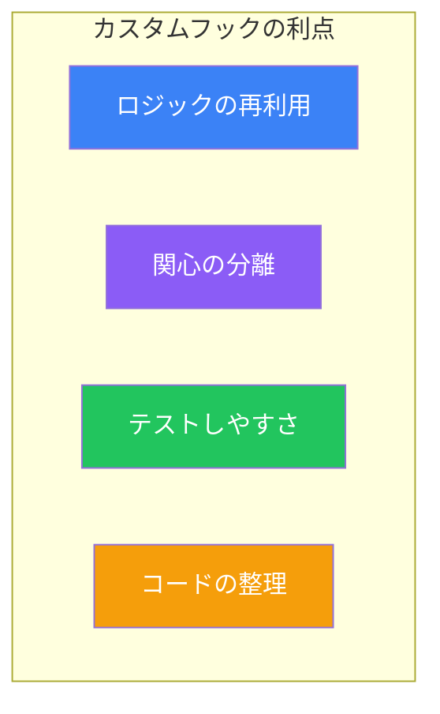
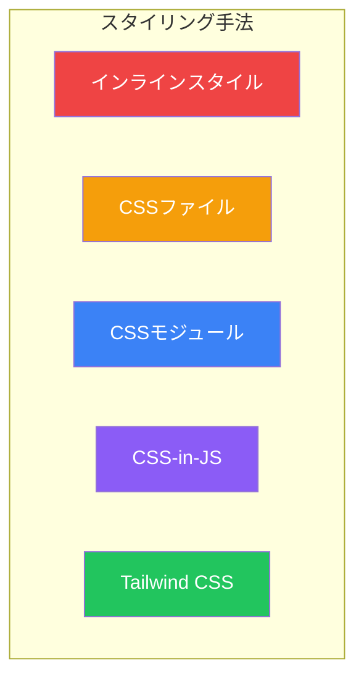
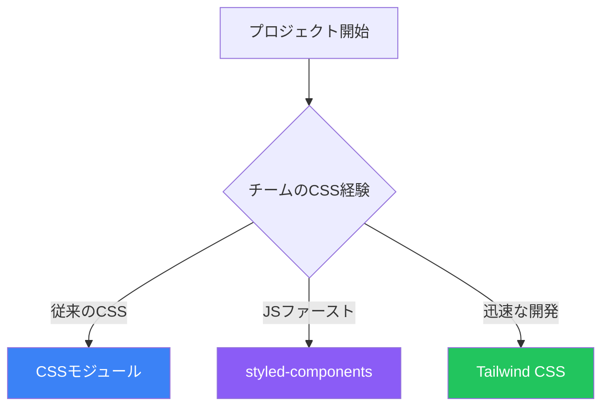

# Day 10: カスタムフックとスタイリング

## 今日学ぶこと

- カスタムフックの作成方法
- よく使われるカスタムフックパターン
- CSSモジュール
- CSS-in-JS（styled-components）
- Tailwind CSS

---

## カスタムフックとは

**カスタムフック**は、コンポーネント間でロジックを再利用するための仕組みです。名前は必ず`use`で始めます。



### 基本的な例

```jsx
import { useState, useEffect } from 'react';

// カスタムフック: ウィンドウサイズを取得
function useWindowSize() {
  const [size, setSize] = useState({
    width: window.innerWidth,
    height: window.innerHeight
  });

  useEffect(() => {
    function handleResize() {
      setSize({
        width: window.innerWidth,
        height: window.innerHeight
      });
    }

    window.addEventListener('resize', handleResize);
    return () => window.removeEventListener('resize', handleResize);
  }, []);

  return size;
}

// 使用例
function ResponsiveComponent() {
  const { width, height } = useWindowSize();

  return (
    <div>
      <p>幅: {width}px</p>
      <p>高さ: {height}px</p>
      {width < 768 ? <MobileLayout /> : <DesktopLayout />}
    </div>
  );
}
```

---

## よく使われるカスタムフックパターン

### useToggle - トグル状態

```jsx
function useToggle(initialValue = false) {
  const [value, setValue] = useState(initialValue);

  const toggle = useCallback(() => {
    setValue(prev => !prev);
  }, []);

  const setTrue = useCallback(() => setValue(true), []);
  const setFalse = useCallback(() => setValue(false), []);

  return { value, toggle, setTrue, setFalse };
}

// 使用例
function Modal() {
  const { value: isOpen, toggle, setFalse: close } = useToggle();

  return (
    <>
      <button onClick={toggle}>Open Modal</button>
      {isOpen && (
        <div className="modal">
          <p>Modal Content</p>
          <button onClick={close}>Close</button>
        </div>
      )}
    </>
  );
}
```

### useLocalStorage - ローカルストレージ

```jsx
function useLocalStorage(key, initialValue) {
  const [storedValue, setStoredValue] = useState(() => {
    try {
      const item = window.localStorage.getItem(key);
      return item ? JSON.parse(item) : initialValue;
    } catch (error) {
      console.error(error);
      return initialValue;
    }
  });

  const setValue = useCallback((value) => {
    try {
      const valueToStore = value instanceof Function
        ? value(storedValue)
        : value;
      setStoredValue(valueToStore);
      window.localStorage.setItem(key, JSON.stringify(valueToStore));
    } catch (error) {
      console.error(error);
    }
  }, [key, storedValue]);

  return [storedValue, setValue];
}

// 使用例
function Settings() {
  const [theme, setTheme] = useLocalStorage('theme', 'light');

  return (
    <select value={theme} onChange={(e) => setTheme(e.target.value)}>
      <option value="light">ライト</option>
      <option value="dark">ダーク</option>
    </select>
  );
}
```

### useFetch - データフェッチング

```jsx
function useFetch(url) {
  const [data, setData] = useState(null);
  const [loading, setLoading] = useState(true);
  const [error, setError] = useState(null);

  useEffect(() => {
    const controller = new AbortController();

    async function fetchData() {
      try {
        setLoading(true);
        setError(null);

        const response = await fetch(url, {
          signal: controller.signal
        });

        if (!response.ok) {
          throw new Error(`HTTP error! status: ${response.status}`);
        }

        const json = await response.json();
        setData(json);
      } catch (err) {
        if (err.name !== 'AbortError') {
          setError(err.message);
        }
      } finally {
        setLoading(false);
      }
    }

    fetchData();

    return () => controller.abort();
  }, [url]);

  return { data, loading, error };
}

// 使用例
function UserProfile({ userId }) {
  const { data: user, loading, error } = useFetch(`/api/users/${userId}`);

  if (loading) return <p>読み込み中...</p>;
  if (error) return <p>エラー: {error}</p>;

  return <h1>{user.name}</h1>;
}
```

### useDebounce - 入力の遅延処理

```jsx
function useDebounce(value, delay = 500) {
  const [debouncedValue, setDebouncedValue] = useState(value);

  useEffect(() => {
    const timer = setTimeout(() => {
      setDebouncedValue(value);
    }, delay);

    return () => clearTimeout(timer);
  }, [value, delay]);

  return debouncedValue;
}

// 使用例
function SearchInput() {
  const [query, setQuery] = useState('');
  const debouncedQuery = useDebounce(query, 300);

  useEffect(() => {
    if (debouncedQuery) {
      console.log('検索:', debouncedQuery);
      // API呼び出し
    }
  }, [debouncedQuery]);

  return (
    <input
      value={query}
      onChange={(e) => setQuery(e.target.value)}
      placeholder="検索..."
    />
  );
}
```

---

## Reactでのスタイリング

Reactでは様々なスタイリング方法があります。



| 手法 | 特徴 | 適した用途 |
|------|------|-----------|
| インラインスタイル | シンプル、動的 | 小さな動的スタイル |
| CSSファイル | 伝統的、グローバル | 小規模プロジェクト |
| CSSモジュール | スコープ付き | 中〜大規模プロジェクト |
| CSS-in-JS | JSと統合 | コンポーネントライブラリ |
| Tailwind CSS | ユーティリティファースト | 迅速な開発 |

---

## CSSモジュール

CSSモジュールは、CSSクラス名を自動的にスコープ化します。

### セットアップ

Viteでは追加設定なしで使用できます。ファイル名を`.module.css`にするだけです。

### 使用例

```css
/* Button.module.css */
.button {
  padding: 10px 20px;
  border: none;
  border-radius: 4px;
  cursor: pointer;
}

.primary {
  background-color: #3b82f6;
  color: white;
}

.secondary {
  background-color: #6b7280;
  color: white;
}

.danger {
  background-color: #ef4444;
  color: white;
}
```

```jsx
// Button.jsx
import styles from './Button.module.css';

function Button({ variant = 'primary', children, ...props }) {
  return (
    <button
      className={`${styles.button} ${styles[variant]}`}
      {...props}
    >
      {children}
    </button>
  );
}

// 使用例
<Button variant="primary">送信</Button>
<Button variant="danger">削除</Button>
```

### 動的クラス名

```jsx
import styles from './Card.module.css';

function Card({ isActive, children }) {
  const cardClass = [
    styles.card,
    isActive && styles.active
  ].filter(Boolean).join(' ');

  return <div className={cardClass}>{children}</div>;
}
```

---

## CSS-in-JS (styled-components)

styled-componentsは、JavaScriptの中でCSSを書く人気のライブラリです。

### インストール

```bash
npm install styled-components
```

### 基本的な使い方

```jsx
import styled from 'styled-components';

// スタイル付きコンポーネントを作成
const Button = styled.button`
  padding: 10px 20px;
  border: none;
  border-radius: 4px;
  cursor: pointer;
  background-color: ${props => props.$primary ? '#3b82f6' : '#6b7280'};
  color: white;

  &:hover {
    opacity: 0.9;
  }
`;

// 使用例
function App() {
  return (
    <>
      <Button $primary>Primary Button</Button>
      <Button>Secondary Button</Button>
    </>
  );
}
```

### 既存コンポーネントの拡張

```jsx
const BaseButton = styled.button`
  padding: 10px 20px;
  border: none;
  border-radius: 4px;
  cursor: pointer;
`;

// 拡張
const PrimaryButton = styled(BaseButton)`
  background-color: #3b82f6;
  color: white;
`;

const DangerButton = styled(BaseButton)`
  background-color: #ef4444;
  color: white;
`;
```

### テーマの使用

```jsx
import styled, { ThemeProvider } from 'styled-components';

const theme = {
  colors: {
    primary: '#3b82f6',
    secondary: '#6b7280',
    danger: '#ef4444'
  },
  spacing: {
    small: '8px',
    medium: '16px',
    large: '24px'
  }
};

const Button = styled.button`
  padding: ${props => props.theme.spacing.medium};
  background-color: ${props => props.theme.colors.primary};
  color: white;
`;

function App() {
  return (
    <ThemeProvider theme={theme}>
      <Button>Themed Button</Button>
    </ThemeProvider>
  );
}
```

---

## Tailwind CSS

Tailwind CSSは、ユーティリティファーストのCSSフレームワークです。

### セットアップ（Vite）

```bash
npm install -D tailwindcss postcss autoprefixer
npx tailwindcss init -p
```

```javascript
// tailwind.config.js
export default {
  content: [
    "./index.html",
    "./src/**/*.{js,ts,jsx,tsx}",
  ],
  theme: {
    extend: {},
  },
  plugins: [],
}
```

```css
/* index.css */
@tailwind base;
@tailwind components;
@tailwind utilities;
```

### 基本的な使い方

```jsx
function Button({ variant = 'primary', children }) {
  const baseClasses = "px-4 py-2 rounded font-medium";

  const variantClasses = {
    primary: "bg-blue-500 text-white hover:bg-blue-600",
    secondary: "bg-gray-500 text-white hover:bg-gray-600",
    danger: "bg-red-500 text-white hover:bg-red-600",
  };

  return (
    <button className={`${baseClasses} ${variantClasses[variant]}`}>
      {children}
    </button>
  );
}

// 使用例
<Button variant="primary">送信</Button>
```

### レスポンシブデザイン

```jsx
function Card() {
  return (
    <div className="p-4 md:p-6 lg:p-8">
      <h2 className="text-lg md:text-xl lg:text-2xl font-bold">
        タイトル
      </h2>
      <p className="text-sm md:text-base text-gray-600">
        説明文がここに入ります。
      </p>
    </div>
  );
}
```

### 条件付きスタイル

```jsx
function Alert({ type = 'info', children }) {
  const classes = {
    info: 'bg-blue-100 text-blue-800 border-blue-300',
    success: 'bg-green-100 text-green-800 border-green-300',
    warning: 'bg-yellow-100 text-yellow-800 border-yellow-300',
    error: 'bg-red-100 text-red-800 border-red-300',
  };

  return (
    <div className={`p-4 border rounded ${classes[type]}`}>
      {children}
    </div>
  );
}
```

---

## スタイリング手法の比較

| 基準 | CSSモジュール | styled-components | Tailwind |
|------|--------------|-------------------|----------|
| 学習曲線 | 低 | 中 | 中 |
| バンドルサイズ | 小 | 中 | 小〜中 |
| ランタイムコスト | なし | あり | なし |
| 動的スタイル | 難しい | 簡単 | 可能 |
| エディタ補完 | 良好 | 良好 | 優秀 |

### プロジェクトに応じた選択



---

## 10日間のまとめ

おめでとうございます！10日間でReactの基礎を学び終えました。

### 学んだこと

| Day | トピック | 主なポイント |
|-----|---------|-------------|
| 1 | Reactへようこそ | 宣言的UI、コンポーネント、Vite |
| 2 | JSXを理解する | JSX構文、条件付きレンダリング、リスト |
| 3 | コンポーネントとProps | Props、children、コンポーネント合成 |
| 4 | Stateとイベント | useState、イベントハンドラー |
| 5 | フォームの処理 | 制御/非制御コンポーネント |
| 6 | 副作用とuseEffect | useEffect、クリーンアップ、データフェッチ |
| 7 | RefsとPortals | useRef、forwardRef、createPortal |
| 8 | ContextとState管理 | Context API、useReducer |
| 9 | パフォーマンス最適化 | memo、useMemo、useCallback、lazy |
| 10 | カスタムフックとスタイリング | カスタムフック、CSSモジュール、Tailwind |

### 次のステップ

1. **実践プロジェクト**: Todoアプリ、ブログ、ECサイトなど
2. **テスト**: Jest、React Testing Library
3. **状態管理**: Zustand、Redux Toolkit
4. **フレームワーク**: Next.js、Remix
5. **TypeScript**: 型安全なReact開発

---

## 練習問題

### 問題1: 基本
`useCounter`カスタムフックを作成してください。増加、減少、リセット機能と、最小/最大値の制限を持たせてください。

### 問題2: 応用
ダークモード切り替え機能を実装してください：
- `useDarkMode`カスタムフック（ローカルストレージに保存）
- Tailwind CSSでダークモードスタイル
- トグルボタン

### チャレンジ問題
完全なTodoアプリを作成してください：
- カスタムフック（`useTodos`）でロジック管理
- ローカルストレージに永続化
- CSSモジュールまたはTailwindでスタイリング
- フィルター機能（全て/完了/未完了）
- アニメーション付き

---

## 参考リンク

- [React公式 - カスタムフック](https://ja.react.dev/learn/reusing-logic-with-custom-hooks)
- [styled-components公式](https://styled-components.com/)
- [Tailwind CSS公式](https://tailwindcss.com/)
- [React TypeScript Cheatsheet](https://react-typescript-cheatsheet.netlify.app/)

---

## おわりに

10日間のReact学習、お疲れさまでした。

この書籍で学んだ内容は、Reactの基礎として非常に重要です。しかし、真のスキルは実践を通じて身につきます。

**学んだことを活かして、自分のプロジェクトを作ってみてください。**

失敗を恐れず、たくさんのコードを書いて、Reactマスターへの道を歩んでいきましょう！
