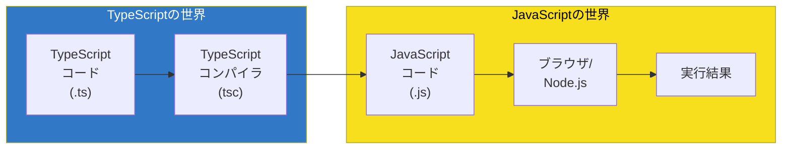
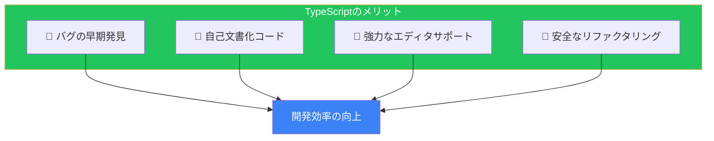
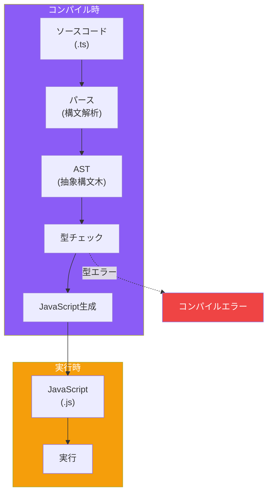

# Day 1: TypeScriptの世界へようこそ

## 今日学ぶこと

- TypeScriptとは何か、なぜ必要なのか
- TypeScriptがどのように動作するか
- 開発環境の構築方法
- 最初のTypeScriptプログラムの作成

---

## JavaScriptの課題

JavaScriptは1995年にBrendan EichによってNetscape社で設計されました。当時はWebページに簡単なインタラクションを追加するための言語として、わずか10日間で作られたと言われています。

それから約30年。JavaScriptは現在、世界で最も広く使われているプログラミング言語の一つになりました。しかし、大規模なアプリケーション開発には課題があります。

### 1. 実行時まで分からないエラー

```javascript
// JavaScriptのコード
function greet(name) {
  console.log("Hello, " + name.toUppercase()); // typo: toUpperCase
}

greet("World"); // 実行時にエラー: name.toUppercase is not a function
```

このコードの問題は、実際に実行するまで分かりません。`toUppercase`は`toUpperCase`のタイプミスですが、JavaScriptは実行するまで何も教えてくれません。

### 2. 引数の型が分からない

```javascript
// この関数は何を受け取るべき？
function calculateTotal(items) {
  return items.reduce((sum, item) => sum + item.price, 0);
}

// 間違った引数を渡してもエラーにならない（実行するまで）
calculateTotal("hello"); // 実行時エラー
calculateTotal(123);     // 実行時エラー
calculateTotal([{ cost: 100 }]); // price ではなく cost... 実行時エラー
```

### 3. エディタのサポートが限定的

型情報がないため、エディタは以下のことができません：

- 正確なオートコンプリート
- 間違ったプロパティ名の警告
- リファクタリング時の影響範囲の特定

---

## TypeScriptとは

TypeScriptは、JavaScriptに**静的型付け**を追加した言語です。Microsoftによって2012年に公開され、現在はオープンソースとして開発が続けられています。



### TypeScriptの特徴

| 特徴 | 説明 |
|------|------|
| **静的型付け** | コードを実行する前に型エラーを検出 |
| **JavaScriptのスーパーセット** | すべてのJavaScriptコードは有効なTypeScript |
| **コンパイル** | TypeScriptはJavaScriptに変換されて実行 |
| **段階的導入** | 既存のJSプロジェクトに少しずつ導入可能 |

### なぜTypeScriptを使うのか



---

## TypeScriptの動作原理

TypeScriptのコンパイルプロセスを理解しましょう。



重要なポイント：

1. **型はコンパイル時のみ存在** - 実行時のJavaScriptには型情報は残りません
2. **型チェックとコード生成は独立** - 型エラーがあってもJavaScriptは生成されます（設定により変更可能）
3. **実行時のパフォーマンスに影響なし** - TypeScriptは最終的にJavaScriptになるため

---

## 環境構築

TypeScriptを始めるための環境を構築しましょう。

### 必要なもの

1. **Node.js** (v18以上推奨)
2. **npm** (Node.jsに付属)
3. **コードエディタ** (VS Code推奨)

### Node.jsのインストール確認

```bash
# Node.jsのバージョン確認
node --version
# v20.x.x などが表示されればOK

# npmのバージョン確認
npm --version
# 10.x.x などが表示されればOK
```

### TypeScriptのインストール

```bash
# グローバルインストール（どこでも使える）
npm install -g typescript

# バージョン確認
tsc --version
# Version 5.x.x などが表示されればOK
```

### VS Codeの設定

VS Codeは、TypeScriptの開発に最適なエディタです。以下の拡張機能をインストールすると便利です：

- **ESLint** - コード品質チェック
- **Prettier** - コードフォーマット
- **Error Lens** - エラーをインラインで表示

---

## 最初のTypeScriptプログラム

### プロジェクトの作成

```bash
# プロジェクトディレクトリを作成
mkdir hello-typescript
cd hello-typescript

# package.jsonを初期化
npm init -y

# TypeScriptをプロジェクトにインストール
npm install typescript --save-dev

# tsconfig.jsonを生成
npx tsc --init
```

### tsconfig.jsonの基本設定

`tsconfig.json`はTypeScriptコンパイラの設定ファイルです。最初は以下の設定で十分です：

```json
{
  "compilerOptions": {
    "target": "ES2020",
    "module": "commonjs",
    "strict": true,
    "outDir": "./dist",
    "rootDir": "./src"
  },
  "include": ["src/**/*"]
}
```

| オプション | 説明 |
|------------|------|
| `target` | 出力するJavaScriptのバージョン |
| `module` | モジュールシステム |
| `strict` | 厳格な型チェックを有効化 |
| `outDir` | コンパイル後のファイル出力先 |
| `rootDir` | ソースファイルのルート |

### Hello, TypeScript!

`src/index.ts`を作成：

```typescript
// src/index.ts
function greet(name: string): string {
  return `Hello, ${name}!`;
}

const message = greet("TypeScript");
console.log(message);
```

コンパイルと実行：

```bash
# コンパイル
npx tsc

# 実行
node dist/index.js
# 出力: Hello, TypeScript!
```

### 型エラーを体験する

試しに間違った型を渡してみましょう：

```typescript
function greet(name: string): string {
  return `Hello, ${name}!`;
}

// 数値を渡そうとする
greet(123);
// エラー: Argument of type 'number' is not assignable to parameter of type 'string'.
```

これがTypeScriptの力です！実行前に問題を発見できます。

---

## TypeScript Playground

ブラウザで手軽にTypeScriptを試したい場合は、公式のPlaygroundが便利です。

**URL**: https://www.typescriptlang.org/play

Playgroundでできること：

- TypeScriptコードの記述と実行
- コンパイル後のJavaScriptの確認
- 様々なコンパイラオプションの試行
- コードの共有

---

## まとめ

| 概念 | 説明 |
|------|------|
| TypeScript | JavaScriptに静的型付けを追加した言語 |
| 静的型付け | コード実行前に型の整合性をチェック |
| tsc | TypeScriptコンパイラ |
| tsconfig.json | コンパイラ設定ファイル |
| 型注釈 | `: string`のように変数や引数に型を指定 |

### 重要ポイント

1. **TypeScriptは「より良いJavaScript」** - JavaScriptの知識はそのまま活かせる
2. **型はコンパイル時のみ** - 実行時にはすべてJavaScriptになる
3. **段階的に導入可能** - 一度にすべてを型付けする必要はない
4. **エディタサポートが強力** - オートコンプリートやリファクタリングが快適に

---

## 練習問題

### 問題1: 基本

以下のJavaScriptコードをTypeScriptに書き換えてください。

```javascript
function add(a, b) {
  return a + b;
}

const result = add(5, 3);
console.log(result);
```

### 問題2: 型エラーの修正

以下のTypeScriptコードにはエラーがあります。修正してください。

```typescript
function multiply(x: number, y: number): number {
  return x * y;
}

const product = multiply("5", 3);
```

### チャレンジ問題

自己紹介を返す関数を作成してください。

- 関数名: `introduce`
- 引数: `name`（文字列）、`age`（数値）
- 戻り値: `"My name is {name} and I am {age} years old."`という文字列

---

## 参考リンク

- [TypeScript公式サイト](https://www.typescriptlang.org/)
- [TypeScript Playground](https://www.typescriptlang.org/play)
- [TypeScript Deep Dive（日本語）](https://typescript-jp.gitbook.io/deep-dive/)

---

**次回予告**: Day 2では「基本の型を理解する」について学びます。string、number、booleanなどのプリミティブ型と、型推論の仕組みを詳しく見ていきましょう。
