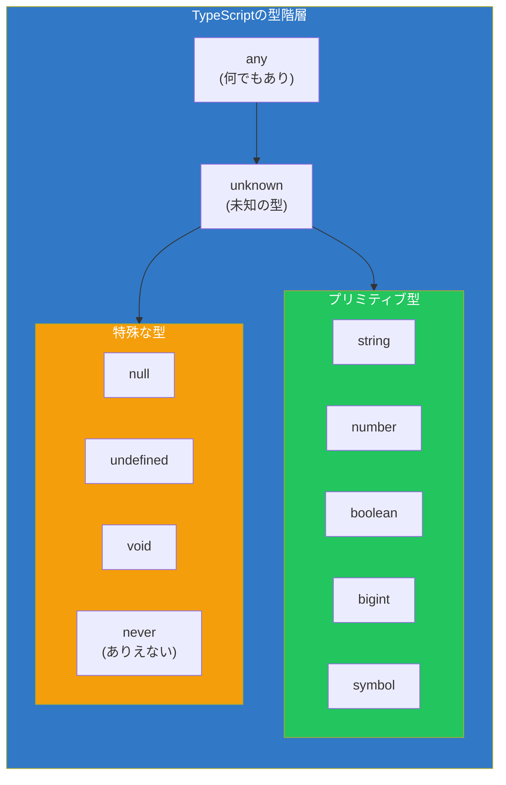
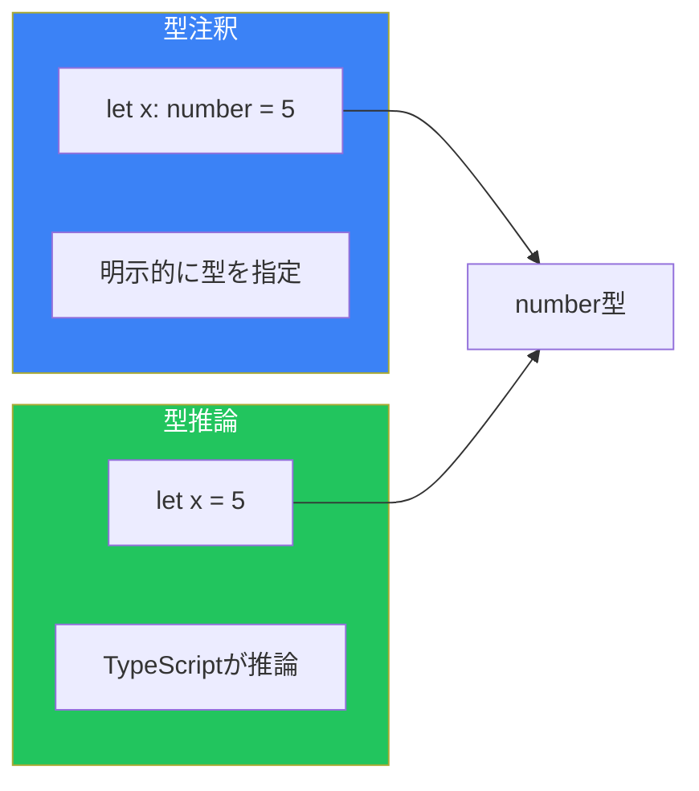
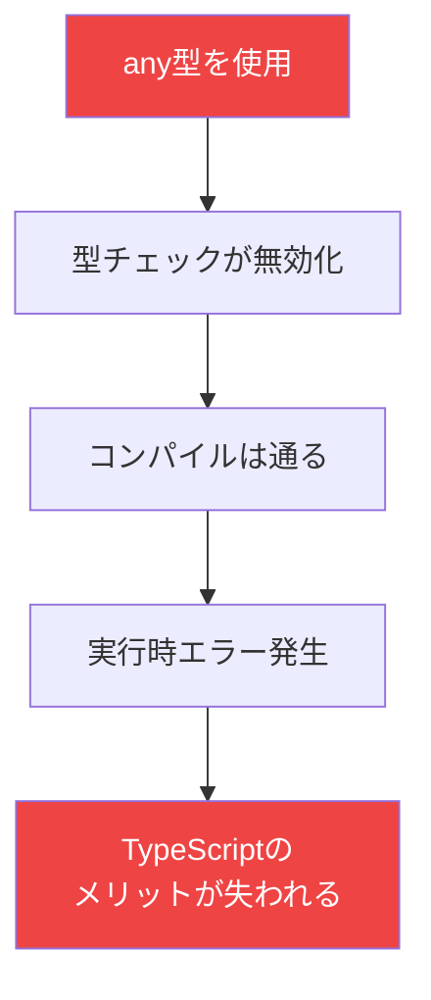
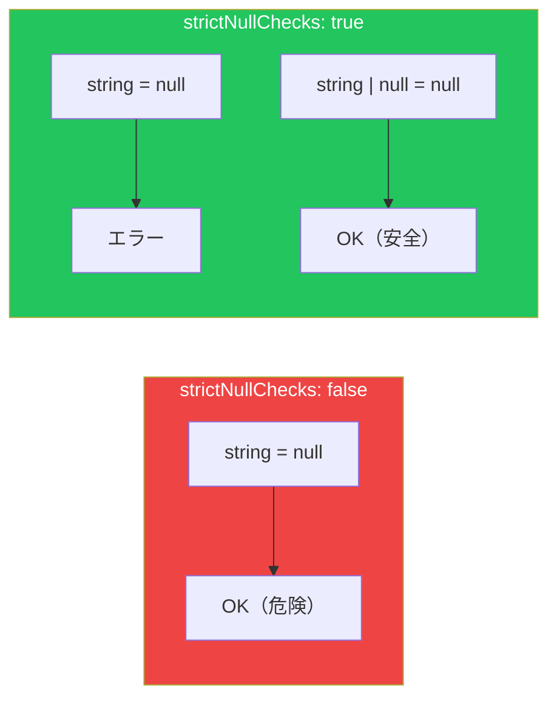
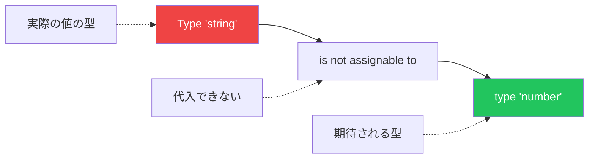

# Day 2: 基本の型を理解する

## 今日学ぶこと

- プリミティブ型（string, number, boolean）
- 型注釈と型推論の違い
- any, unknown, never の使い分け
- null と undefined の扱い方

---

## 型とは何か

TypeScriptにおける「型」とは、**値の集合と、その値に対して実行できる操作**を表します。

例えば：

- `string`型 = すべての文字列の集合 + 文字列に対する操作（`+`, `.toUpperCase()`, `.slice()`など）
- `number`型 = すべての数値の集合 + 数値に対する操作（`+`, `-`, `*`, `/`など）

型を知ることで、その値に対して**何ができるか**と**何ができないか**が明確になります。



---

## プリミティブ型

JavaScriptの7つのプリミティブ値には、それぞれ対応するTypeScriptの型があります。

### string（文字列）

```typescript
// 型注釈を明示
let greeting: string = "Hello, World!";

// 型推論（TypeScriptが自動で判断）
let name = "TypeScript"; // string型と推論される

// 文字列の操作
greeting.toUpperCase(); // OK
greeting.toLowerCase(); // OK
greeting * 2;           // エラー: 文字列に * 演算子は使えない
```

### number（数値）

```typescript
let age: number = 25;
let price = 19.99;        // number型と推論
let hex = 0xff;           // 16進数もnumber
let binary = 0b1010;      // 2進数もnumber

// 数値の操作
age + 10;        // OK
age.toFixed(2);  // OK
age.toUpperCase(); // エラー: numberにtoUpperCaseはない
```

### boolean（真偽値）

```typescript
let isActive: boolean = true;
let isCompleted = false;  // boolean型と推論

// 論理演算
!isActive;          // OK
isActive && isCompleted; // OK
isActive + 1;       // エラー: booleanに + 演算子は使えない
```

### bigint（大きな整数）

```typescript
// ES2020以降で利用可能
let bigNumber: bigint = 9007199254740991n;
let anotherBig = BigInt(123); // bigint型と推論

// numberとbigintは混在できない
let num: number = 100;
bigNumber + num; // エラー: bigintとnumberは混在不可
bigNumber + 100n; // OK
```

### symbol（シンボル）

```typescript
let sym1: symbol = Symbol("description");
let sym2 = Symbol("description");

// シンボルは常にユニーク
sym1 === sym2; // false（同じ説明でも異なるシンボル）
```

---

## 型注釈と型推論

TypeScriptには型を指定する2つの方法があります。

### 型注釈（Type Annotation）

プログラマーが明示的に型を指定します：

```typescript
let username: string = "alice";
let count: number = 42;
let isValid: boolean = true;
```

### 型推論（Type Inference）

TypeScriptが初期値から自動的に型を推論します：

```typescript
let username = "alice";    // string と推論
let count = 42;            // number と推論
let isValid = true;        // boolean と推論
```



### どちらを使うべき？

| シナリオ | 推奨 |
|----------|------|
| 初期値がある変数 | 型推論に任せる |
| 関数の引数 | 型注釈を使う |
| 関数の戻り値 | 型注釈を使う（複雑な場合） |
| 初期値がない変数 | 型注釈が必須 |

```typescript
// 型推論で十分なケース
let message = "Hello"; // string と明らか

// 型注釈が必要なケース
let data: string[]; // 初期値なし、後で代入
data = ["a", "b", "c"];

// 関数の引数には型注釈
function greet(name: string): string {
  return `Hello, ${name}!`;
}
```

---

## any型：逃げ道だが使うべきでない

`any`型は、どんな型でも受け入れる特殊な型です。

```typescript
let anything: any = "hello";
anything = 42;        // OK
anything = true;      // OK
anything = { x: 1 };  // OK

// anyは型チェックを無効化
anything.foo.bar.baz(); // エラーにならない（実行時エラーの危険）
```

### anyの問題点



**`any`は原則として使わない**ことを推奨します。やむを得ない場合のみ使用してください。

---

## unknown型：安全な「わからない」

`unknown`型は「型が分からない」ことを表しますが、`any`より安全です。

```typescript
let value: unknown = "hello";
value = 42;        // OK
value = true;      // OK

// unknownはそのままでは操作できない
value.toUpperCase(); // エラー: 'unknown'型にはtoUpperCaseがない

// 型を確認してから操作
if (typeof value === "string") {
  value.toUpperCase(); // OK: stringであることが確認された
}
```

### anyとunknownの比較

| 特徴 | any | unknown |
|------|-----|---------|
| 何でも代入できる | ✅ | ✅ |
| そのまま操作できる | ✅ | ❌ |
| 型チェックの恩恵 | ❌ | ✅ |
| 推奨度 | 低 | 高 |

```typescript
// 外部からのデータを受け取る場合
function processData(data: unknown) {
  // 型チェックが必須
  if (typeof data === "string") {
    return data.toUpperCase();
  }
  if (typeof data === "number") {
    return data * 2;
  }
  return null;
}
```

---

## never型：決して起こらない

`never`型は、**決して値を持たない**型です。主に2つの場面で使われます：

### 1. 関数が決してreturnしない

```typescript
// 常に例外をスロー
function throwError(message: string): never {
  throw new Error(message);
}

// 無限ループ
function infiniteLoop(): never {
  while (true) {
    // 永遠に終わらない
  }
}
```

### 2. 網羅性チェック

```typescript
type Color = "red" | "green" | "blue";

function getColorCode(color: Color): string {
  switch (color) {
    case "red":
      return "#ff0000";
    case "green":
      return "#00ff00";
    case "blue":
      return "#0000ff";
    default:
      // ここに到達したら型エラー
      const exhaustiveCheck: never = color;
      return exhaustiveCheck;
  }
}
```

---

## null と undefined

JavaScriptには「値がない」ことを表す2つの値があります。

```typescript
let nullable: string | null = null;
let undefinedValue: string | undefined = undefined;

// nullableな値を使う前にチェック
if (nullable !== null) {
  console.log(nullable.toUpperCase()); // OK
}
```

### strictNullChecks

`tsconfig.json`で`strict: true`または`strictNullChecks: true`を設定すると、nullやundefinedの扱いが厳格になります。

```typescript
// strictNullChecks: true の場合
let name: string = null; // エラー: nullはstringに代入できない

// nullを許容する場合は明示的に
let name: string | null = null; // OK
```



---

## 型エラーの読み方

TypeScriptのエラーメッセージは情報量が多いです。読み方を覚えましょう。

```typescript
let count: number = "hello";
// Type 'string' is not assignable to type 'number'.
```

エラーメッセージの構造：
- `Type 'X'` - 実際に渡された値の型
- `is not assignable to` - 代入できない
- `type 'Y'` - 期待されている型



---

## まとめ

| 型 | 説明 | 例 |
|----|------|-----|
| string | 文字列 | `"hello"`, `'world'` |
| number | 数値 | `42`, `3.14` |
| boolean | 真偽値 | `true`, `false` |
| bigint | 大きな整数 | `9007199254740991n` |
| symbol | ユニークな識別子 | `Symbol("id")` |
| any | 何でもあり（非推奨） | - |
| unknown | 未知の型（安全） | - |
| never | ありえない型 | - |
| null | 値がない | `null` |
| undefined | 未定義 | `undefined` |

### 重要ポイント

1. **型推論を活用** - 明らかな場合は型注釈を省略できる
2. **anyは避ける** - 型チェックの恩恵が失われる
3. **unknownを使う** - 型が分からない場合の安全な選択
4. **strictNullChecksを有効に** - null安全なコードを書く

---

## 練習問題

### 問題1: 型の特定

以下の変数にはどの型が推論されるでしょうか？

```typescript
let a = "TypeScript";
let b = 3.14;
let c = true;
let d = null;
let e;
```

### 問題2: 型エラーの修正

以下のコードのエラーを修正してください。

```typescript
let score: number = "100";
let isActive: boolean = 1;
let name: string = undefined;
```

### チャレンジ問題

`unknown`型の値を受け取り、文字列なら大文字に、数値なら2倍にする関数`processValue`を作成してください。それ以外の型の場合は`null`を返します。

---

## 参考リンク

- [TypeScript Handbook - Everyday Types](https://www.typescriptlang.org/docs/handbook/2/everyday-types.html)
- [MDN - JavaScript データ型](https://developer.mozilla.org/ja/docs/Web/JavaScript/Data_structures)

---

**次回予告**: Day 3では「Union型と型の絞り込み」を学びます。複数の型を組み合わせる方法と、Type Guardによる型の絞り込みを理解しましょう。
