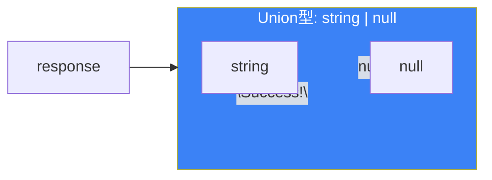
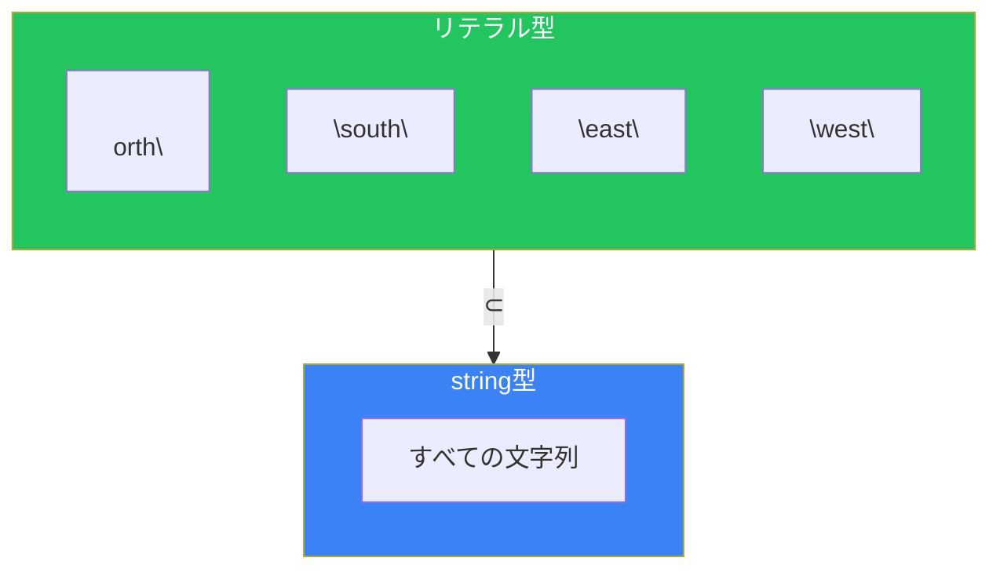
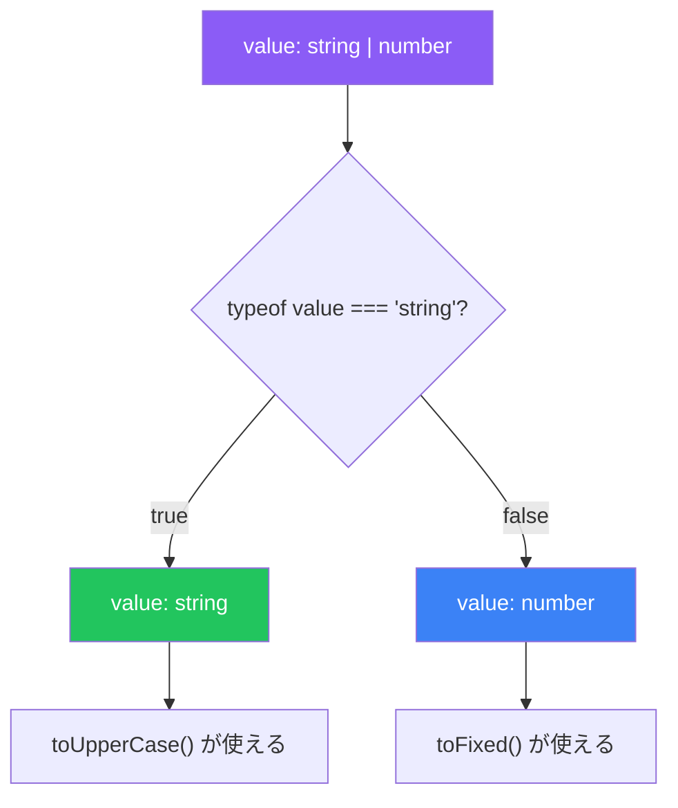
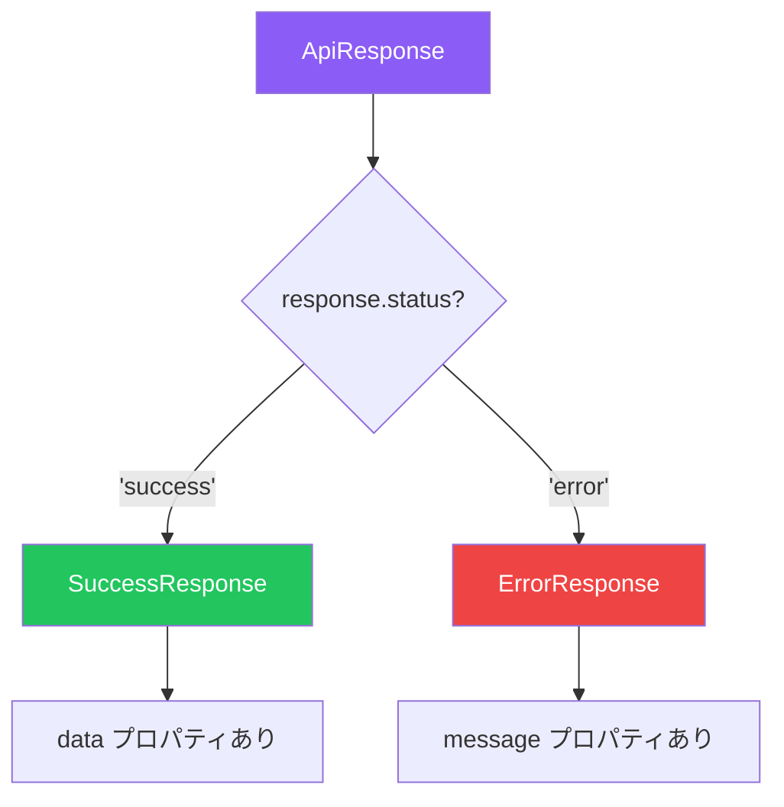

# Day 3: Union型と型の絞り込み

## 今日学ぶこと

- Union型（|）で複数の型を組み合わせる
- リテラル型で特定の値のみを許容する
- 型の絞り込み（Narrowing）の仕組み
- 型エイリアスで型に名前をつける

---

## Union型とは

現実のプログラムでは、変数が複数の型を持つ可能性があることがよくあります。

```typescript
// APIからのレスポンス：成功時は文字列、失敗時はnull
let response = Math.random() > 0.5 ? "Success!" : null;
// response の型は string | null
```

この `string | null` のように、「AまたはB」を表す型を**Union型**と呼びます。



### Union型の基本構文

```typescript
// 2つの型のUnion
let id: string | number;
id = "abc123";  // OK
id = 12345;     // OK
id = true;      // エラー: booleanはstring | numberに代入できない

// 3つ以上の型も可能
let value: string | number | boolean;
value = "hello";  // OK
value = 42;       // OK
value = true;     // OK
```

### Union型のプロパティアクセス

Union型の値に対しては、**すべての構成型で共通するプロパティ**のみアクセスできます。

```typescript
let value: string | number;

// 共通するメソッドは使える
value.toString();  // OK: stringにもnumberにもある

// 片方にしかないメソッドは使えない
value.toUpperCase(); // エラー: numberにはtoUpperCaseがない
value.toFixed();     // エラー: stringにはtoFixedがない
```

---

## リテラル型

通常の型（`string`, `number`）は、その型のすべての値を許容します。しかし、**リテラル型**を使うと、特定の値のみを許容できます。

```typescript
// 通常のstring型：すべての文字列を許容
let direction: string = "north";
direction = "south";  // OK
direction = "hello";  // OK（意図しない値も許容）

// リテラル型：特定の値のみ許容
let direction2: "north" | "south" | "east" | "west";
direction2 = "north"; // OK
direction2 = "south"; // OK
direction2 = "hello"; // エラー: "hello"は許容されない
```



### リテラル型の種類

```typescript
// 文字列リテラル型
type Status = "pending" | "approved" | "rejected";

// 数値リテラル型
type DiceValue = 1 | 2 | 3 | 4 | 5 | 6;

// 真偽値リテラル型（true または false のみ）
type True = true;
type False = false;
```

### constとletの型推論の違い

```typescript
// letは変更可能なので、広い型が推論される
let message = "Hello";  // 型: string

// constは変更不可なので、リテラル型が推論される
const greeting = "Hello";  // 型: "Hello"
```

---

## 型の絞り込み（Narrowing）

Union型の値を使う際、TypeScriptは**条件分岐**によって型を絞り込むことができます。これを**Narrowing**と呼びます。

### typeof による絞り込み

```typescript
function printValue(value: string | number) {
  // ここでは value は string | number

  if (typeof value === "string") {
    // ここでは value は string
    console.log(value.toUpperCase());
  } else {
    // ここでは value は number
    console.log(value.toFixed(2));
  }
}
```



### 真偽値による絞り込み

```typescript
function printName(name: string | null) {
  if (name) {
    // name が truthy なら string
    console.log(name.toUpperCase());
  } else {
    // name が falsy なら null（または空文字列）
    console.log("No name provided");
  }
}
```

### in 演算子による絞り込み

```typescript
type Fish = { swim: () => void };
type Bird = { fly: () => void };

function move(animal: Fish | Bird) {
  if ("swim" in animal) {
    // animal は Fish
    animal.swim();
  } else {
    // animal は Bird
    animal.fly();
  }
}
```

### instanceof による絞り込み

```typescript
function formatDate(date: Date | string) {
  if (date instanceof Date) {
    // date は Date
    return date.toISOString();
  } else {
    // date は string
    return new Date(date).toISOString();
  }
}
```

### 比較による絞り込み

```typescript
function printLength(value: string | string[] | null) {
  if (value === null) {
    // value は null
    console.log("No value");
  } else if (typeof value === "string") {
    // value は string
    console.log(`String length: ${value.length}`);
  } else {
    // value は string[]
    console.log(`Array length: ${value.length}`);
  }
}
```

---

## 型エイリアス（Type Alias）

複雑な型や、繰り返し使う型には**型エイリアス**で名前をつけられます。

```typescript
// 型エイリアスの定義
type ID = string | number;
type Status = "pending" | "approved" | "rejected";

// 使用
let userId: ID = "user_123";
let postId: ID = 456;
let orderStatus: Status = "pending";
```

### 型エイリアスの命名規則

```typescript
// PascalCase を使う
type UserID = string;
type HttpStatus = 200 | 404 | 500;
type ApiResponse = { data: unknown; error: string | null };
```

### 型エイリアスの組み合わせ

```typescript
type StringOrNumber = string | number;
type NullableString = string | null;

// エイリアスを組み合わせる
type ID = StringOrNumber | null;

// 条件に応じた結果型
type Result =
  | { success: true; data: string }
  | { success: false; error: string };
```

---

## 判別可能なUnion（Discriminated Union）

実際のアプリケーションでは、オブジェクトのUnion型をよく使います。このとき、**共通のプロパティ**で型を判別できると便利です。

```typescript
type SuccessResponse = {
  status: "success";
  data: string;
};

type ErrorResponse = {
  status: "error";
  message: string;
};

type ApiResponse = SuccessResponse | ErrorResponse;

function handleResponse(response: ApiResponse) {
  // status プロパティで判別
  if (response.status === "success") {
    // response は SuccessResponse
    console.log(response.data);
  } else {
    // response は ErrorResponse
    console.log(response.message);
  }
}
```



### 判別可能なUnionのベストプラクティス

```typescript
// 共通の判別プロパティを持つ
type LoadingState = { status: "loading" };
type SuccessState = { status: "success"; data: string[] };
type ErrorState = { status: "error"; error: Error };

type State = LoadingState | SuccessState | ErrorState;

function renderState(state: State) {
  switch (state.status) {
    case "loading":
      return "Loading...";
    case "success":
      return state.data.join(", ");
    case "error":
      return `Error: ${state.error.message}`;
  }
}
```

---

## まとめ

| 概念 | 説明 | 例 |
|------|------|-----|
| Union型 | 複数の型のいずれか | `string \| number` |
| リテラル型 | 特定の値のみ | `"north" \| "south"` |
| Narrowing | 条件分岐で型を絞り込む | `typeof`, `in`, `instanceof` |
| 型エイリアス | 型に名前をつける | `type ID = string \| number` |
| 判別可能なUnion | 共通プロパティで判別 | `{ status: "success" } \| { status: "error" }` |

### 重要ポイント

1. **Union型は「または」** - 複数の型のいずれかを許容
2. **リテラル型で厳格に** - 特定の値のみを許容することでバグを防ぐ
3. **Narrowingを活用** - 条件分岐で型を絞り込んで安全に操作
4. **型エイリアスで可読性向上** - 複雑な型には名前をつける

---

## 練習問題

### 問題1: 基本

以下の変数の型を答えてください。

```typescript
let a = Math.random() > 0.5 ? "hello" : 42;
let b = Math.random() > 0.5 ? true : null;
const c = "fixed";
```

### 問題2: Narrowing

以下の関数を完成させてください。`value`が文字列なら長さを、数値ならその数値自体を、それ以外なら0を返します。

```typescript
function getLength(value: string | number | boolean): number {
  // ここに実装
}
```

### チャレンジ問題

ショッピングカートの状態を表す判別可能なUnion型を作成してください。

- `empty`: カートが空
- `hasItems`: 商品がある（items配列を持つ）
- `checkout`: 支払い処理中（items配列と totalPrice を持つ）

そして、状態に応じたメッセージを返す関数 `getCartMessage` を実装してください。

---

## 参考リンク

- [TypeScript Handbook - Narrowing](https://www.typescriptlang.org/docs/handbook/2/narrowing.html)
- [TypeScript Handbook - Union Types](https://www.typescriptlang.org/docs/handbook/2/everyday-types.html#union-types)

---

**次回予告**: Day 4では「関数に型をつける」を学びます。引数と戻り値の型定義、オプショナルパラメータ、関数オーバーロードなどを理解しましょう。
