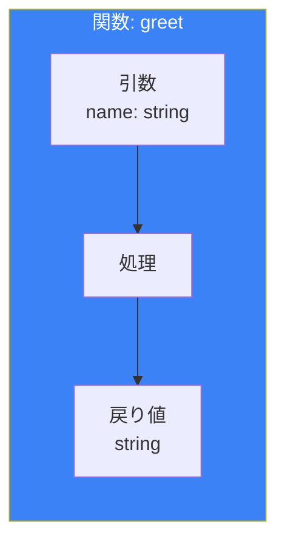
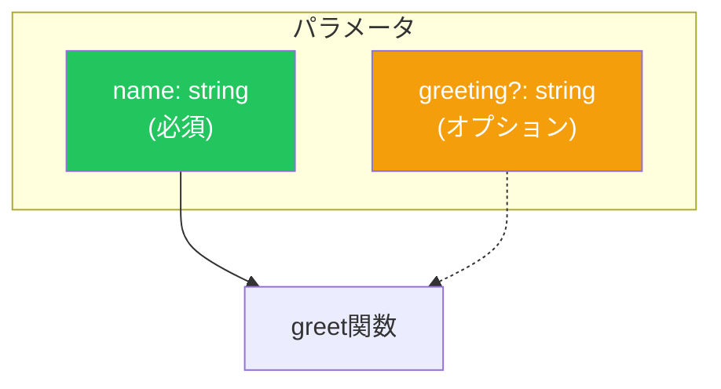
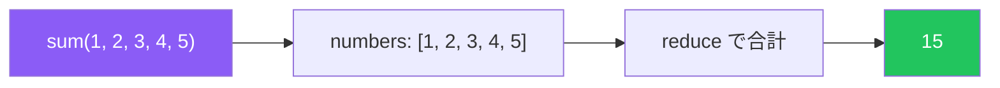
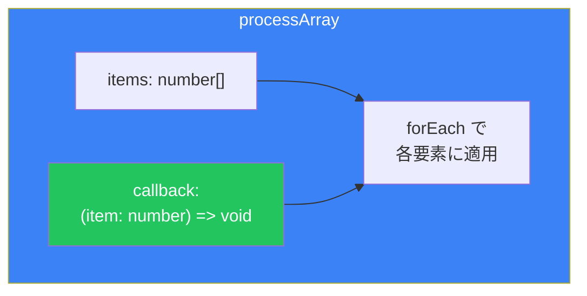
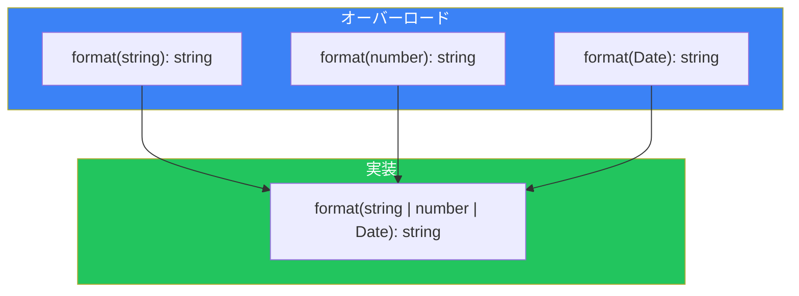

# Day 4: 関数に型をつける

## 今日学ぶこと

- 関数の引数と戻り値に型をつける
- オプショナルパラメータとデフォルト値
- Rest Parameters（残余引数）
- void型とnever型の関数
- 関数オーバーロード
- コールバック関数の型定義

---

## 関数の基本的な型定義

TypeScriptでは、関数の**引数（パラメータ）**と**戻り値**に型を指定できます。

```typescript
// 基本的な関数の型定義
function greet(name: string): string {
  return `Hello, ${name}!`;
}

// 呼び出し
greet("TypeScript"); // OK
greet(123);          // エラー: numberはstringに代入できない
```



### アロー関数の型定義

```typescript
// アロー関数でも同様
const add = (a: number, b: number): number => {
  return a + b;
};

// 省略形（式が1つの場合）
const multiply = (a: number, b: number): number => a * b;
```

### 戻り値の型推論

TypeScriptは戻り値の型を推論できますが、明示することも推奨されます。

```typescript
// 型推論に任せる
function add(a: number, b: number) {
  return a + b; // 戻り値はnumberと推論される
}

// 明示的に型を指定（推奨）
function subtract(a: number, b: number): number {
  return a - b;
}
```

---

## オプショナルパラメータ

パラメータの後に `?` をつけると、そのパラメータは省略可能になります。

```typescript
function greet(name: string, greeting?: string): string {
  // greeting は string | undefined
  if (greeting) {
    return `${greeting}, ${name}!`;
  }
  return `Hello, ${name}!`;
}

greet("Alice");           // "Hello, Alice!"
greet("Bob", "Hi");       // "Hi, Bob!"
greet("Charlie", "Hey");  // "Hey, Charlie!"
```



### オプショナルパラメータの注意点

- オプショナルパラメータは**必須パラメータの後**に配置
- 値が渡されない場合は `undefined`

```typescript
// エラー: オプショナルパラメータは必須パラメータの後に
function bad(a?: string, b: number) { } // エラー

// OK
function good(a: number, b?: string) { } // OK
```

---

## デフォルトパラメータ

パラメータにデフォルト値を設定できます。

```typescript
function greet(name: string, greeting: string = "Hello"): string {
  return `${greeting}, ${name}!`;
}

greet("Alice");           // "Hello, Alice!"
greet("Bob", "Hi");       // "Hi, Bob!"
greet("Charlie", undefined); // "Hello, Charlie!" (デフォルト値が使われる)
```

### デフォルトパラメータの型推論

```typescript
// デフォルト値から型が推論される
function createUser(name: string, age = 20) {
  // age は number と推論される
  return { name, age };
}
```

---

## Rest Parameters（残余引数）

可変長の引数を配列として受け取れます。

```typescript
function sum(...numbers: number[]): number {
  return numbers.reduce((total, n) => total + n, 0);
}

sum(1, 2);           // 3
sum(1, 2, 3, 4, 5);  // 15
sum();               // 0
```



### Rest Parametersと通常のパラメータの組み合わせ

```typescript
function log(message: string, ...values: unknown[]): void {
  console.log(message, ...values);
}

log("Hello");                    // "Hello"
log("Values:", 1, 2, 3);         // "Values:" 1 2 3
log("Mixed:", "a", 1, true);     // "Mixed:" "a" 1 true
```

---

## void型：戻り値がない関数

関数が何も返さない場合、戻り値の型は `void` です。

```typescript
function logMessage(message: string): void {
  console.log(message);
  // return文がない、または return; のみ
}

// アロー関数でも同様
const printHello = (): void => {
  console.log("Hello!");
};
```

### voidとundefinedの違い

```typescript
// void: 戻り値を使わないことを示す
function logA(): void {
  console.log("A");
}

// undefined: undefinedを返すことを示す
function logB(): undefined {
  console.log("B");
  return undefined; // 必須
}

const resultA = logA(); // void
const resultB = logB(); // undefined
```

---

## never型：決してreturnしない関数

関数が**決して正常に終了しない**場合、戻り値の型は `never` です。

```typescript
// 常に例外をスロー
function throwError(message: string): never {
  throw new Error(message);
}

// 無限ループ
function infiniteLoop(): never {
  while (true) {
    // 永遠に終わらない
  }
}
```

### voidとneverの違い

| 型 | 説明 | 例 |
|----|------|-----|
| void | 戻り値がない（正常終了） | `console.log()` |
| never | 決してreturnしない | `throw`, 無限ループ |

---

## 関数型

関数自体の型を定義できます。

```typescript
// 関数型の定義
type GreetFunction = (name: string) => string;

// 関数型を使用
const greet: GreetFunction = (name) => {
  return `Hello, ${name}!`;
};

// 型注釈があるので、引数の型は推論される
const greet2: GreetFunction = (name) => `Hi, ${name}!`;
```

### コールバック関数の型

```typescript
// コールバック関数を受け取る関数
function processArray(
  items: number[],
  callback: (item: number) => void
): void {
  items.forEach(callback);
}

processArray([1, 2, 3], (item) => {
  console.log(item * 2);
});
```



### 複雑な関数型

```typescript
// 複数のシグネチャを持つ関数型
type EventHandler = {
  (event: MouseEvent): void;
  (event: KeyboardEvent): void;
};

// オブジェクト内の関数
type Calculator = {
  add: (a: number, b: number) => number;
  subtract: (a: number, b: number) => number;
};

const calc: Calculator = {
  add: (a, b) => a + b,
  subtract: (a, b) => a - b,
};
```

---

## 関数オーバーロード

同じ関数名で、異なる引数パターンに対応できます。

```typescript
// オーバーロードシグネチャ
function format(value: string): string;
function format(value: number): string;
function format(value: Date): string;

// 実装シグネチャ
function format(value: string | number | Date): string {
  if (typeof value === "string") {
    return value.toUpperCase();
  }
  if (typeof value === "number") {
    return value.toFixed(2);
  }
  return value.toISOString();
}

format("hello");      // "HELLO"
format(3.14159);      // "3.14"
format(new Date());   // "2024-01-20T..."
```

### オーバーロードの注意点

1. **オーバーロードシグネチャ**：呼び出し時の型チェックに使用
2. **実装シグネチャ**：実際の実装（すべてのケースを処理）
3. 実装シグネチャは外部から直接呼び出せない



---

## this パラメータ

TypeScriptでは、関数の `this` の型を明示的に指定できます。

```typescript
interface User {
  name: string;
  greet(this: User): string;
}

const user: User = {
  name: "Alice",
  greet() {
    return `Hello, I'm ${this.name}`;
  }
};

user.greet(); // "Hello, I'm Alice"

// thisの型が異なる場合はエラー
const greetFn = user.greet;
greetFn(); // エラー: thisの型が一致しない
```

---

## まとめ

| 概念 | 説明 | 例 |
|------|------|-----|
| パラメータ型 | 引数に型を指定 | `(name: string)` |
| 戻り値型 | 戻り値に型を指定 | `: string` |
| オプショナル | 省略可能な引数 | `(name?: string)` |
| デフォルト値 | デフォルト値を設定 | `(name = "default")` |
| Rest Parameters | 可変長引数 | `(...args: number[])` |
| void | 戻り値なし | `(): void` |
| never | 決してreturnしない | `(): never` |
| 関数型 | 関数自体の型 | `type Fn = (x: number) => number` |
| オーバーロード | 複数のシグネチャ | 複数の宣言 + 1つの実装 |

### 重要ポイント

1. **引数には必ず型をつける** - 型推論が効かないため
2. **戻り値の型は明示推奨** - 意図を明確にし、エラーを防ぐ
3. **オプショナルは最後に** - 必須パラメータの後に配置
4. **void と never を区別** - 正常終了の有無で使い分け

---

## 練習問題

### 問題1: 基本

以下の関数に適切な型注釈を追加してください。

```typescript
function concatenate(a, b, separator) {
  return a + separator + b;
}
```

### 問題2: オプショナルとデフォルト

ユーザー情報を表示する関数を作成してください。

- `name`: 必須（string）
- `age`: オプショナル（number）
- `country`: デフォルト値 "Japan"（string）

### チャレンジ問題

以下の要件を満たす`createLogger`関数を作成してください。

1. `prefix`（string）を引数に取る
2. ログ関数を返す
3. 返されるログ関数は、任意の数の引数を受け取り、prefixをつけてコンソールに出力

```typescript
const logger = createLogger("[INFO]");
logger("Hello", "World"); // "[INFO] Hello World"
logger(1, 2, 3);          // "[INFO] 1 2 3"
```

---

## 参考リンク

- [TypeScript Handbook - More on Functions](https://www.typescriptlang.org/docs/handbook/2/functions.html)
- [MDN - 関数](https://developer.mozilla.org/ja/docs/Web/JavaScript/Guide/Functions)

---

**次回予告**: Day 5では「オブジェクトの型」を学びます。オブジェクト型の定義、構造的部分型、readonly修飾子などを理解しましょう。
