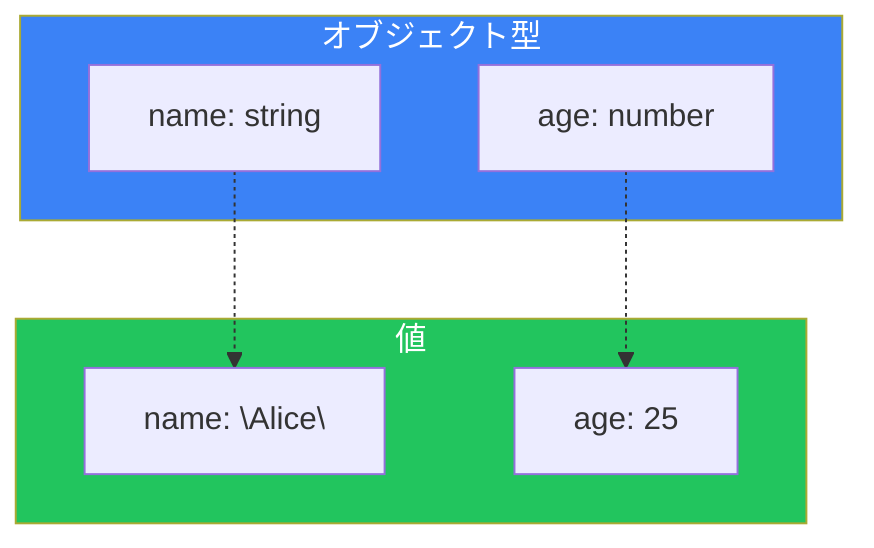
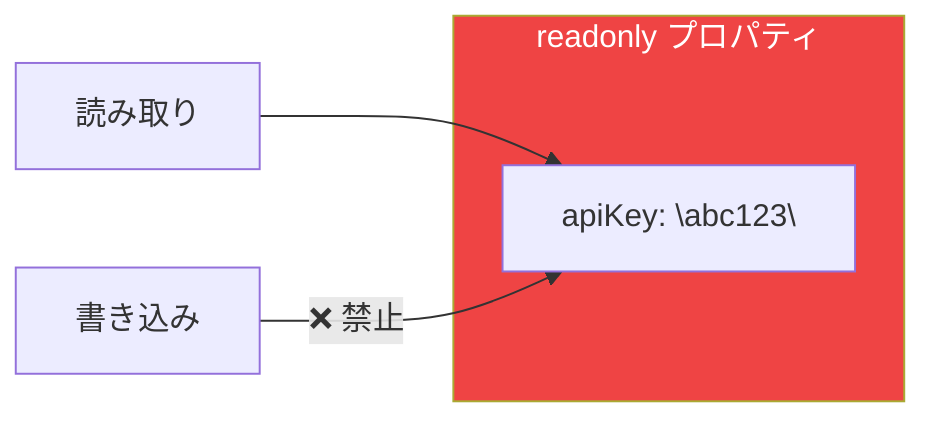
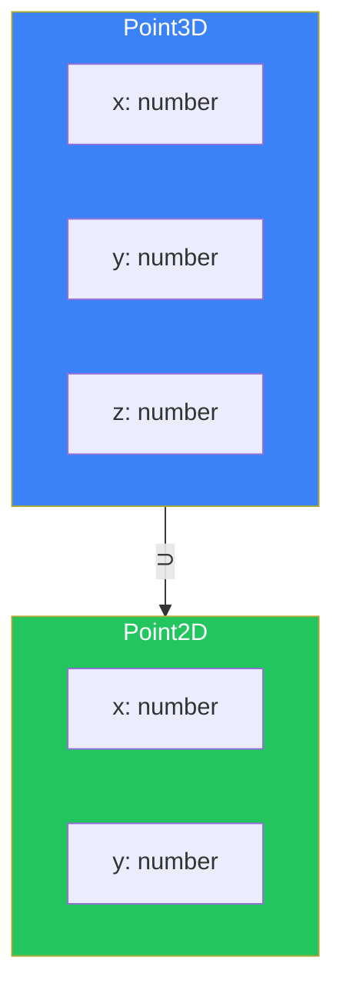
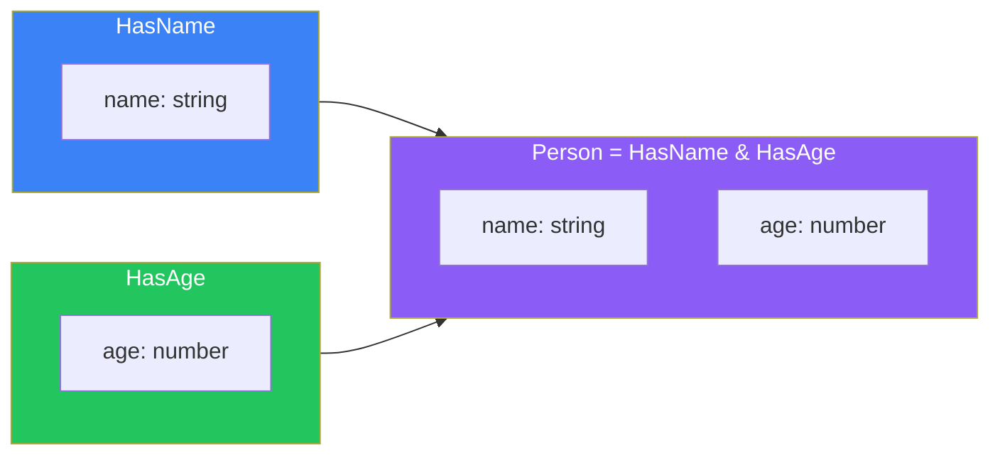

# Day 5: オブジェクトの型

## 今日学ぶこと

- オブジェクト型の定義方法
- オプショナルプロパティとreadonly
- インデックスシグネチャ
- 構造的部分型（Structural Typing）
- 交差型（Intersection Types）

---

## オブジェクト型の基本

TypeScriptでは、オブジェクトの「形」を型として定義できます。

```typescript
// オブジェクトリテラルから型推論
const user = {
  name: "Alice",
  age: 25,
};
// 型: { name: string; age: number; }

// 明示的な型定義
const product: { name: string; price: number } = {
  name: "TypeScript Book",
  price: 2980,
};
```



### 型エイリアスでオブジェクト型を定義

```typescript
// 型エイリアスで再利用可能に
type User = {
  name: string;
  age: number;
  email: string;
};

const alice: User = {
  name: "Alice",
  age: 25,
  email: "alice@example.com",
};

const bob: User = {
  name: "Bob",
  age: 30,
  email: "bob@example.com",
};
```

---

## オプショナルプロパティ

プロパティ名の後に `?` をつけると、そのプロパティは省略可能になります。

```typescript
type User = {
  name: string;
  age: number;
  email?: string;  // オプショナル
};

// emailは省略可能
const user1: User = {
  name: "Alice",
  age: 25,
};

const user2: User = {
  name: "Bob",
  age: 30,
  email: "bob@example.com",
};
```

### オプショナルプロパティへのアクセス

```typescript
type User = {
  name: string;
  email?: string;
};

function sendEmail(user: User) {
  // email は string | undefined
  if (user.email) {
    console.log(`Sending email to ${user.email}`);
  } else {
    console.log("No email address");
  }
}
```

---

## readonly修飾子

`readonly`をつけると、プロパティを変更不可にできます。

```typescript
type Config = {
  readonly apiKey: string;
  readonly endpoint: string;
};

const config: Config = {
  apiKey: "abc123",
  endpoint: "https://api.example.com",
};

// 読み取りはOK
console.log(config.apiKey);

// 変更はエラー
config.apiKey = "new-key"; // エラー: 読み取り専用プロパティ
```



### すべてのプロパティをreadonlyに

```typescript
type User = {
  name: string;
  age: number;
};

// Readonly ユーティリティ型を使用
type ReadonlyUser = Readonly<User>;

const user: ReadonlyUser = {
  name: "Alice",
  age: 25,
};

user.name = "Bob"; // エラー: 読み取り専用
user.age = 30;     // エラー: 読み取り専用
```

---

## インデックスシグネチャ

キー名が動的なオブジェクトの型を定義できます。

```typescript
// 文字列キーで数値を持つオブジェクト
type Scores = {
  [subject: string]: number;
};

const scores: Scores = {
  math: 90,
  english: 85,
  science: 88,
};

// 動的にアクセス可能
scores["history"] = 92;
console.log(scores.math); // 90
```

### インデックスシグネチャと固定プロパティの組み合わせ

```typescript
type Dictionary = {
  // 固定プロパティ
  length: number;
  // インデックスシグネチャ
  [word: string]: number | string;
};

const dict: Dictionary = {
  length: 3,
  hello: "こんにちは",
  goodbye: "さようなら",
  count: 100,
};
```

### 注意点

```typescript
type StringMap = {
  [key: string]: string;
};

const map: StringMap = {
  a: "apple",
  b: "banana",
};

// 存在しないキーにアクセスしてもエラーにならない
const value = map["nonexistent"]; // 型: string（実際はundefined）
```

---

## 構造的部分型（Structural Typing）

TypeScriptは**構造的部分型**を採用しています。型の名前ではなく、**構造（形）**が一致すれば互換性があります。

```typescript
type Point2D = {
  x: number;
  y: number;
};

type Point3D = {
  x: number;
  y: number;
  z: number;
};

function printPoint(point: Point2D) {
  console.log(`(${point.x}, ${point.y})`);
}

const point3D: Point3D = { x: 1, y: 2, z: 3 };

// Point3DはPoint2Dの構造を含むのでOK
printPoint(point3D); // OK: (1, 2)
```



### Excess Property Checking（過剰プロパティチェック）

ただし、オブジェクトリテラルを直接渡す場合は、余分なプロパティがあるとエラーになります。

```typescript
type User = {
  name: string;
  age: number;
};

// オブジェクトリテラルを直接渡す場合はエラー
const user: User = {
  name: "Alice",
  age: 25,
  email: "alice@example.com", // エラー: 余分なプロパティ
};

// 変数を経由すればOK
const userData = {
  name: "Alice",
  age: 25,
  email: "alice@example.com",
};
const user2: User = userData; // OK
```

---

## 交差型（Intersection Types）

`&`を使って複数の型を結合できます。

```typescript
type HasName = {
  name: string;
};

type HasAge = {
  age: number;
};

// 交差型：両方のプロパティを持つ
type Person = HasName & HasAge;

const person: Person = {
  name: "Alice",
  age: 25,
};
```



### Union型との違い

```typescript
// Union: AまたはB
type StringOrNumber = string | number;

// Intersection: AかつB
type Named = { name: string };
type Aged = { age: number };
type NamedAndAged = Named & Aged; // 両方のプロパティが必須
```

### 交差型の実用例

```typescript
// ベースとなる型
type Timestamp = {
  createdAt: Date;
  updatedAt: Date;
};

// エンティティ型
type User = {
  id: string;
  name: string;
  email: string;
};

// タイムスタンプ付きユーザー
type UserWithTimestamp = User & Timestamp;

const user: UserWithTimestamp = {
  id: "1",
  name: "Alice",
  email: "alice@example.com",
  createdAt: new Date(),
  updatedAt: new Date(),
};
```

---

## ネストしたオブジェクト型

オブジェクト型はネストできます。

```typescript
type Address = {
  street: string;
  city: string;
  zipCode: string;
};

type User = {
  name: string;
  address: Address;
  contacts: {
    email: string;
    phone?: string;
  };
};

const user: User = {
  name: "Alice",
  address: {
    street: "123 Main St",
    city: "Tokyo",
    zipCode: "100-0001",
  },
  contacts: {
    email: "alice@example.com",
  },
};
```

---

## まとめ

| 概念 | 説明 | 例 |
|------|------|-----|
| オブジェクト型 | プロパティと型を定義 | `{ name: string; age: number }` |
| オプショナル | 省略可能なプロパティ | `email?: string` |
| readonly | 変更不可 | `readonly id: string` |
| インデックスシグネチャ | 動的キー | `[key: string]: number` |
| 構造的部分型 | 形が一致すれば互換 | - |
| 交差型 | 複数の型を結合 | `TypeA & TypeB` |

### 重要ポイント

1. **型エイリアスで再利用** - 同じ型定義を繰り返さない
2. **オプショナルはundefinedを含む** - アクセス前にチェック
3. **readonlyで不変性を保証** - 意図しない変更を防ぐ
4. **構造的部分型を理解** - 名前ではなく構造で互換性を判断

---

## 練習問題

### 問題1: 基本

以下のオブジェクトの型を定義してください。

```typescript
const book = {
  title: "TypeScript入門",
  author: "山田太郎",
  pages: 300,
  published: true,
};
```

### 問題2: オプショナルとreadonly

以下の要件を満たす`Product`型を定義してください。

- `id`: 変更不可の文字列
- `name`: 文字列
- `price`: 数値
- `description`: オプショナルの文字列

### チャレンジ問題

APIレスポンスを表す型を設計してください。

- 共通プロパティ: `status` (number), `timestamp` (Date)
- 成功時: `data` (任意の型)
- 失敗時: `error` (メッセージとコードを持つオブジェクト)

交差型やUnion型を使って、`ApiResponse<T>`のような汎用的な型を作成してみてください。

---

## 参考リンク

- [TypeScript Handbook - Object Types](https://www.typescriptlang.org/docs/handbook/2/objects.html)
- [TypeScript Deep Dive - 構造的型付け](https://typescript-jp.gitbook.io/deep-dive/type-system/type-compatibility)

---

**次回予告**: Day 6では「配列とタプル」を学びます。配列の型定義、タプル型、readonly配列などを理解しましょう。
