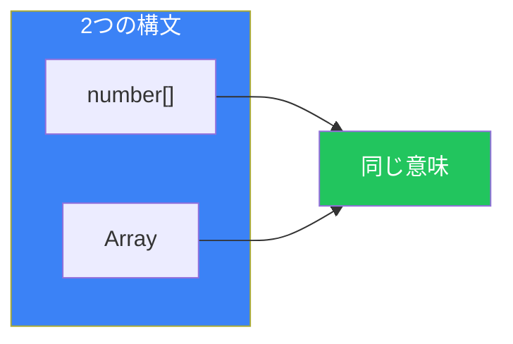
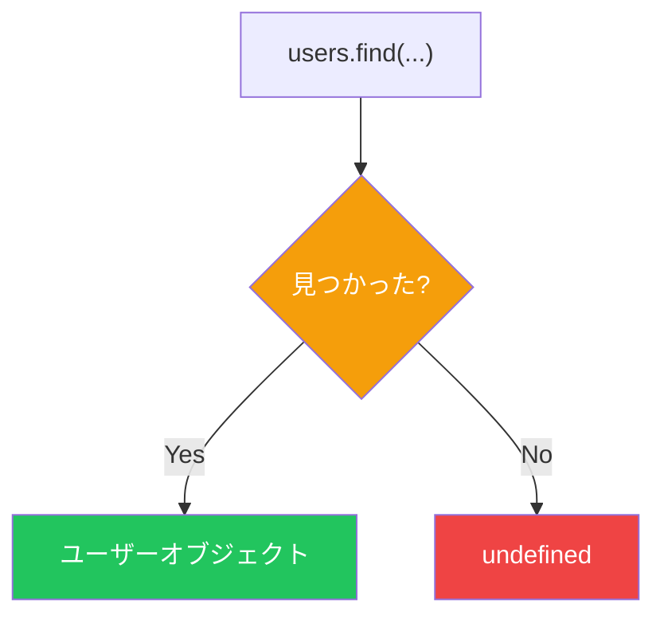
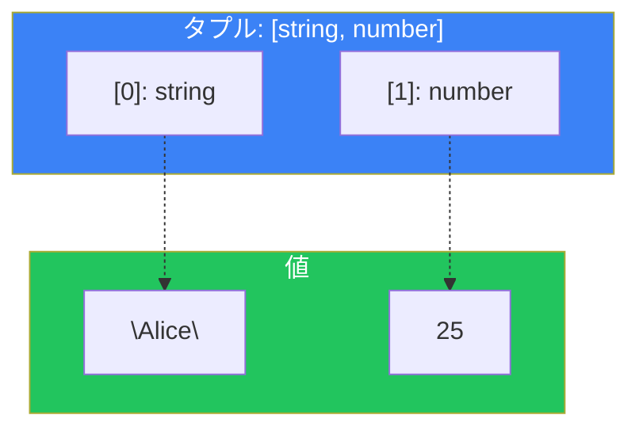
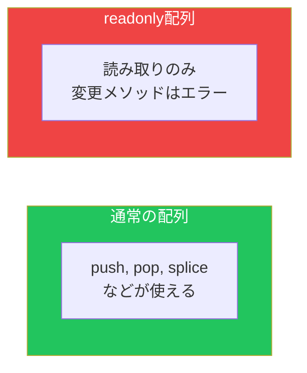

# Day 6: 配列とタプル

## 今日学ぶこと

- 配列の型定義方法
- 配列のメソッドと型
- タプル型の基本と活用
- readonly配列とタプル
- スプレッド演算子と型

---

## 配列の型定義

TypeScriptでは配列の要素の型を指定できます。2つの書き方があります。

```typescript
// 構文1: 型[]
let numbers: number[] = [1, 2, 3, 4, 5];
let names: string[] = ["Alice", "Bob", "Charlie"];

// 構文2: Array<型>（ジェネリクス構文）
let scores: Array<number> = [90, 85, 88];
let items: Array<string> = ["apple", "banana"];
```



### 型推論

```typescript
// 初期値から型が推論される
let fruits = ["apple", "banana", "orange"]; // string[]
let mixed = [1, "two", 3];                  // (string | number)[]

// 空配列は注意
let empty = [];        // any[] と推論される（危険）
let empty2: string[] = []; // 明示的に型を指定
```

---

## 配列のメソッドと型

TypeScriptは配列メソッドの戻り値も正しく型付けします。

### map, filter, reduce

```typescript
const numbers: number[] = [1, 2, 3, 4, 5];

// map: number[] → string[]
const strings = numbers.map(n => n.toString());
// 型: string[]

// filter: number[] → number[]
const evens = numbers.filter(n => n % 2 === 0);
// 型: number[]

// reduce: number[] → number
const sum = numbers.reduce((acc, n) => acc + n, 0);
// 型: number
```

### find と findIndex

```typescript
const users = [
  { id: 1, name: "Alice" },
  { id: 2, name: "Bob" },
];

// find: 見つからない可能性があるのでundefinedを含む
const user = users.find(u => u.id === 1);
// 型: { id: number; name: string; } | undefined

if (user) {
  console.log(user.name); // OK: undefinedでないことが確認済み
}
```



---

## Union型の配列

配列の要素が複数の型を持つ場合：

```typescript
// 数値または文字列の配列
let mixed: (string | number)[] = [1, "two", 3, "four"];

// オブジェクトのUnion型の配列
type Dog = { type: "dog"; bark: () => void };
type Cat = { type: "cat"; meow: () => void };
type Pet = Dog | Cat;

const pets: Pet[] = [
  { type: "dog", bark: () => console.log("Woof!") },
  { type: "cat", meow: () => console.log("Meow!") },
];
```

### 注意: (A | B)[] と A[] | B[] の違い

```typescript
// (string | number)[]: 各要素がstringまたはnumber
let mixed: (string | number)[] = [1, "two", 3];

// string[] | number[]: 配列全体がstring[]かnumber[]のどちらか
let either: string[] | number[] = [1, 2, 3]; // OK
either = ["a", "b", "c"]; // OK
either = [1, "two"]; // エラー: 混在不可
```

---

## タプル型

**タプル**は、要素の数と各位置の型が固定された配列です。

```typescript
// [string, number] タプル
let person: [string, number] = ["Alice", 25];

// 各要素に正しい型でアクセス
const name = person[0]; // string
const age = person[1];  // number

// 範囲外のアクセスはエラー
person[2]; // エラー: インデックス'2'は存在しない
```



### タプルの活用例

```typescript
// 座標
type Point = [number, number];
const origin: Point = [0, 0];

// RGBカラー
type RGB = [number, number, number];
const red: RGB = [255, 0, 0];

// 名前付きタプル（TypeScript 4.0+）
type NamedPoint = [x: number, y: number];
const point: NamedPoint = [10, 20];

// 関数の複数戻り値
function getMinMax(numbers: number[]): [number, number] {
  return [Math.min(...numbers), Math.max(...numbers)];
}

const [min, max] = getMinMax([5, 2, 8, 1, 9]);
// min: 1, max: 9
```

### オプショナル要素

```typescript
// 3番目の要素はオプショナル
type Point2DOrMaybe3D = [number, number, number?];

const point2D: Point2DOrMaybe3D = [10, 20];
const point3D: Point2DOrMaybe3D = [10, 20, 30];
```

### Rest要素を持つタプル

```typescript
// 最初はstring、残りはすべてnumber
type StringThenNumbers = [string, ...number[]];

const data: StringThenNumbers = ["header", 1, 2, 3, 4, 5];
```

---

## readonly配列とタプル

配列やタプルを変更不可にできます。

### readonly配列

```typescript
// 方法1: readonly修飾子
const numbers: readonly number[] = [1, 2, 3];

// 方法2: ReadonlyArray<T>
const items: ReadonlyArray<string> = ["a", "b", "c"];

// 読み取りはOK
console.log(numbers[0]); // 1

// 変更はエラー
numbers.push(4);    // エラー
numbers[0] = 10;    // エラー
numbers.pop();      // エラー
```



### readonlyタプル

```typescript
const point: readonly [number, number] = [10, 20];

// 読み取りはOK
console.log(point[0]); // 10

// 変更はエラー
point[0] = 30; // エラー
```

### as const でイミュータブルに

```typescript
// as const で最も狭い型として推論
const colors = ["red", "green", "blue"] as const;
// 型: readonly ["red", "green", "blue"]

// 各要素はリテラル型
type FirstColor = typeof colors[0]; // "red"

// 変更不可
colors.push("yellow"); // エラー
colors[0] = "orange";  // エラー
```

---

## スプレッド演算子と型

### 配列のスプレッド

```typescript
const arr1: number[] = [1, 2, 3];
const arr2: number[] = [4, 5, 6];

// スプレッドで結合
const combined: number[] = [...arr1, ...arr2];
// [1, 2, 3, 4, 5, 6]

// 異なる型の配列を結合
const strings: string[] = ["a", "b"];
const mixed: (string | number)[] = [...arr1, ...strings];
// [1, 2, 3, "a", "b"]
```

### タプルのスプレッド

```typescript
const tuple1: [string, number] = ["hello", 42];
const tuple2: [boolean] = [true];

// タプルを結合
const combined: [string, number, boolean] = [...tuple1, ...tuple2];
// ["hello", 42, true]
```

### 関数引数へのスプレッド

```typescript
function greet(name: string, age: number) {
  console.log(`Hello, ${name}! You are ${age} years old.`);
}

const args: [string, number] = ["Alice", 25];
greet(...args); // OK: タプルの型が引数と一致
```

---

## まとめ

| 概念 | 説明 | 例 |
|------|------|-----|
| 配列型 | 同じ型の要素の配列 | `number[]`, `Array<string>` |
| Union配列 | 複数の型を許容 | `(string \| number)[]` |
| タプル | 固定長・固定型の配列 | `[string, number]` |
| readonly | 変更不可 | `readonly number[]` |
| as const | リテラル型として推論 | `[1, 2, 3] as const` |

### 重要ポイント

1. **空配列は型を明示** - `any[]`を避ける
2. **findはundefinedを含む** - アクセス前にチェック
3. **タプルで固定長配列** - 位置に意味がある場合に使用
4. **readonlyで不変性保証** - 意図しない変更を防ぐ

---

## 練習問題

### 問題1: 基本

以下のコードの型エラーを修正してください。

```typescript
const scores: number[] = [90, 85, "88", 92];
scores.push("100");
```

### 問題2: タプル

以下の関数の戻り値の型をタプルとして定義してください。

```typescript
function parseCoordinate(input: string) {
  const [x, y] = input.split(",").map(Number);
  return [x, y];
}

const result = parseCoordinate("10,20");
// result は [number, number] であるべき
```

### チャレンジ問題

以下の要件を満たす関数`groupBy`を作成してください。

1. 配列と、要素からキーを取得する関数を受け取る
2. キーごとにグループ化したオブジェクトを返す
3. 適切な型定義を行う

```typescript
const users = [
  { name: "Alice", role: "admin" },
  { name: "Bob", role: "user" },
  { name: "Charlie", role: "admin" },
];

const grouped = groupBy(users, (user) => user.role);
// { admin: [...], user: [...] }
```

---

## 参考リンク

- [TypeScript Handbook - Arrays](https://www.typescriptlang.org/docs/handbook/2/everyday-types.html#arrays)
- [TypeScript Handbook - Tuple Types](https://www.typescriptlang.org/docs/handbook/2/objects.html#tuple-types)

---

**次回予告**: Day 7では「インターフェース」を学びます。インターフェースの定義、typeとの違い、拡張などを理解しましょう。
