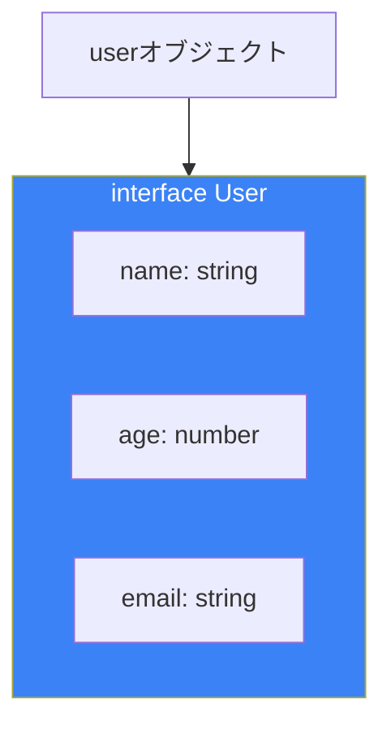
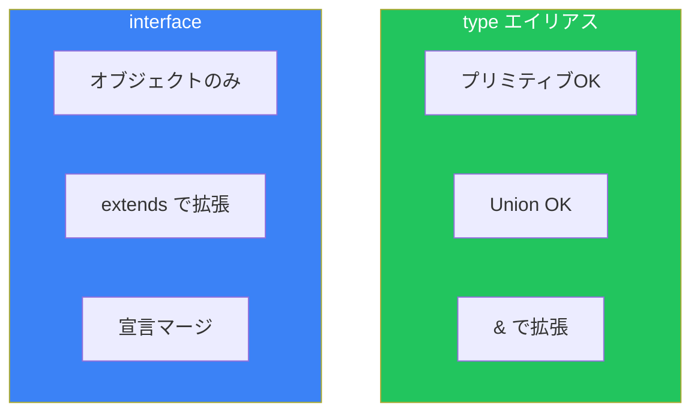
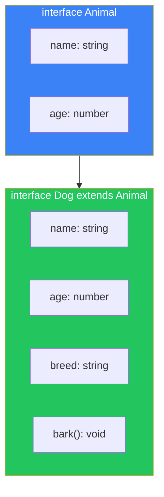
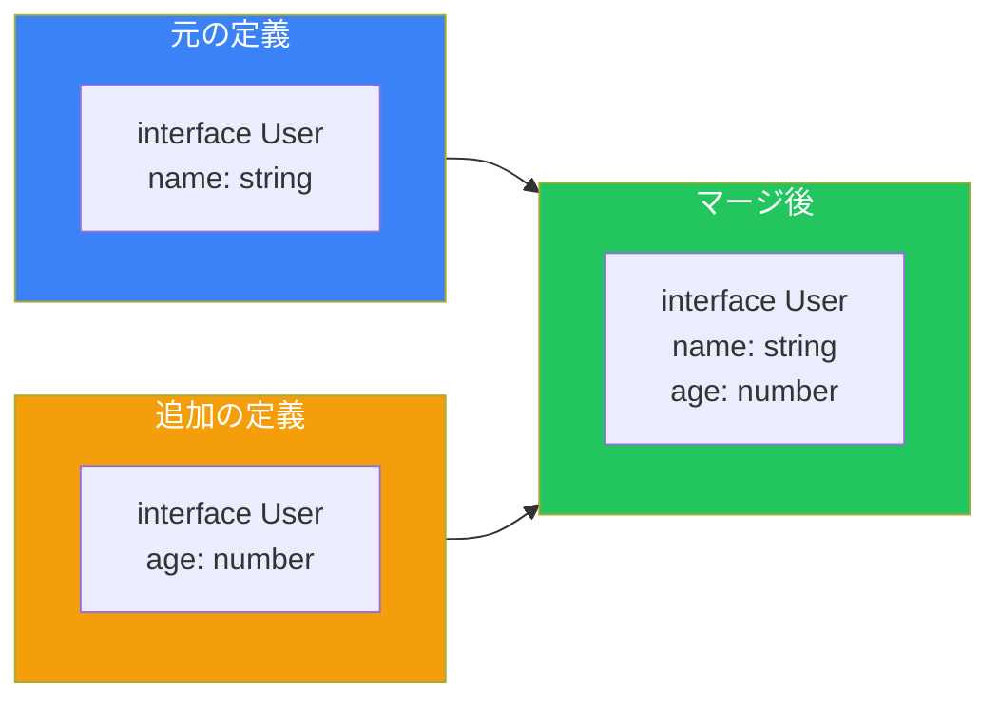

# Day 7: インターフェース

## 今日学ぶこと

- インターフェースの基本構文
- typeとinterfaceの違い
- インターフェースの拡張（extends）
- 宣言マージ
- インターフェースの実践的な使い方

---

## インターフェースの基本

**インターフェース**は、オブジェクトの形を定義するもう一つの方法です。

```typescript
// インターフェースの定義
interface User {
  name: string;
  age: number;
  email: string;
}

// インターフェースを使用
const user: User = {
  name: "Alice",
  age: 25,
  email: "alice@example.com",
};
```



### オプショナルとreadonly

型エイリアスと同様に、オプショナルやreadonlyを使用できます。

```typescript
interface Product {
  readonly id: string;      // 変更不可
  name: string;
  price: number;
  description?: string;     // オプショナル
}

const product: Product = {
  id: "prod-001",
  name: "TypeScript Book",
  price: 2980,
};

product.id = "new-id"; // エラー: 読み取り専用
```

---

## type vs interface

TypeScriptでは、オブジェクト型を定義する方法が2つあります。

```typescript
// 型エイリアス
type UserType = {
  name: string;
  age: number;
};

// インターフェース
interface UserInterface {
  name: string;
  age: number;
}
```

### 主な違い

| 特徴 | type | interface |
|------|------|-----------|
| 拡張方法 | `&`（交差型） | `extends` |
| 宣言マージ | ❌ 不可 | ✅ 可能 |
| Union型 | ✅ 可能 | ❌ 不可 |
| プリミティブ型 | ✅ 可能 | ❌ 不可 |
| 計算プロパティ | ✅ 可能 | ❌ 不可 |



### 使い分けの指針

```typescript
// インターフェースが適している場合
// - オブジェクトの形を定義
// - クラスが実装する型
// - ライブラリのAPI定義

interface ApiResponse {
  data: unknown;
  status: number;
}

// 型エイリアスが適している場合
// - Union型
// - プリミティブの別名
// - 複雑な型操作

type ID = string | number;
type Result<T> = { success: true; data: T } | { success: false; error: string };
```

---

## インターフェースの拡張

`extends`キーワードで既存のインターフェースを拡張できます。

```typescript
// ベースとなるインターフェース
interface Animal {
  name: string;
  age: number;
}

// 拡張したインターフェース
interface Dog extends Animal {
  breed: string;
  bark(): void;
}

const dog: Dog = {
  name: "Max",
  age: 3,
  breed: "Labrador",
  bark() {
    console.log("Woof!");
  },
};
```



### 複数のインターフェースを拡張

```typescript
interface Timestamp {
  createdAt: Date;
  updatedAt: Date;
}

interface Identifiable {
  id: string;
}

// 複数のインターフェースを拡張
interface User extends Timestamp, Identifiable {
  name: string;
  email: string;
}

const user: User = {
  id: "user-001",
  name: "Alice",
  email: "alice@example.com",
  createdAt: new Date(),
  updatedAt: new Date(),
};
```

---

## 宣言マージ

インターフェースは同じ名前で複数回宣言すると、自動的にマージされます。

```typescript
interface User {
  name: string;
}

interface User {
  age: number;
}

// 自動的にマージされる
const user: User = {
  name: "Alice",
  age: 25,
};
```

### 宣言マージの活用

既存のライブラリの型を拡張する際に便利です。

```typescript
// Node.jsのprocess.envを拡張
declare global {
  namespace NodeJS {
    interface ProcessEnv {
      DATABASE_URL: string;
      API_KEY: string;
    }
  }
}

// 型安全にアクセス可能
const dbUrl = process.env.DATABASE_URL; // string
```



---

## メソッドの定義

インターフェースではメソッドを2つの方法で定義できます。

```typescript
interface Calculator {
  // プロパティ構文
  add: (a: number, b: number) => number;

  // メソッド構文
  subtract(a: number, b: number): number;
}

const calc: Calculator = {
  add: (a, b) => a + b,
  subtract(a, b) {
    return a - b;
  },
};
```

### コールシグネチャ

関数自体の型をインターフェースで表現できます。

```typescript
interface Greeter {
  (name: string): string;
  greeting: string;
}

const greeter: Greeter = (name: string) => {
  return `${greeter.greeting}, ${name}!`;
};
greeter.greeting = "Hello";

console.log(greeter("World")); // "Hello, World!"
```

---

## インデックスシグネチャ

インターフェースでもインデックスシグネチャを使用できます。

```typescript
interface StringDictionary {
  [key: string]: string;
}

const dict: StringDictionary = {
  hello: "こんにちは",
  goodbye: "さようなら",
};

// 数値インデックス
interface NumberArray {
  [index: number]: string;
}

const arr: NumberArray = ["a", "b", "c"];
console.log(arr[0]); // "a"
```

### インデックスシグネチャと固定プロパティ

```typescript
interface User {
  id: string;
  name: string;
  [key: string]: string; // その他のプロパティ
}

const user: User = {
  id: "001",
  name: "Alice",
  email: "alice@example.com", // OK
  phone: "123-456-7890",      // OK
};
```

---

## 実践的なパターン

### API型定義

```typescript
interface ApiResponse<T> {
  data: T;
  status: number;
  message: string;
}

interface User {
  id: string;
  name: string;
  email: string;
}

interface UserListResponse extends ApiResponse<User[]> {
  totalCount: number;
  page: number;
}

const response: UserListResponse = {
  data: [
    { id: "1", name: "Alice", email: "alice@example.com" },
    { id: "2", name: "Bob", email: "bob@example.com" },
  ],
  status: 200,
  message: "Success",
  totalCount: 100,
  page: 1,
};
```

### コンポーネントProps

```typescript
interface ButtonProps {
  label: string;
  onClick: () => void;
  disabled?: boolean;
  variant?: "primary" | "secondary" | "danger";
}

// 拡張
interface IconButtonProps extends ButtonProps {
  icon: string;
  iconPosition?: "left" | "right";
}
```

---

## まとめ

| 概念 | 説明 | 例 |
|------|------|-----|
| interface | オブジェクトの形を定義 | `interface User { name: string }` |
| extends | インターフェースを拡張 | `interface Dog extends Animal` |
| 宣言マージ | 同名interfaceは結合 | 複数の`interface User`宣言 |
| メソッド定義 | 2つの構文 | `method(): void` または `method: () => void` |

### 重要ポイント

1. **オブジェクト型にはinterface** - 読みやすく拡張しやすい
2. **Union型にはtype** - インターフェースでは不可
3. **extendsで継承** - コードの再利用性を高める
4. **宣言マージに注意** - 意図しない結合を避ける

---

## 練習問題

### 問題1: 基本

以下の要件を満たす`Vehicle`インターフェースを定義してください。

- `brand`: 文字列
- `model`: 文字列
- `year`: 数値
- `start()`: voidを返すメソッド

### 問題2: 拡張

`Vehicle`を拡張して`ElectricCar`インターフェースを作成してください。

- `batteryCapacity`: 数値（kWh）
- `charge()`: voidを返すメソッド

### チャレンジ問題

以下の要件を満たすイベント管理システムの型定義を作成してください。

1. `Event`インターフェース: id, title, date, location
2. `OnlineEvent`と`OfflineEvent`に拡張（それぞれ固有のプロパティを持つ）
3. `EventManager`インターフェース: イベントの追加、削除、取得のメソッドを持つ

---

## 参考リンク

- [TypeScript Handbook - Interfaces](https://www.typescriptlang.org/docs/handbook/interfaces.html)
- [TypeScript Handbook - Declaration Merging](https://www.typescriptlang.org/docs/handbook/declaration-merging.html)

---

**次回予告**: Day 8では「クラス」を学びます。クラスと型の関係、アクセス修飾子、抽象クラスなどを理解しましょう。
