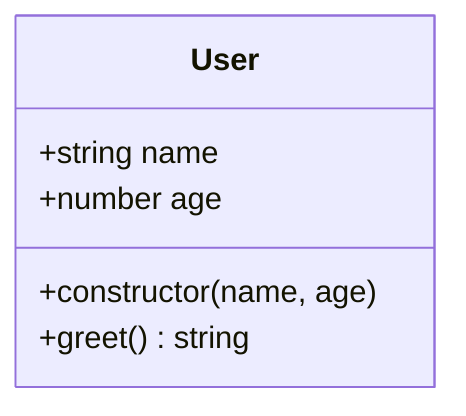
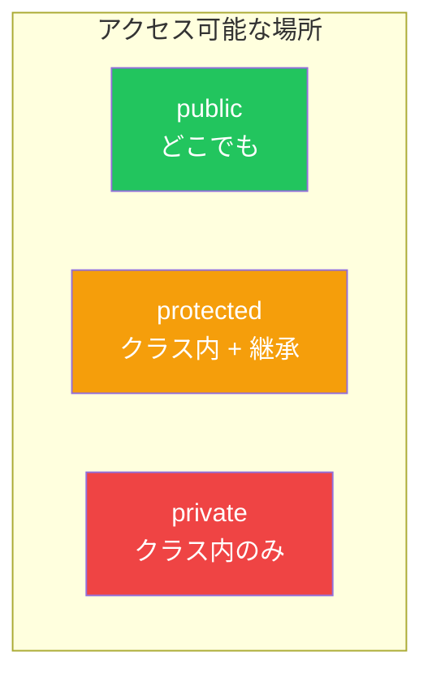
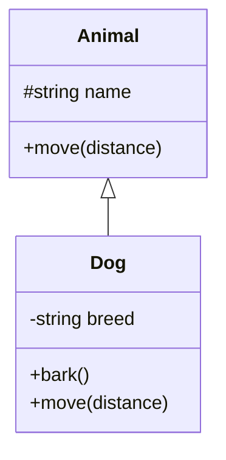
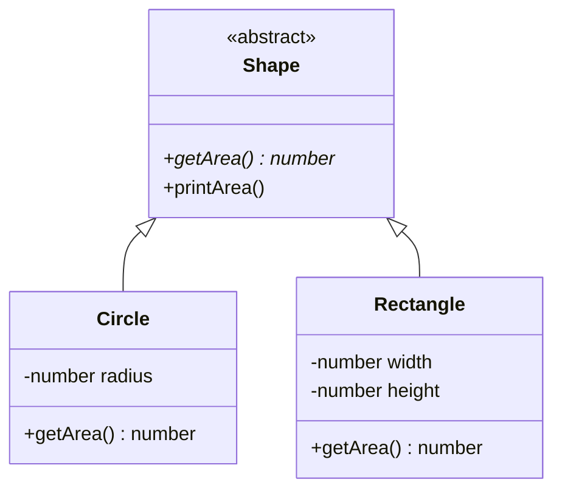

# Day 8: クラス

## 今日学ぶこと

- TypeScriptにおけるクラスの基本
- アクセス修飾子（public, private, protected）
- readonlyプロパティ
- 抽象クラス
- インターフェースの実装（implements）

---

## クラスの基本

TypeScriptのクラスは、JavaScriptのクラスに型の安全性を追加したものです。

```typescript
class User {
  name: string;
  age: number;

  constructor(name: string, age: number) {
    this.name = name;
    this.age = age;
  }

  greet(): string {
    return `Hello, I'm ${this.name}!`;
  }
}

const user = new User("Alice", 25);
console.log(user.greet()); // "Hello, I'm Alice!"
```



### プロパティの初期化

TypeScriptでは、プロパティは宣言時またはコンストラクタ内で初期化する必要があります。

```typescript
class Product {
  // 宣言時に初期化
  category: string = "general";

  // コンストラクタで初期化
  name: string;
  price: number;

  constructor(name: string, price: number) {
    this.name = name;
    this.price = price;
  }
}
```

---

## アクセス修飾子

TypeScriptには3つのアクセス修飾子があります。

### public（デフォルト）

どこからでもアクセス可能です。

```typescript
class User {
  public name: string; // public は省略可能

  constructor(name: string) {
    this.name = name;
  }
}

const user = new User("Alice");
console.log(user.name); // OK
```

### private

クラス内からのみアクセス可能です。

```typescript
class BankAccount {
  private balance: number;

  constructor(initialBalance: number) {
    this.balance = initialBalance;
  }

  deposit(amount: number): void {
    this.balance += amount;
  }

  getBalance(): number {
    return this.balance;
  }
}

const account = new BankAccount(1000);
account.deposit(500);
console.log(account.getBalance()); // 1500
console.log(account.balance);      // エラー: privateプロパティ
```

### protected

クラス内と継承したクラスからアクセス可能です。

```typescript
class Animal {
  protected name: string;

  constructor(name: string) {
    this.name = name;
  }
}

class Dog extends Animal {
  bark(): void {
    // protectedなのでアクセス可能
    console.log(`${this.name} says: Woof!`);
  }
}

const dog = new Dog("Max");
dog.bark();      // OK: "Max says: Woof!"
dog.name;        // エラー: protectedプロパティ
```



### パラメータプロパティ

コンストラクタの引数に修飾子をつけると、プロパティ宣言と代入を省略できます。

```typescript
// 通常の書き方
class User {
  private name: string;
  private age: number;

  constructor(name: string, age: number) {
    this.name = name;
    this.age = age;
  }
}

// パラメータプロパティを使用
class User2 {
  constructor(
    private name: string,
    private age: number
  ) {}
  // 自動的にthis.name, this.ageが設定される
}
```

---

## readonly修飾子

`readonly`をつけると、初期化後に変更できなくなります。

```typescript
class User {
  readonly id: string;
  name: string;

  constructor(id: string, name: string) {
    this.id = id;   // コンストラクタ内でのみ代入可能
    this.name = name;
  }

  changeName(newName: string): void {
    this.name = newName; // OK
  }

  changeId(newId: string): void {
    this.id = newId; // エラー: readonlyプロパティ
  }
}
```

---

## クラスの継承

`extends`キーワードで既存のクラスを継承できます。

```typescript
class Animal {
  constructor(protected name: string) {}

  move(distance: number): void {
    console.log(`${this.name} moved ${distance}m`);
  }
}

class Dog extends Animal {
  constructor(name: string, private breed: string) {
    super(name); // 親クラスのコンストラクタを呼び出し
  }

  bark(): void {
    console.log(`${this.name} says: Woof!`);
  }

  // メソッドのオーバーライド
  move(distance: number): void {
    console.log(`${this.name} runs...`);
    super.move(distance); // 親のメソッドを呼び出し
  }
}

const dog = new Dog("Max", "Labrador");
dog.bark(); // "Max says: Woof!"
dog.move(10); // "Max runs..." → "Max moved 10m"
```



---

## 抽象クラス

**抽象クラス**は、直接インスタンス化できないクラスです。継承して使用します。

```typescript
abstract class Shape {
  abstract getArea(): number; // 抽象メソッド：実装は子クラスで

  printArea(): void {
    console.log(`Area: ${this.getArea()}`);
  }
}

class Circle extends Shape {
  constructor(private radius: number) {
    super();
  }

  // 抽象メソッドの実装が必須
  getArea(): number {
    return Math.PI * this.radius ** 2;
  }
}

class Rectangle extends Shape {
  constructor(
    private width: number,
    private height: number
  ) {
    super();
  }

  getArea(): number {
    return this.width * this.height;
  }
}

// const shape = new Shape(); // エラー: 抽象クラスはインスタンス化不可
const circle = new Circle(5);
circle.printArea(); // "Area: 78.53981633974483"
```



---

## インターフェースの実装

クラスはインターフェースを`implements`で実装できます。

```typescript
interface Printable {
  print(): void;
}

interface Serializable {
  serialize(): string;
}

// 複数のインターフェースを実装
class Document implements Printable, Serializable {
  constructor(private content: string) {}

  print(): void {
    console.log(this.content);
  }

  serialize(): string {
    return JSON.stringify({ content: this.content });
  }
}

const doc = new Document("Hello, World!");
doc.print();           // "Hello, World!"
doc.serialize();       // '{"content":"Hello, World!"}'
```

### インターフェース vs 抽象クラス

| 特徴 | interface | abstract class |
|------|-----------|----------------|
| 多重実装/継承 | ✅ 複数可 | ❌ 単一のみ |
| デフォルト実装 | ❌ | ✅ |
| プロパティの実装 | ❌ | ✅ |
| コンストラクタ | ❌ | ✅ |

```typescript
// インターフェース：契約を定義
interface Logger {
  log(message: string): void;
}

// 抽象クラス：共通の実装を提供
abstract class BaseLogger implements Logger {
  abstract log(message: string): void;

  // 共通のメソッド
  error(message: string): void {
    this.log(`[ERROR] ${message}`);
  }
}

class ConsoleLogger extends BaseLogger {
  log(message: string): void {
    console.log(message);
  }
}
```

---

## クラスと型

TypeScriptでは、クラスは**値**であり**型**でもあります。

```typescript
class User {
  constructor(public name: string) {}
}

// User は値（コンストラクタ関数）
const user = new User("Alice");

// User は型としても使える
function greet(user: User): void {
  console.log(`Hello, ${user.name}!`);
}

// インターフェースと互換（構造的部分型）
interface HasName {
  name: string;
}

const obj: HasName = { name: "Bob" };
greet(obj); // OK: 構造が一致
```

---

## まとめ

| 概念 | 説明 | 例 |
|------|------|-----|
| public | どこからでもアクセス | `public name: string` |
| private | クラス内のみ | `private balance: number` |
| protected | クラス内 + 継承先 | `protected id: string` |
| readonly | 初期化後は変更不可 | `readonly createdAt: Date` |
| abstract | 抽象クラス/メソッド | `abstract class Shape` |
| implements | インターフェースを実装 | `class Dog implements Animal` |

### 重要ポイント

1. **アクセス修飾子で隠蔽** - 内部実装を隠す
2. **パラメータプロパティで簡潔に** - ボイラープレートを削減
3. **抽象クラスで共通実装** - 継承で再利用
4. **interfaceで契約定義** - 実装の詳細は隠す

---

## 練習問題

### 問題1: 基本

以下の要件を満たす`Counter`クラスを作成してください。

- `count`プロパティ（privateでreadonly不可）
- `increment()`メソッド
- `decrement()`メソッド
- `getCount()`メソッド

### 問題2: 継承

`Animal`クラスを継承して`Bird`クラスを作成してください。

- `Animal`は`name`と`move()`を持つ
- `Bird`は`fly()`メソッドを追加し、`move()`をオーバーライド

### チャレンジ問題

以下の要件を満たすシステムを設計してください。

1. `Storage`インターフェース: `save()`, `load()`, `delete()`
2. `MemoryStorage`と`FileStorage`クラスで実装
3. 共通の`BaseStorage`抽象クラスを作成し、エラーハンドリングを共通化

---

## 参考リンク

- [TypeScript Handbook - Classes](https://www.typescriptlang.org/docs/handbook/2/classes.html)
- [MDN - Classes](https://developer.mozilla.org/ja/docs/Web/JavaScript/Reference/Classes)

---

**次回予告**: Day 9では「ジェネリクス」を学びます。型をパラメータ化して、再利用可能な型定義を作成しましょう。
