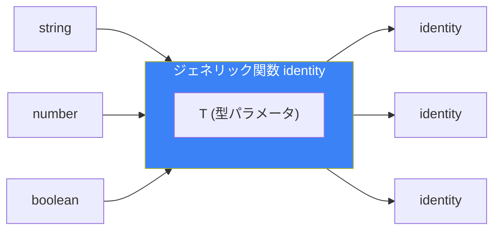
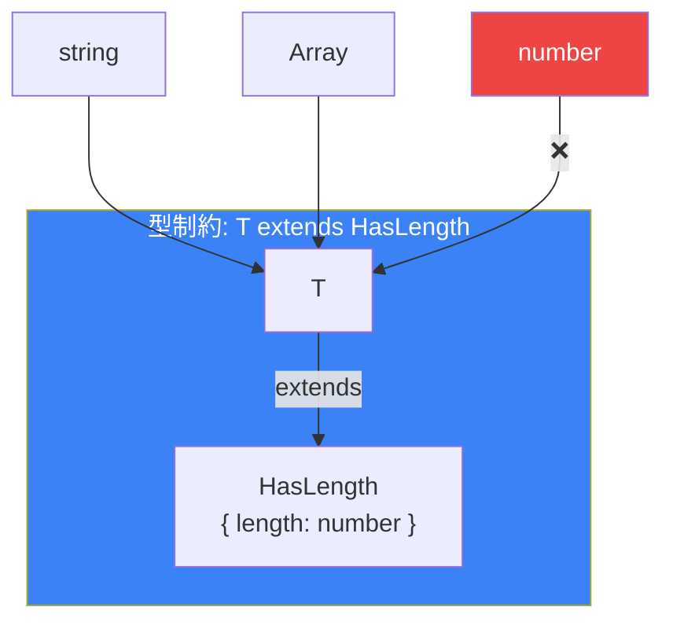
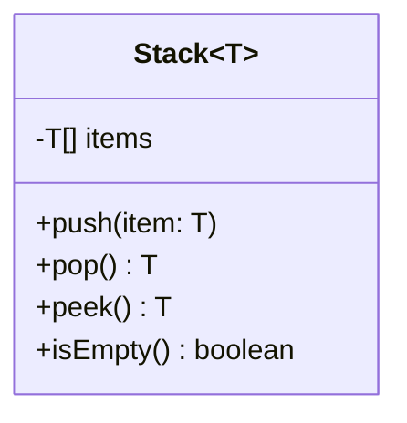
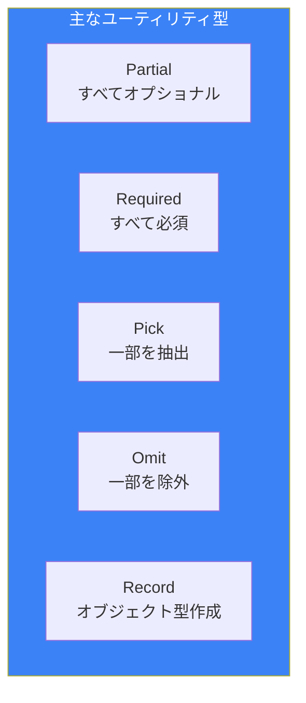

# Day 9: ジェネリクス

## 今日学ぶこと

- ジェネリクスの基本概念
- ジェネリック関数
- ジェネリッククラスとインターフェース
- 型制約（extends）
- ユーティリティ型

---

## ジェネリクスとは

**ジェネリクス**は、型をパラメータ化する機能です。関数やクラスを様々な型で再利用できます。

```typescript
// ジェネリクスなしの問題
function identityString(value: string): string {
  return value;
}

function identityNumber(value: number): number {
  return value;
}

// 型ごとに関数が必要になる...

// ジェネリクスで解決
function identity<T>(value: T): T {
  return value;
}

identity<string>("hello");  // 型: string
identity<number>(42);       // 型: number
identity<boolean>(true);    // 型: boolean
```



### 型引数の推論

多くの場合、TypeScriptは型引数を推論してくれます。

```typescript
function identity<T>(value: T): T {
  return value;
}

// 明示的に指定
identity<string>("hello");

// 型推論に任せる（推奨）
identity("hello");  // T は string と推論される
identity(42);       // T は number と推論される
```

---

## ジェネリック関数

### 複数の型パラメータ

```typescript
function pair<T, U>(first: T, second: U): [T, U] {
  return [first, second];
}

const result = pair("hello", 42);
// 型: [string, number]
```

### 配列を操作する関数

```typescript
function first<T>(arr: T[]): T | undefined {
  return arr[0];
}

first([1, 2, 3]);      // number | undefined
first(["a", "b"]);     // string | undefined
first([]);             // undefined

function map<T, U>(arr: T[], fn: (item: T) => U): U[] {
  return arr.map(fn);
}

map([1, 2, 3], (n) => n.toString()); // string[]
```

### アロー関数でのジェネリクス

```typescript
// アロー関数
const identity = <T>(value: T): T => value;

// JSXと混同を避けるため、TSXファイルではこう書く
const identity2 = <T,>(value: T): T => value;
// または
const identity3 = <T extends unknown>(value: T): T => value;
```

---

## 型制約（extends）

型パラメータに制約を設けることができます。

```typescript
// 制約なし：どんな型でもOK
function getLength<T>(value: T): number {
  return value.length; // エラー: Tにlengthがあるか不明
}

// 制約あり：lengthを持つ型のみ
interface HasLength {
  length: number;
}

function getLength<T extends HasLength>(value: T): number {
  return value.length; // OK
}

getLength("hello");        // OK: stringにはlengthがある
getLength([1, 2, 3]);      // OK: 配列にはlengthがある
getLength({ length: 10 }); // OK
getLength(123);            // エラー: numberにはlengthがない
```



### keyofとの組み合わせ

```typescript
function getProperty<T, K extends keyof T>(obj: T, key: K): T[K] {
  return obj[key];
}

const user = { name: "Alice", age: 25 };

getProperty(user, "name"); // OK: string
getProperty(user, "age");  // OK: number
getProperty(user, "email"); // エラー: "email"はuserのキーではない
```

---

## ジェネリックインターフェース

インターフェースも型パラメータを持てます。

```typescript
interface Box<T> {
  value: T;
  getValue(): T;
}

const stringBox: Box<string> = {
  value: "hello",
  getValue() {
    return this.value;
  },
};

const numberBox: Box<number> = {
  value: 42,
  getValue() {
    return this.value;
  },
};
```

### APIレスポンスの型定義

```typescript
interface ApiResponse<T> {
  data: T;
  status: number;
  message: string;
}

interface User {
  id: string;
  name: string;
}

interface Product {
  id: string;
  name: string;
  price: number;
}

type UserResponse = ApiResponse<User>;
type ProductListResponse = ApiResponse<Product[]>;
```

---

## ジェネリッククラス

クラスも型パラメータを持てます。

```typescript
class Stack<T> {
  private items: T[] = [];

  push(item: T): void {
    this.items.push(item);
  }

  pop(): T | undefined {
    return this.items.pop();
  }

  peek(): T | undefined {
    return this.items[this.items.length - 1];
  }

  isEmpty(): boolean {
    return this.items.length === 0;
  }
}

const numberStack = new Stack<number>();
numberStack.push(1);
numberStack.push(2);
numberStack.pop(); // 2

const stringStack = new Stack<string>();
stringStack.push("hello");
stringStack.push("world");
```



---

## デフォルト型パラメータ

型パラメータにデフォルト値を設定できます。

```typescript
interface Container<T = string> {
  value: T;
}

const defaultContainer: Container = { value: "hello" }; // T = string
const numberContainer: Container<number> = { value: 42 };

// 関数でも同様
function createArray<T = number>(length: number, value: T): T[] {
  return Array(length).fill(value);
}

createArray(3, "x"); // string[]
createArray(3, 42);  // number[]
```

---

## ユーティリティ型

TypeScriptには便利な組み込みジェネリック型があります。

### Partial<T>

すべてのプロパティをオプショナルにします。

```typescript
interface User {
  name: string;
  age: number;
  email: string;
}

// Partial<User> = { name?: string; age?: number; email?: string; }
function updateUser(id: string, updates: Partial<User>): void {
  // 一部のフィールドだけ更新可能
}

updateUser("1", { name: "Bob" }); // OK
updateUser("1", { age: 30 });     // OK
```

### Required<T>

すべてのプロパティを必須にします。

```typescript
interface Config {
  host?: string;
  port?: number;
}

// Required<Config> = { host: string; port: number; }
const config: Required<Config> = {
  host: "localhost",
  port: 3000,
};
```

### Pick<T, K>

特定のプロパティのみを抽出します。

```typescript
interface User {
  id: string;
  name: string;
  email: string;
  password: string;
}

// Pick<User, "id" | "name"> = { id: string; name: string; }
type PublicUser = Pick<User, "id" | "name">;

const user: PublicUser = {
  id: "1",
  name: "Alice",
};
```

### Omit<T, K>

特定のプロパティを除外します。

```typescript
// Omit<User, "password"> = { id: string; name: string; email: string; }
type SafeUser = Omit<User, "password">;
```

### Record<K, T>

キーと値の型を指定したオブジェクト型を作成します。

```typescript
// Record<string, number> = { [key: string]: number }
const scores: Record<string, number> = {
  math: 90,
  english: 85,
};

type Role = "admin" | "user" | "guest";
type Permissions = Record<Role, string[]>;

const permissions: Permissions = {
  admin: ["read", "write", "delete"],
  user: ["read", "write"],
  guest: ["read"],
};
```



---

## まとめ

| 概念 | 説明 | 例 |
|------|------|-----|
| 型パラメータ | 型をパラメータ化 | `<T>` |
| 型制約 | 型パラメータに制約 | `<T extends HasLength>` |
| デフォルト型 | デフォルト値を設定 | `<T = string>` |
| ユーティリティ型 | 組み込みジェネリック型 | `Partial<T>`, `Pick<T, K>` |

### 重要ポイント

1. **再利用性を高める** - 型をパラメータ化して汎用的に
2. **型推論を活用** - 明示的な型引数は省略可能な場合が多い
3. **適切な制約を設定** - 必要な機能を保証
4. **ユーティリティ型を活用** - 既存の型を変換

---

## 練習問題

### 問題1: 基本

最後の要素を返すジェネリック関数`last<T>`を作成してください。

```typescript
last([1, 2, 3]);      // 3
last(["a", "b"]);     // "b"
last([]);             // undefined
```

### 問題2: 型制約

`id`プロパティを持つオブジェクトの配列から、指定したIDのオブジェクトを検索する関数`findById`を作成してください。

```typescript
interface HasId {
  id: string | number;
}

// 実装してください
// findById(items, id)
```

### チャレンジ問題

以下のユーティリティ型を自分で実装してください。

1. `MyPartial<T>`: Partial<T>と同じ機能
2. `MyPick<T, K>`: Pick<T, K>と同じ機能
3. `MyReadonly<T>`: すべてのプロパティをreadonlyにする

---

## 参考リンク

- [TypeScript Handbook - Generics](https://www.typescriptlang.org/docs/handbook/2/generics.html)
- [TypeScript Handbook - Utility Types](https://www.typescriptlang.org/docs/handbook/utility-types.html)

---

**次回予告**: Day 10では「高度な型とベストプラクティス」を学びます。Mapped Types、Conditional Types、そしてTypeScriptを効果的に使うためのベストプラクティスを理解しましょう。
