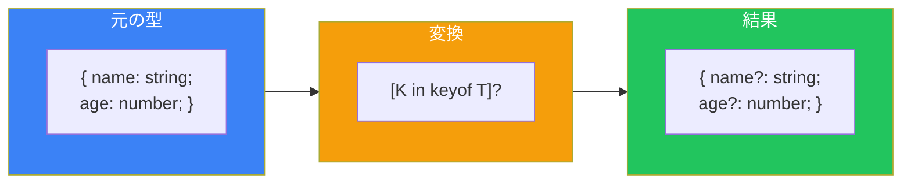
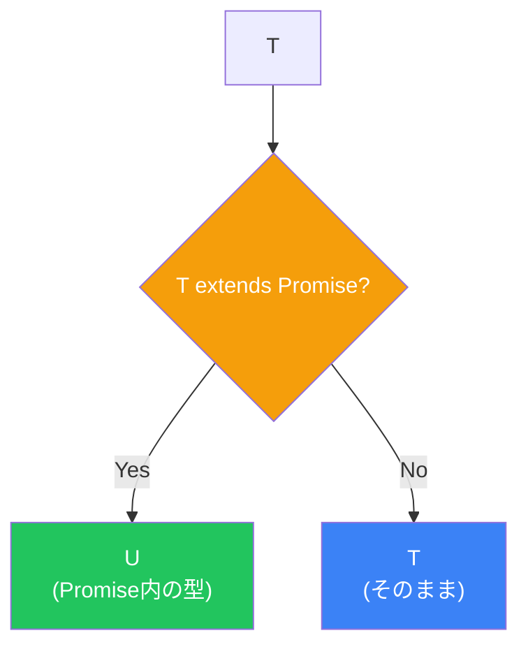
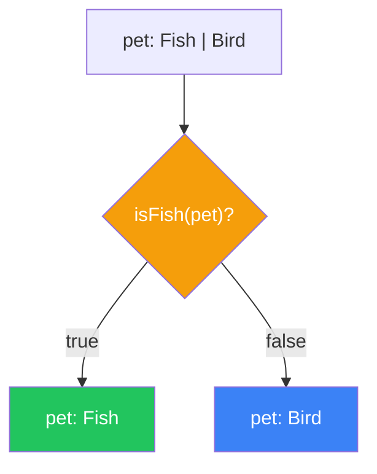

# Day 10: 高度な型とベストプラクティス

## 今日学ぶこと

- Mapped Types（マップ型）
- Conditional Types（条件付き型）
- Template Literal Types
- 型アサーションとType Guard
- tsconfig.jsonの重要設定
- TypeScriptのベストプラクティス

---

## Mapped Types（マップ型）

**Mapped Types**は、既存の型のプロパティを変換して新しい型を作成します。

```typescript
// 基本構文
type MappedType<T> = {
  [K in keyof T]: T[K];
};

// 実際の使用例：すべてのプロパティをオプショナルに
type MyPartial<T> = {
  [K in keyof T]?: T[K];
};

interface User {
  name: string;
  age: number;
}

type PartialUser = MyPartial<User>;
// { name?: string; age?: number; }
```



### 修飾子の追加・削除

```typescript
// readonlyを追加
type Readonly<T> = {
  readonly [K in keyof T]: T[K];
};

// readonlyを削除
type Mutable<T> = {
  -readonly [K in keyof T]: T[K];
};

// オプショナルを削除
type Required<T> = {
  [K in keyof T]-?: T[K];
};
```

### キーの変換

```typescript
// ゲッター関数を生成
type Getters<T> = {
  [K in keyof T as `get${Capitalize<string & K>}`]: () => T[K];
};

interface Person {
  name: string;
  age: number;
}

type PersonGetters = Getters<Person>;
// { getName: () => string; getAge: () => number; }
```

---

## Conditional Types（条件付き型）

**Conditional Types**は、条件に基づいて型を選択します。

```typescript
// 基本構文: T extends U ? X : Y
type IsString<T> = T extends string ? true : false;

type A = IsString<string>;  // true
type B = IsString<number>;  // false
```

### infer キーワード

`infer`を使って型を抽出できます。

```typescript
// 関数の戻り値の型を抽出
type ReturnType<T> = T extends (...args: any[]) => infer R ? R : never;

function greet(): string {
  return "Hello";
}

type GreetReturn = ReturnType<typeof greet>; // string

// Promiseの中身の型を抽出
type Awaited<T> = T extends Promise<infer U> ? U : T;

type A = Awaited<Promise<string>>; // string
type B = Awaited<string>;          // string
```



### 分配条件付き型

Union型に対して条件付き型を適用すると、各メンバーに分配されます。

```typescript
type ToArray<T> = T extends any ? T[] : never;

type A = ToArray<string | number>;
// string[] | number[] （各型に分配される）

// 分配を防ぐには[]で囲む
type ToArrayNonDist<T> = [T] extends [any] ? T[] : never;

type B = ToArrayNonDist<string | number>;
// (string | number)[]
```

---

## Template Literal Types

文字列リテラル型をテンプレートで操作できます。

```typescript
// 基本
type Greeting = `Hello, ${string}!`;
const g: Greeting = "Hello, World!"; // OK
const g2: Greeting = "Hi, World!";   // エラー

// Union型との組み合わせ
type Direction = "top" | "right" | "bottom" | "left";
type MarginProperty = `margin-${Direction}`;
// "margin-top" | "margin-right" | "margin-bottom" | "margin-left"
```

### 組み込みの文字列操作型

```typescript
type Uppercase<S extends string> = ...
type Lowercase<S extends string> = ...
type Capitalize<S extends string> = ...
type Uncapitalize<S extends string> = ...

type A = Uppercase<"hello">;     // "HELLO"
type B = Capitalize<"hello">;    // "Hello"

// イベントハンドラ名の生成
type EventName = "click" | "focus" | "blur";
type Handler = `on${Capitalize<EventName>}`;
// "onClick" | "onFocus" | "onBlur"
```

---

## 型アサーションとType Guard

### 型アサーション

型チェッカーの判断を上書きします。

```typescript
// as構文（推奨）
const value = someValue as string;

// 角括弧構文（JSXと競合するため非推奨）
const value2 = <string>someValue;

// 使用例
const canvas = document.getElementById("canvas") as HTMLCanvasElement;
```

### 注意: 型アサーションは安全ではない

```typescript
const value: unknown = "hello";

// 危険: 実行時エラーの可能性
const num = value as number;
console.log(num.toFixed(2)); // 実行時エラー
```

### Type Guard（カスタム型ガード）

`is`キーワードで型を絞り込む関数を作成できます。

```typescript
interface Fish {
  swim(): void;
}

interface Bird {
  fly(): void;
}

// カスタム型ガード
function isFish(pet: Fish | Bird): pet is Fish {
  return (pet as Fish).swim !== undefined;
}

function move(pet: Fish | Bird) {
  if (isFish(pet)) {
    pet.swim(); // OK: Fishと認識される
  } else {
    pet.fly();  // OK: Birdと認識される
  }
}
```



---

## tsconfig.jsonの重要設定

### 厳格モードの設定

```json
{
  "compilerOptions": {
    // 推奨: すべての厳格チェックを有効化
    "strict": true,

    // 個別の厳格設定
    "noImplicitAny": true,        // 暗黙のany禁止
    "strictNullChecks": true,     // null/undefined厳格チェック
    "strictFunctionTypes": true,  // 関数型の厳格チェック
    "strictBindCallApply": true,  // bind/call/applyの厳格チェック
    "noImplicitThis": true,       // 暗黙のthis禁止
    "alwaysStrict": true          // "use strict"を出力
  }
}
```

### コード品質の設定

```json
{
  "compilerOptions": {
    "noUnusedLocals": true,           // 未使用ローカル変数を警告
    "noUnusedParameters": true,       // 未使用パラメータを警告
    "noImplicitReturns": true,        // 暗黙のreturnを禁止
    "noFallthroughCasesInSwitch": true // switch文のフォールスルー禁止
  }
}
```

### モジュールとターゲット

```json
{
  "compilerOptions": {
    "target": "ES2020",           // 出力JSのバージョン
    "module": "ESNext",           // モジュールシステム
    "moduleResolution": "bundler", // モジュール解決方式
    "esModuleInterop": true       // CommonJSとの相互運用
  }
}
```

---

## ベストプラクティス

### 1. anyを避ける

```typescript
// ❌ 悪い例
function process(data: any) {
  return data.value;
}

// ✅ 良い例
function process<T extends { value: unknown }>(data: T) {
  return data.value;
}

// または unknown を使用
function process(data: unknown) {
  if (isValidData(data)) {
    return data.value;
  }
}
```

### 2. 型推論を活用する

```typescript
// ❌ 冗長
const name: string = "Alice";
const numbers: number[] = [1, 2, 3];

// ✅ 型推論に任せる
const name = "Alice";
const numbers = [1, 2, 3];

// 関数の戻り値は明示が有用
function calculateTotal(items: Item[]): number {
  return items.reduce((sum, item) => sum + item.price, 0);
}
```

### 3. Union型を活用する

```typescript
// ❌ 曖昧
function setStatus(status: string) { }

// ✅ 明確
function setStatus(status: "pending" | "approved" | "rejected") { }
```

### 4. readonly を活用する

```typescript
// ❌ 変更可能
interface Config {
  apiKey: string;
  endpoint: string;
}

// ✅ 変更不可
interface Config {
  readonly apiKey: string;
  readonly endpoint: string;
}

// 配列も
function process(items: readonly number[]) {
  // items.push(1); // エラー
}
```

### 5. discriminated unionsを活用する

```typescript
// ❌ 曖昧
interface Response {
  success: boolean;
  data?: any;
  error?: string;
}

// ✅ 明確
type Response =
  | { success: true; data: any }
  | { success: false; error: string };
```

---

## まとめ

| 概念 | 説明 | 例 |
|------|------|-----|
| Mapped Types | プロパティを変換 | `{ [K in keyof T]: T[K] }` |
| Conditional Types | 条件分岐 | `T extends U ? X : Y` |
| Template Literal | 文字列操作 | `` `prefix-${T}` `` |
| Type Guard | 型の絞り込み | `function isX(v): v is X` |

### 10日間の総括

おめでとうございます！10日間でTypeScriptの基礎から高度な型まで学びました。

| Day | トピック | キーポイント |
|-----|----------|--------------|
| 1 | 導入 | TypeScriptとは、環境構築 |
| 2 | 基本型 | プリミティブ、any, unknown, never |
| 3 | Union型 | 型の組み合わせ、Narrowing |
| 4 | 関数 | 引数、戻り値、オーバーロード |
| 5 | オブジェクト | 型定義、構造的部分型 |
| 6 | 配列・タプル | 配列型、固定長配列 |
| 7 | インターフェース | extends、宣言マージ |
| 8 | クラス | アクセス修飾子、抽象クラス |
| 9 | ジェネリクス | 型パラメータ、ユーティリティ型 |
| 10 | 高度な型 | Mapped/Conditional Types |

---

## 次のステップ

TypeScriptの学習を続けるためのリソース：

1. **公式ハンドブック**: https://www.typescriptlang.org/docs/handbook/
2. **TypeScript Deep Dive**: https://typescript-jp.gitbook.io/deep-dive/
3. **Type Challenges**: https://github.com/type-challenges/type-challenges
4. **実践**: 既存のJavaScriptプロジェクトをTypeScriptに移行

### 練習のヒント

- 小さなプロジェクトから始める
- `strict: true`で始める
- エラーメッセージを読み解く習慣をつける
- 型定義ファイル（.d.ts）を読んでみる

---

## 最終練習問題

### 問題1: Mapped Types

オブジェクトのすべてのプロパティをnullableにする`Nullable<T>`型を実装してください。

```typescript
interface User {
  name: string;
  age: number;
}

type NullableUser = Nullable<User>;
// { name: string | null; age: number | null; }
```

### 問題2: Conditional Types

配列型から要素の型を抽出する`ElementType<T>`を実装してください。

```typescript
type A = ElementType<string[]>;  // string
type B = ElementType<number[]>;  // number
type C = ElementType<string>;    // never
```

### チャレンジ問題

深くネストしたオブジェクトのすべてのプロパティをオプショナルにする`DeepPartial<T>`を実装してください。

```typescript
interface Config {
  server: {
    host: string;
    port: number;
  };
  database: {
    url: string;
  };
}

type PartialConfig = DeepPartial<Config>;
// すべてのネストしたプロパティもオプショナルに
```

---

## 参考リンク

- [TypeScript公式ドキュメント](https://www.typescriptlang.org/docs/)
- [TypeScript Playground](https://www.typescriptlang.org/play)
- [DefinitelyTyped](https://github.com/DefinitelyTyped/DefinitelyTyped)

---

**お疲れ様でした！** TypeScriptの基礎をマスターしました。これからは実際のプロジェクトでTypeScriptを使って、型安全なコードを書いていきましょう！
